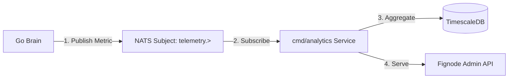

# Technical PRD: Agent Analytics & Telemetry Engine

**Version:** 1.0  
**Objective:** Build a high-frequency observability layer to profile AI Agents as "Economic Units."

## 1. Core Philosophy: "Agents as Assets"

We do not just track "server health" (CPU/RAM). We track "Agent Economic Health."
To financialize an Agent (sell bonds against its output), we must prove its Unit Economics in real-time.

### The Golden Equation

$$
\text{Agent Profit} = (\text{Value Created} \times \text{Price}) - (\text{Compute Cost} + \text{Error Liability})
$$

## 2. Architecture: "Fire-and-Forget" Telemetry

We cannot allow logging to slow down the Agent. The telemetry pipeline must be asynchronous and decoupled.



### 2.1 The Emitter (Go Brain)

Every time an Agent completes a "Step" (Thought) or a "Task" (Action), it emits a structured JSON event to NATS.

**Subject:** `telemetry.agent.{agent_id}.{event_type}`

**Example:** `telemetry.agent.uuid_123.task_complete`

**Payload:**

```json
{
  "timestamp": 1706227200000,
  "agent_id": "uuid_123",
  "tenant_id": "uuid_abc",
  "skill": "invoice_parser",
  "status": "success",
  "duration_ms": 450,
  "tokens_used": 120,
  "cost_usd": 0.002,
  "value_usd": 0.10,
  "error_code": null
}
```

## 3. The Analytics Service (cmd/analytics)

This is a new Go microservice in the monorepo. It handles the high-volume write load.

### 3.1 Tech Stack

*   **Language:** Go (High concurrency consumer).
*   **Ingress:** NATS JetStream (Durable consumer).
*   **Storage:** TimescaleDB (Postgres extension).
*   **Why:** It sits inside our existing Postgres infrastructure but handles time-series data efficiently. We don't need a separate ClickHouse cluster yet.

### 3.2 The Schema (TimescaleDB)

**File:** `sql/schema/005_analytics.sql`

```sql
-- Enable Timescale
CREATE EXTENSION IF NOT EXISTS timescaledb;

CREATE TABLE agent_metrics (
    time TIMESTAMPTZ NOT NULL,
    agent_id UUID NOT NULL,
    tenant_id UUID NOT NULL,
    skill TEXT NOT NULL,
    status TEXT NOT NULL, -- 'success', 'error', 'timeout'
    
    duration_ms INT,
    tokens_used INT,
    cost_micros BIGINT, -- Cost in millionths of a dollar
    value_micros BIGINT -- Revenue in millionths of a dollar
);

-- Convert to Hypertable (Partition by time)
SELECT create_hypertable('agent_metrics', 'time');

-- Compression (Save disk space)
ALTER TABLE agent_metrics SET (
  timescaledb.compress,
  timescaledb.compress_segmentby = 'agent_id'
);
```

## 4. Key Metrics to Profile

We need 3 Dashboards:

### 4.1 The "Health" Score (Reliability)

*   **Error Rate:** Failures / Total Tasks (Moving 1h average).
    *   *Alert:* If > 5%, pause the Agent.
*   **Latency:** P95 and P99 duration.
    *   *Insight:* "Why is the Trucking Agent taking 3s to reply?"

### 4.2 The "P&L" Score (Investability)

*   **Net Margin:** SUM(Value) - SUM(Cost).
*   **ROI:** Net Margin / Compute Cost.
    *   *Target:* We want Agents with > 500% ROI (e.g., Cost $0.01, Charge $0.10).

### 4.3 The "Volume" Score (Throughput)

*   **Tasks Per Minute (TPM):** How much work is it doing?
*   **Utilization:** Is the Agent idle? (Idle agents burn retainer money but generate no value).

## 5. Implementation Roadmap

### Step 1: The Emitter Logic (Go)

Modify `cmd/protocol/agent/engine.go`:

```go
func (e *Engine) recordMetric(skill string, start time.Time, err error, tokens int) {
    status := "success"
    if err != nil { status = "error" }
    
    metric := TelemetryEvent{
        Time: time.Now(),
        Duration: time.Since(start).Milliseconds(),
        Status: status,
        // ...
    }
    
    // Non-blocking publish
    e.nats.Publish("telemetry.agent.log", metric)
}
```

### Step 2: The Collector Service

Build `cmd/analytics/main.go`:

*   Connects to NATS.
*   Buffers messages (Batch size: 100).
*   Bulk Inserts into TimescaleDB using COPY protocol (pgx).

### Step 3: The API

Expose an endpoint for the Desktop App:

`GET /api/analytics/agent/{id}/stats`

**Returns:**

```json
{"success_rate": 0.99, "profit_24h": 50.00}
```

## 6. Strategic Value

This data is the "Audited Financials" for our Agents.
When we go to Ares Management (Level 7) or Investors (Level 15), we don't show them code. We show them the TimescaleDB Charts.

> "Look at this curve. This Agent prints money with 99.9% reliability. Fund it."