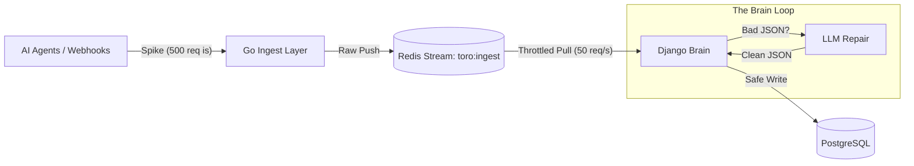

# Technical Architecture: AI-Powered Buffer (The Airbag)

## 1. Overview
The **AI-Powered Buffer** acts as a stability layer ("Airbag") between high-volume, erratic external sources (**AI Agents, N8N, Slack, Twilio, etc.**) and your sensitive infrastructure. Its core philosophy is **"Queue first, write later"**.

It decouples **Ingestion** (Speed) from **Processing** (Intelligence & Safety).

---

## 2. The Muscle: High-Performance Ingestion (Go)
**Role**: The Doorman. Fast, dumb, and resilient.
**Location**: `go/main.go`
**Responsibility**:
- **Endpoint**: Exposes high-throughput endpoints (e.g., `/hooks/{source}`).
- **Zero-Validation**: Does *not* look at payload content or query database.
- **Immediate Ack**: Returns `200 OK` in <5ms to keep the sender happy.
- **Buffering**: Pushes raw request data (Headers + Body) directly into a **Redis Stream**.

### Workflow
1.  **Request**: `POST /hooks/n8n-agent-1` or `POST /hooks/slack`
2.  **Action**:
    -   Generate unique Event ID.
    -   `XADD` to Redis Stream `toro:ingest`.
3.  **Response**: `200 OK` (with Event ID).

**Why Go?**
Go's lightweight concurrency model (Goroutines) allows it to handle thousands of concurrent connections with minimal memory footprint, ensuring the "Front Door" never crashes under load.

---

## 3. The Glue: Redis Streams
**Role**: The Buffer / Persistence Layer.
**Storage**: Memory-first, persistent on disk.

### Streams Design
-   **`toro:ingest`**: The "Firehose". All raw inbound events land here.
-   **`toro:processed`**: Successfully processed events.
-   **`toro:failed`**: Events that failed processing even after AI repair attempts.

**Persistence Configuration (The Safety Net)**:
We use Redis **AOF (Append Only File)**.
-   **Why?** Redis is our "Inbox". If the server restarts while 5,000 webhooks are in the queue (and not yet in Postgres), without AOF, they are lost forever.
-   **Role**: *Transient* safety. It ensures the queue survives a crash.
-   **Postgres Role**: *Permanent* storage. Once Django processes the item and writes to Postgres, we can (optionally) trim it from Redis.

**Key Feature**: **Consumer Groups** allow multiple Django workers to read from the stream in parallel without processing the same event twice.

---

## 4. The Brain: Intelligent Processing (Django + Celery)
**Role**: The Analyst. Smart, safe, and deliberate.
**Location**: Django Workers / Celery Tasks
**Responsibility**:
-   **Throttled Consumption**: Reads from `toro:ingest` at a configurable rate (e.g., 50 req/sec) to protect the DB from max_connection errors.
-   **Validation**: Checks if payload matches defined Schema.
-   **AI Schema Repair** (The "AI" in AI-Powered Buffer):
    -   If JSON is malformed or schema mismatches (e.g., "Field 'amount' is null but expected Integer"), it pauses.
    -   **Action**: Sends the payload + Error to an LLM (e.g., GPT-4o-mini).
    -   **Prompt**: "Fix this JSON to match this Pydantic schema."
    -   **Result**: Valid, clean JSON is returned.
-   **Safe Write**: Writes the sanitized, validated data to **PostgreSQL**.

### Connection Safety
Because Django consumes the stream *serially* (or with a fixed number of workers), you have absolute control over database load. Even if 10,000 webhooks hit Go in 1 second, Django will process them calmly over the next few minutes.

---

## 5. Summary Diagram

