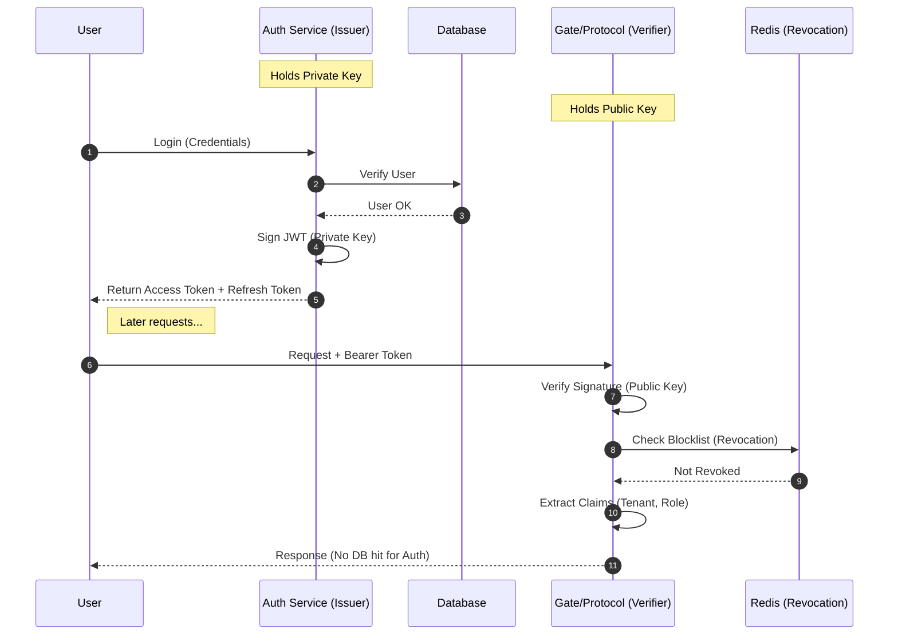

# Technical PRD: Authentication & Multi-Tenancy Architecture

**Version:** 1.0 (Stateless JWT + Redis Revocation)  
**Objective:** Secure, high-performance identity management for a distributed Go architecture.

---

## 1. Core Philosophy: "Issue Once, Verify Locally"

We reject the "Centralized Session Store" model (where every request hits the DB) in favor of Asymmetric JWTs.

### Architecture Overview



- **Service A (cmd/auth) - The Issuer**: Owns the User DB. Signs tokens with a Private Key.
- **Service B (cmd/gate, cmd/protocol) - The Verifiers**: Trust the token by checking the signature with the Public Key. *No DB hit required for auth.*
- **Revocation**: Handled via a Redis Blocklist to allow instant bans.

---

## 2. Database Schema (Postgres)

We treat tenants and users as the root of our data model.
File: `sql/schema/001_auth.sql`

```sql
-- Enable UUIDs
CREATE EXTENSION IF NOT EXISTS "uuid-ossp";

-- 1. Tenants (The "Firm")
-- Not RLS protected because Auth Service needs to see them all
CREATE TABLE tenants (
    id UUID PRIMARY KEY DEFAULT uuid_generate_v4(),
    name TEXT NOT NULL,
    status TEXT DEFAULT 'active', -- 'active', 'suspended'
    plan_tier TEXT DEFAULT 'pro',
    created_at TIMESTAMPTZ DEFAULT NOW(),
    updated_at TIMESTAMPTZ DEFAULT NOW()
);

-- 2. Users (The "Human")
-- Not RLS protected because Login needs to scan email globally
CREATE TABLE users (
    id UUID PRIMARY KEY DEFAULT uuid_generate_v4(),
    tenant_id UUID NOT NULL REFERENCES tenants(id) ON DELETE CASCADE,
    
    email TEXT UNIQUE NOT NULL,
    password_hash TEXT NOT NULL, -- Argon2id hash
    
    full_name TEXT,
    role TEXT DEFAULT 'member', -- 'owner', 'admin', 'member'
    
    is_active BOOLEAN DEFAULT TRUE,
    created_at TIMESTAMPTZ DEFAULT NOW(),
    updated_at TIMESTAMPTZ DEFAULT NOW()
);

CREATE INDEX idx_users_email ON users(email);
CREATE INDEX idx_users_tenant ON users(tenant_id);

-- 3. Refresh Tokens (Long-lived sessions)
CREATE TABLE refresh_tokens (
    token_hash TEXT PRIMARY KEY,
    user_id UUID NOT NULL REFERENCES users(id) ON DELETE CASCADE,
    expires_at TIMESTAMPTZ NOT NULL,
    ip_address TEXT,
    user_agent TEXT,
    created_at TIMESTAMPTZ DEFAULT NOW()
);
```

---

## 3. The `cmd/auth` Service (The Issuer)

This is the only service that imports bcrypt (or Argon2) and touches the `users` table.

### 3.1 Responsibilities

1. **Signup**: Create Tenant + User transactionally.
2. **Login**: Verify password, issue Access Token (15 min) + Refresh Token (7 days).
3. **Refresh**: Rotate tokens.
4. **Logout**: Revoke tokens (Update Redis).

### 3.2 SQL Queries
File: `sql/queries/auth.sql`

```sql
-- name: CreateTenant :one
INSERT INTO tenants (name, plan_tier) VALUES ($1, $2) RETURNING id;

-- name: CreateUser :one
INSERT INTO users (tenant_id, email, password_hash, role) 
VALUES ($1, $2, $3, $4) RETURNING id;

-- name: GetUserByEmail :one
SELECT * FROM users WHERE email = $1;

-- name: CreateRefreshToken :exec
INSERT INTO refresh_tokens (token_hash, user_id, expires_at, ip_address, user_agent)
VALUES ($1, $2, $3, $4, $5);
```

---

## 4. The Shared Library (`internal/auth`)

This code lives in `internal/` and is imported by all services (`gate`, `sync`, `socket`).

### 4.1 The JWT Structure
File: `claims.go`

```go
package auth

import (
	"github.com/golang-jwt/jwt/v5"
	"github.com/google/uuid"
)

type ToroClaims struct {
	UserID   uuid.UUID `json:"sub"`
	TenantID uuid.UUID `json:"tid"`
	Role     string    `json:"role"`
	jwt.RegisteredClaims
}
```

### 4.2 The Middleware
File: `middleware.go`

This is what protects your endpoints. It does not query Postgres.

```go
package auth

import (
	"context"
	"crypto/ed25519"
	"net/http"
	"strings"

	"github.com/golang-jwt/jwt/v5"
	"github.com/redis/go-redis/v9"
)

type Authenticator struct {
	PublicKey ed25519.PublicKey
	Redis     *redis.Client
}

func (a *Authenticator) Middleware(next http.Handler) http.Handler {
	return http.HandlerFunc(func(w http.ResponseWriter, r *http.Request) {
		// 1. Extract Header
		authHeader := r.Header.Get("Authorization")
		if authHeader == "" {
			http.Error(w, "Missing Authorization Header", http.StatusUnauthorized)
			return
		}
		tokenString := strings.TrimPrefix(authHeader, "Bearer ")

		// 2. Parse & Verify Signature (CPU Only)
		token, err := jwt.ParseWithClaims(tokenString, &ToroClaims{}, func(t *jwt.Token) (interface{}, error) {
			return a.PublicKey, nil
		})

		if err != nil || !token.Valid {
			http.Error(w, "Invalid Token", http.StatusUnauthorized)
			return
		}

		claims := token.Claims.(*ToroClaims)

		// 3. Check Revocation (Redis - Fast)
		// We store revoked tokens as "blacklist:jti"
		isRevoked, _ := a.Redis.Exists(r.Context(), "blacklist:"+claims.ID).Result()
		if isRevoked > 0 {
			http.Error(w, "Token Revoked", http.StatusUnauthorized)
			return
		}

		// 4. Inject Context
		ctx := context.WithValue(r.Context(), "user_id", claims.UserID)
		ctx = context.WithValue(ctx, "tenant_id", claims.TenantID)
		ctx = context.WithValue(ctx, "role", claims.Role)

		next.ServeHTTP(w, r.WithContext(ctx))
	})
}
```

---

## 5. Security Strategy

### 5.1 Key Management
We use **Ed25519** (Elliptic Curve) signatures because they are faster and smaller than RSA.

- **Private Key**: Exists ONLY in `cmd/auth`.
- **Public Key**: Distributed to `cmd/gate`, `cmd/socket`, etc.

### 5.2 RLS Integration
When `cmd/gate` handles a request, it uses the `tenant_id` from the JWT to set the database context.

```go
// Inside cmd/gate handler
tenantID := r.Context().Value("tenant_id").(uuid.UUID)

// Calls the DB Store with RLS
store.ExecTx(ctx, tenantID.String(), func(q *db.Queries) error {
    // This query is now safe
    return q.CreateTransaction(...)
})
```

---

## 6. Implementation Checklist

- [ ] **Generate Keys**: Run `openssl genpkey -algorithm Ed25519 -out private.pem` and extract the public key.
- [ ] **Env Vars**:
    - `AUTH_PRIVATE_KEY` -> `cmd/auth`
    - `AUTH_PUBLIC_KEY` -> `cmd/gate`, `cmd/sync`, `cmd/socket`
- [ ] **Service Setup**: Create `cmd/auth/main.go` using the standard Toro layout.
- [ ] **Middleware**: Wrap your routers in `cmd/gate` with `auth.Middleware`.

> This architecture ensures that your high-velocity services (gate) **never wait on the database** to authenticate a user.
