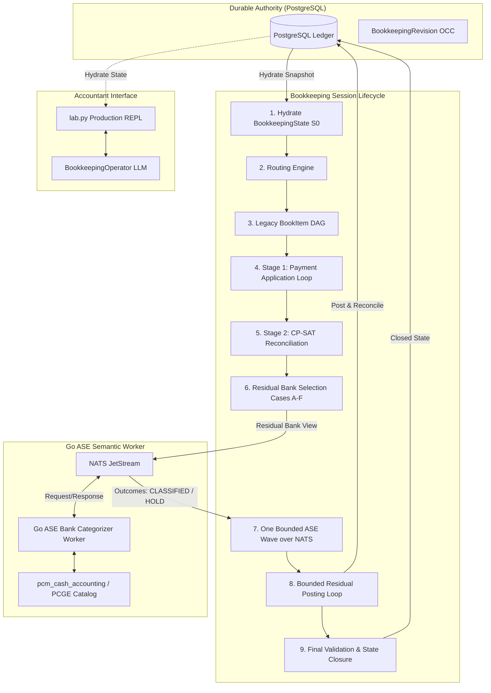

# Toro Bookkeeping Runtime Documentation

Welcome to the authoritative developer and operational documentation for Toro's **BookkeepingState** runtime.

Toro's bookkeeping engine is a hybrid deterministic-and-semantic accounting automation system. It orchestrates double-entry transaction settlement, combinatorial bank reconciliation, residual bank classification via the Autonomous Semantic Engine (ASE) over NATS, deterministic journal entry posting, and conversational accountant operation over live PostgreSQL states.

---

## What is BookkeepingState?

`BookkeepingState` is an in-memory, immutably versioned working projection of a company's financial and transactional reality. It hydrates directly from durable PostgreSQL records, coordinates multi-stage accounting transitions through an authoritative `TransitionEngine`, and commits changes back to the database under strict Optimistic Concurrency Control (OCC).

### Problems It Solves

1. **Elimination of Accounting Drift**: Traditional AI accounting often attempts to generate journal entries directly from LLM prompts. Toro separates semantic judgment from accounting execution: an LLM or semantic classifier may determine intent or account codes, but deterministic mathematical solvers and the Django accounting kernel execute the double-entry postings and reconciliations.
2. **Two-Stage Settlement Separation**: Distinguishes between settling approved open obligations (Invoices/Bills in Stage 1) and reconciling bank statements against already-posted General Ledger cash movements (Stage 2).
3. **Residual Bank Movement Resolution**: Automatically handles ambiguous, non-obligation bank statement lines (such as tax payments, bank fees, interest, direct revenues, and unidentified transfers) through a dedicated post-reconciliation residual classification wave and deterministic posting loop.
4. **Accountant Explainability**: Exposes a natural-language Operator REPL (`lab.py`) that answers complex queries directly from hydrated domain state, grounding every explanation in actual transactions, active holds, and balance assertions without hallucinations.

---

## High-Level System Architecture

---

## Core Pipeline at a Glance

The production bookkeeping pipeline executes in a strict, bounded sequence:

1. **Hydration**: Loads an authoritative snapshot from PostgreSQL into an open, in-memory `BookkeepingState` at local revision $S_0$.
2. **Routing**: Maps book items to candidate bank accounts based on currency, counterparty, and settlement history.
3. **Legacy BookItem DAG**: Historical stage for classifying book items (skipped for modern production pipelines where incoming book items are settled invoices/bills).
4. **Stage 1 (Payment Application Fixed-Point Loop)**:
   - Identifies candidate bank items and matches them against approved open obligations (Invoices and Bills).
   - Bank items with selectable Stage 2 posted authority are strictly excluded.
   - Executes real double-entry cash movements through `make_payment_with_result(commit=True)`.
   - Persists immutable `BookkeepingPaymentApplication` records and rehydrates state.
5. **Stage 2 (Bank Reconciliation)**:
   - Formulates a discrete combinatorial optimization problem solved via Google OR-Tools CP-SAT.
   - Matches remaining bank statement items strictly against `POSTED_BOOK_ITEM` cash transactions in the General Ledger.
   - Generates value-conserving `BookkeepingReconciliation` records.
6. **Residual Bank Classification Wave**:
   - Identifies remaining unreconciled bank movements (economic residuals).
   - Evaluates semantic eligibility according to Cases A–F.
   - Dispatches exactly **one** bounded request wave over NATS to the Go ASE worker (`worker.inbox.bookkeeping_ase_bank_categorizer`).
   - Persists atomic `BookkeepingResidualBankClassificationDecision` records with status `CLASSIFIED` (with account code, confidence $\ge 0.98$) or `HOLD` (with hold reason and required evidence).
7. **Residual Posting Loop**:
   - Iterates through unposted `CLASSIFIED` decisions in deterministic order.
   - Executes `PostResidualBankClassificationCommand`: posts a balanced Journal Entry (bank leg vs. contra account leg), establishes a direct reconciliation, and records `BookkeepingResidualBankPosting` provenance.
   - Closes and rehydrates state after each committed posting.
8. **Final State Validation**:
   - Runs `validate_state()` to ensure zero conservation leaks, no active unposted classified decisions, and strict OCC compliance.
   - Seals the session and marks `state.close()`.

---

## Documentation Directory & Reading Order

| I want to... | Read | Description |
|---|---|---|
| **Get started in 5 minutes** | [Quickstart](quickstart.md) | Repo-verified commands to spin up PostgreSQL, seed data, run the E2E lifecycle, and launch the REPL. |
| **Understand domain & state terms** | [Concepts](concepts.md) | Explains entities, charts of accounts, bank items, book items, revisions, and authority boundaries. |
| **Understand architectural design** | [Architecture](architecture.md) | Component architecture, trust boundaries, RPC layers, and why LLMs reason while solvers mutate. |
| **Understand in-memory state** | [State Model](state-model.md) | Explains `BookkeepingState`, snapshots, derived queries, fingerprints, and rehydration mechanics. |
| **Understand the session lifecycle** | [Lifecycle](lifecycle.md) | Step-by-step trace of `BookkeepingSession.run()` with inputs, outputs, and stop conditions. |
| **Understand Stage 1** | [Stage 1 Payment Application](stage1-payment-application.md) | Matching open invoices/bills, capability minting, payment execution, and provenance. |
| **Understand Stage 2** | [Stage 2 Reconciliation](stage2-reconciliation.md) | Matching bank movements to posted cash GL movements using CP-SAT constraint optimization. |
| **Understand AI residual classification** | [Residual Categorization](residual-categorization.md) | Residual selection (Cases A–F), NATS ASE wave, 0.98 confidence policy, and HOLD semantics. |
| **Understand residual journal posting** | [Residual Posting](residual-posting.md) | Journal entry creation, debit/credit rules, deterministic bank ledgers, and direct reconciliation. |
| **Use the accountant REPL** | [Operator REPL](operator-repl.md) | Developer and accountant commands, natural-language question handling, and non-hallucination rules. |
| **Integrate via Python APIs** | [API Reference](api-reference.md) | Complete guide to public classes, transition commands, queries, and helper functions. |
| **Understand NATS & Go contracts** | [NATS ASE Contract](nats-ase-contract.md) | Request/response wire formats, canonical digests, JetStream KV idempotency, and Go worker internals. |
| **Inspect database tables** | [Data Model](data-model.md) | Django models, table schemas, PostgreSQL constraints, and entity-relationship diagrams. |
| **Run production E2E test suites** | [Production E2E](production-e2e.md) | 7-case synthetic company runbook, verification steps, and idempotent rerun assertions. |
| **Run tests** | [Testing](testing.md) | Unit tests, transition tests, persistence tests, NATS integration, and REPL surface tests. |
| **Debug and resolve errors** | [Troubleshooting](troubleshooting.md) | Common errors, invariant violations (Case E), timeouts, lock contentions, and safe remedies. |
| **Extend the platform safely** | [Extending](extending.md) | How to add new ASE domain tools, operator tools, transition commands, or synthetic scenarios. |
| **Look up terminology** | [Glossary](glossary.md) | Definitions for ASE, DAG, AmountUnits, OCC, PCM, PCGE, sealed decisions, and core vocabulary. |
