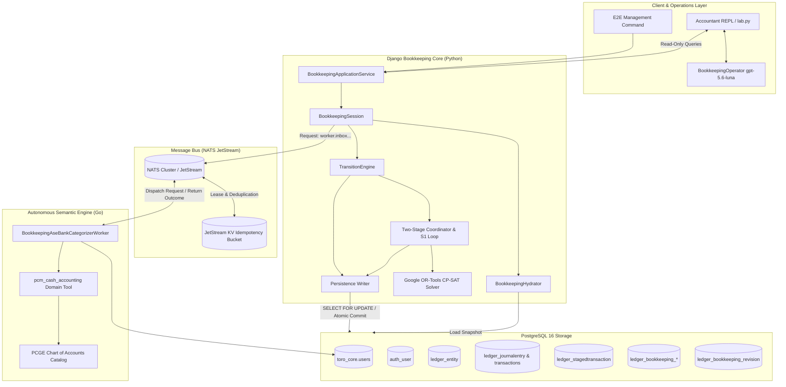

# System Architecture & Trust Boundaries

This document provides a comprehensive technical breakdown of Toro's bookkeeping architecture, trust boundaries, inter-process communication, and the architectural principles governing the division between semantic reasoning and deterministic accounting execution.

---

## 1. Architectural Principles

### Semantic Judgment vs. Accounting Execution

The core architectural tenet of Toro is that **Large Language Models (LLMs) and probabilistic neural systems must never possess direct mutation authority over the General Ledger.**

```text
┌───────────────────────────────────────────────────────────┐
│                    SEMANTIC BOUNDARY                      │
│   - Interprets unstructured narratives                    │
│   - Evaluates evidence and confidence                     │
│   - Proposes account candidates and hold reasons          │
│   - Advisory ONLY; zero database write access             │
└─────────────────────────────┬─────────────────────────────┘
                              │
                      RPC / NATS Envelopes
                      (Canonical Digests)
                              │
┌─────────────────────────────▼─────────────────────────────┐
│                  DETERMINISTIC BOUNDARY                   │
│   - Validates entity Chart of Accounts constraints        │
│   - Enforces 0.98 confidence policy threshold             │
│   - Solves multi-to-multi integer conservation (CP-SAT)   │
│   - Enforces Optimistic Concurrency Control (OCC)         │
│   - Executes double-entry balanced Journal Entries        │
│   - Manages immutable provenance & direct reconciliations │
└───────────────────────────────────────────────────────────┘
```

By decoupling these concerns:
- LLMs are utilized exclusively where they excel: fuzzy text understanding, semantic categorization, and contextual explanation.
- Deterministic code governs where correctness is non-negotiable: value conservation ($\sum \text{Debits} = \sum \text{Credits}$), balance sheets, row locking, and immutable audit trails.

---

## 2. End-to-End System Topology



---

## 3. Component Breakdown

### 3.1 Go/SQL User & Entity Boundary
Every tenant company in Toro exists within an authoritative ownership hierarchy:
- In the Go core layer (`toro_core.users`), users have UUIDs, organizations, and security roles.
- In the Django layer, users map to `auth_user`, and organizations map to `EntityModel`.
- **Validation**: Management commands (`seed_production_like_bookkeeping_company` and `run_synthetic_bookkeeping_e2e`) explicitly verify that the entity admin ID matches the user's primary key across both stores before executing.

### 3.2 BookkeepingHydrator & Repository
- **`BookkeepingRepository`**: Interface governing snapshot loading and atomic commit execution.
- **`BookkeepingHydrator`**: Reads raw database records under transaction isolation and instantiates an in-memory `BookkeepingState` populated with `BankItem`s, `BookItem`s, `BankAccount`s, existing reconciliations, payment applications, residual decisions, and evidence assertions.

### 3.3 BookkeepingSession Coordinator
The authoritative runtime coordinator. It drives execution through a finite-state sequence:
1. Routing $\to$
2. DAG $\to$
3. Stage 1 Fixed Point Loop $\to$
4. Stage 2 CP-SAT Reconciliation $\to$
5. Residual Bank Selection $\to$
6. One Bounded ASE Wave over NATS $\to$
7. Residual Posting Loop $\to$
8. State Validation & Closure.

### 3.4 TransitionEngine
All state mutations flow through `TransitionEngine.apply()` or `TransitionEngine.apply_batch()`.
- **Precondition Verification**: Enforces `expected_state_revision` and `expected_persistence_revision`.
- **Handler Delegation**: Routes typed commands (`ApplyPaymentCommand`, `RecordResidualBankClassificationCommand`, `PostResidualBankClassificationCommand`, `InvalidateReconciliationCommand`) to isolated handlers.
- **Atomic Commit Execution**: Packages accepted transitions into a `PersistenceWriteSet` passed to `BookkeepingWriter`.
- **Catastrophic Failure Isolation**: If an error occurs after a database commit while applying local state updates, the state is immediately marked `is_closed = True` (`CommittedStateApplicationError`) to prevent dirty state reuse.

### 3.5 Stage 1 Coordinator (`plan_two_stage_bookkeeping`)
Coordinates the boundary between open obligations and bank statements:
- Executes a read-only Stage 2 preplan to find bank items already matchable to existing `POSTED_BOOK_ITEM` transactions.
- Excludes those bank items from Stage 1.
- Mints an HMAC-signed `Stage1ExecutionCapability` binding the exact bank item, amount, direction, and state fingerprint.
- Delegates payment execution to the Django kernel (`make_payment_with_result(commit=True)`).

### 3.6 Stage 2 Reconciliation Solver (`ReconciliationService`)
Solves multi-to-multi integer allocation using Google OR-Tools CP-SAT:
- Objective 1: Maximize total reconciled currency units.
- Objective 2: Maximize fully cleared transactions.
- Objective 3: Maximize amount-weighted semantic scoring utility ($[0, 1000]$).
- All arithmetic operates on integer solver units (scale factor 10,000).

### 3.7 Go ASE Worker (`BookkeepingAseBankCategorizerWorker`)
A standalone Go microservice listening on NATS:
- Implements JetStream KV distributed leasing, payload hashing, and response replay.
- Invokes domain tools (`pcm_cash_accounting`) with the Moroccan PCGE chart of accounts catalog.
- Returns deterministic structured outcomes: `CLASSIFIED` (with account code) or `HOLD` (with hold reason and required evidence).

---

## 4. Trust, Process, and Persistence Boundaries

| Boundary | Technology | Trust Model | Failure Behavior |
|---|---|---|---|
| **Python Core $\to$ PostgreSQL** | Django ORM / `psycopg2` | Authoritative transactional boundary. | Row-level locking (`select_for_update`). On failure, roll back transaction. |
| **Python Core $\to$ NATS Bus** | `nats-py` / JSON wire contract | Untrusted network RPC. | Timeout after 10.0s. Fails closed (`FailureStage.RESIDUAL_CATEGORIZATION`). |
| **NATS $\to$ Go ASE Worker** | `nats.go` JetStream KV | Distributed idempotent queue group. | Claim leasing with CAS. If worker crashes, lease expires and task is retried. |
| **Operator REPL $\to$ State** | Python function calls | Strict read-only inspection. | Operator LLM is restricted to read-only tools. Cannot mutate state without explicit commands. |

---

## 5. Concurrency & Reentrancy Guarantees

Toro implements a four-tier defense against race conditions and inconsistent states:

1. **Entity-Level Row Lock**: The `PersistenceWriter` acquires a row-level lock on `EntityModel` (`SELECT FOR UPDATE`) at the start of every atomic commit.
2. **Optimistic Concurrency Control (OCC)**: `BookkeepingRevision` maintains an authoritative revision integer ($P_k$). Commits specify `expected_revision`. If $P_k \neq \text{expected}$, the transaction aborts with `PersistenceConflictError`.
3. **NATS JetStream Deduplication**: Every residual categorization request carries a deterministic SHA-256 payload digest. The Go worker stores in-flight claims and completed responses in JetStream KV. Duplicate requests receive cached responses without re-running inference.
4. **Posting-Owned Reconciliation Protection**: Once a residual classification is posted to the ledger, its direct reconciliation cannot be invalidated independently (`CANNOT_INVALIDATE_POSTING_RECONCILIATION`), preserving the integrity of the accounting entry.
