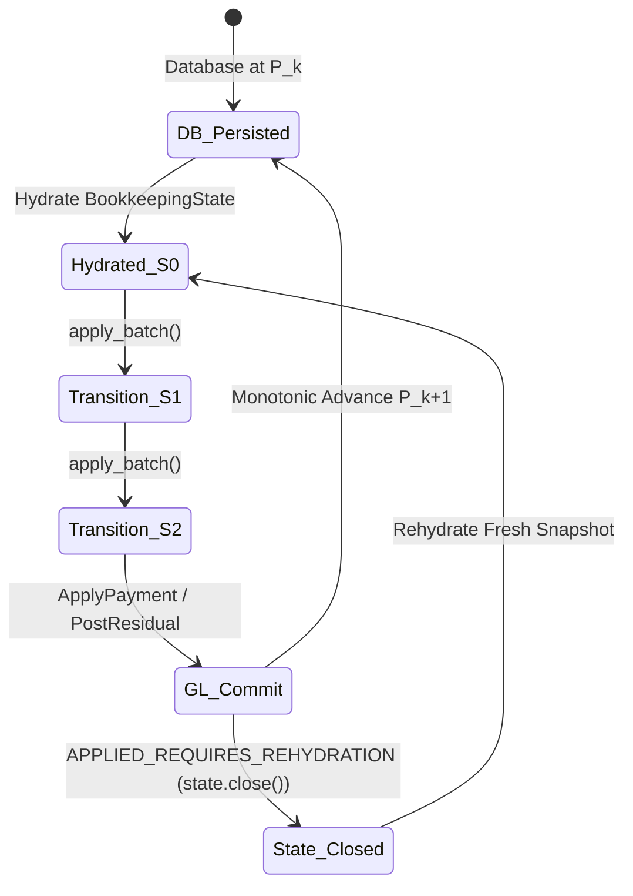

# Core Concepts & Domain Terminology

This document establishes the conceptual foundations and terminology of Toro's bookkeeping architecture.

---

## 1. The Authoritative Architecture Matrix

A core principle of Toro is the strict distinction between **authoritative double-entry truth**, **in-memory evaluation working state**, and **stateless semantic reasoning**.

| Component | Responsibility | Authority Level | Lifecycle |
|---|---|---|---|
| **Django / PostgreSQL Ledger** | Authoritative general ledger, chart of accounts, posted journal entries, balances, and durable provenance records. | **Authoritative Ground Truth** | Durable, transactional, persistent across sessions. |
| **BookkeepingState** | In-memory, immutably versioned working graph of bank items, book items, routes, classifications, and reconciliations. | **Derived Working Projection** | Ephemeral; hydrated from database, closed/discarded when committed. |
| **Autonomous Semantic Engine (ASE)** | Go-based semantic evaluation engine; interprets transaction narratives and maps them to accounts or holds. | **Semantic Judgment Engine** | Stateless / advisory; never writes directly to ledger. |
| **Worker Leases & Caches** | NATS JetStream KV buckets for distributed deduplication and instance heartbeat leases. | **Disposable Runtime Coordination** | Ephemeral, subject to TTL expiration. |

> [!CAUTION]
> **Semantic Reasoning is Not Accounting Authority**:
> An LLM or ASE worker can output an account code (e.g. `4456`) or a confidence score (`0.99`), but this determination is merely an *advisory recommendation*. It does not become financial truth until the deterministic `TransitionEngine` validates entity CoA constraints, balances transaction legs, locks bank ledgers, and commits an atomic database transaction.

---

## 2. Core Entities and Ledger Primitives

### Entity / Company
The legal business entity (tenant) represented by `EntityModel`. Every bank account, ledger, invoice, journal entry, and bookkeeping decision is strictly scoped to an entity.

### Chart of Accounts (CoA) & Account
A structured hierarchy of ledger accounts (e.g., standard Moroccan Plan Comptable Général des Entreprises - PCGE). Represented by `AccountModel`.
- **Operating Bank Account Role**: Accounts with role `ASSET_CA_CASH` (e.g., account code `5141`).
- **Accounts Receivable**: `3421` (Clients).
- **Accounts Payable**: `4411` (Fournisseurs).
- **Tax Liability**: `4456` (Etat, TVA due).
- **Operating Expenses**: Class 6 (e.g., `6147` Frais bancaires, `6125` Fournitures de bureau).
- **Operating Revenues**: Class 7 (e.g., `7111` Ventes de marchandises, `7127` Ventes de produits accessoires).

### BankAccount & StagedTransactionModel
- **`BankAccountModel`**: Represents a real company bank account with a specific IBAN/RIB and currency, linked to a cash GL account (`AccountModel`).
- **`StagedTransactionModel`**: An imported bank statement movement (from bank sync or CSV upload). It records `date_posted`, raw narrative (`name`, `memo`), signed amount, and external transaction ID (`fit_id`).

### JournalEntry & TransactionModel
- **`JournalEntryModel`**: An atomic, balanced double-entry accounting transaction containing two or more transaction legs. A journal entry must satisfy $\sum \text{Debits} = \sum \text{Credits}$.
- **`TransactionModel`**: A single debit or credit leg linked to a specific `AccountModel` within a `JournalEntryModel`.

---

## 3. In-Memory Domain Primitives

When hydrated into `BookkeepingState`, raw database rows are projected into typed in-memory domain models:

### BankItem
A normalized representation of an observed statement movement owned by a `BankAccount`.
- **`id`**: e.g., `staged:<uuid>` or `plaid:<uuid>`.
- **`amount_units`**: Positive integer solver units (scale factor 10,000).
- **`direction`**: `Direction.BANK_INFLOW` (deposit) or `Direction.BANK_OUTFLOW` (withdrawal).
- **`currency`**: Standard 3-letter currency code (e.g., `MAD`, `USD`).

### BookItem
A normalized representation of an accounting transaction, expectation, or obligation. A `BookItem` has a `source_type`:
1. **`STAGING_BOOK_ITEM`**: An unposted, open obligation originating from an approved `InvoiceModel` (receivable) or `BillModel` (payable). These are targets for **Stage 1 Payment Application**.
2. **`POSTED_BOOK_ITEM`**: A posted cash transaction backed by a real `TransactionModel` row in the General Ledger. These are targets for **Stage 2 Bank Reconciliation**.

---

## 4. Revisions, Concurrency, and Lifecycle

### Persistence Revision ($P_k$)
The authoritative, monotonically increasing database revision stored in `BookkeepingRevision.revision` per entity.
- Increments by $+1$ each time an atomic bookkeeping transaction (`PersistenceWriteSet`) commits to the database.
- Guarantees Optimistic Concurrency Control (OCC). If two workers attempt to commit against $P_2$, the second worker fails with `PersistenceConflictError`.

### Local State Revision ($S_k$)
The internal revision of the in-memory `BookkeepingState`.
- Always initializes to $S_0$ upon fresh hydration.
- Advances ($S_0 \to S_1 \to S_2 \dots$) each time an in-memory `TransitionBatch` is accepted by the `TransitionEngine`.

### `APPLIED_REQUIRES_REHYDRATION`
Certain transition commands (specifically `ApplyPaymentCommand` in Stage 1 and `PostResidualBankClassificationCommand` in Residual Posting) commit real General Ledger journal entries and provenance records directly into PostgreSQL.
Because external accounting rows (such as new `TransactionModel` cash legs) were committed, the in-memory `BookkeepingState` can no longer track reality via local deltas. The engine returns status `APPLIED_REQUIRES_REHYDRATION`, seals the current state, and mandates that the session perform a full database rehydration.

---

## 5. Pipeline Stages & Transitions

### Routing
The deterministic process of assigning a `BookItem` to a specific `BankAccount` search space based on currency match, settlement history, and policy rules. Produces `RoutingDecision` records.

### Stage 1: Payment Application
The process of matching unposted bank statement movements (`BankItem`) with open, approved customer invoices or vendor bills (`STAGING_BOOK_ITEM`).
- **Execution**: Invokes `make_payment_with_result(commit=True)` in the Django accounting kernel.
- **Result**: Posts real cash and AR/AP journal entries, creates `BookkeepingPaymentApplication` provenance, and advances the persistence revision.

### Stage 2: Bank Reconciliation
The process of matching bank movements (`BankItem`) against already-posted cash transactions in the General Ledger (`POSTED_BOOK_ITEM`).
- **Execution**: Solved using Google OR-Tools CP-SAT discrete constraint programming.
- **Result**: Establishes value-conserving `BookkeepingReconciliation` records without creating new journal entries.

### Residual Bank Items
Bank statement lines that remain unreconciled with positive remaining balance after both Stage 1 and Stage 2 have executed. These represent taxes, bank fees, interest, owner drawings, direct revenue, or unclassified transfers.

---

## 6. Semantic Classifications: Legacy vs. Residual

Toro maintains a strict semantic distinction between legacy book classifications and modern residual bank classifications:

| Dimension | Legacy Book Classification | Residual Bank Classification |
|---|---|---|
| **Target Subject** | `BookItem` (bills/invoices in DAG) | `BankItem` (unreconciled bank statement lines) |
| **Pipeline Stage** | Pre-reconciliation DAG stage | Post-reconciliation residual stage (Stage 4.5) |
| **Eligibility** | General staging obligations (mostly ineligible in modern pipelines) | Unreconciled bank movements evaluated against Cases A–F |
| **Transport** | `worker.inbox.bookkeeping_ase_book_categorizer` | `worker.inbox.bookkeeping_ase_bank_categorizer` |
| **Possible Statuses** | `CLASSIFIED` / `HOLD` | `CLASSIFIED` / `HOLD` |
| **Post-Action** | Informs routing/settlement | Deterministic journal posting + direct reconciliation |

### CLASSIFIED vs. HOLD Decisions

When the Go ASE evaluates residual bank movements:
1. **`CLASSIFIED`**: The model identified a definitive account code (e.g. `4456` for DGI VAT) with high confidence ($\ge 0.98$). This decision enters the automated residual posting loop.
2. **`HOLD`**: The model cannot classify the movement with sufficient confidence ($< 0.98$) or the narrative is ambiguous (e.g. `HOLD_AMBIGUOUS`).
   - A `HOLD` is a **durable, sealed outcome** recorded in persistence.
   - It prevents redundant re-evaluation on subsequent runs.
   - It surfaces to human accountants in the REPL with explicit hold reasons and required evidence (e.g. `PROOF_OF_PAYMENT`, `VENDOR_CONTRACT`).

---

## 7. History, Invalidation, and Supersession

Toro enforces an **append-only, immutable audit trail**:

- **No Destructive Deletes**: Rows in `BookkeepingReconciliation`, `BookkeepingResidualBankClassificationDecision`, or `BookkeepingPaymentApplication` are never updated in place or deleted.
- **Invalidation**: A reconciliation or classification is retired by inserting a dedicated invalidation record (`BookkeepingReconciliationInvalidation` or `BookkeepingResidualBankClassificationInvalidation`).
- **Supersession**: When a previously invalidated classification is re-evaluated with new evidence, a new decision row is inserted with `supersedes_id` pointing to the previous tip.
- **Posting Protection**: A reconciliation owned by an authoritative residual posting (`BookkeepingResidualBankPosting`) cannot be invalidated independently. It is protected by rejection code `CANNOT_INVALIDATE_POSTING_RECONCILIATION`.
