# Database Schema & Entity-Relationship Data Model

This document details the PostgreSQL table schemas, Django ORM models, foreign key deletion protections, and entity-relationship constraints of the bookkeeping subsystem (`ledger/models/bookkeeping.py`).

---

## 1. Entity-Relationship Diagram (ERD)

```mermaid
erDiagram
    EntityModel ||--o| BookkeepingRevision : "has 1 OCC head"
    EntityModel ||--o{ BankAccountModel : "owns"
    EntityModel ||--o{ ChartOfAccountModel : "has"
    ChartOfAccountModel ||--o{ AccountModel : "contains"
    BankAccountModel ||--o| AccountModel : "linked to cash GL"
    BankAccountModel ||--o{ ImportJobModel : "imports statements"
    ImportJobModel ||--o{ StagedTransactionModel : "contains movements"

    EntityModel ||--o{ InvoiceModel : "issues"
    EntityModel ||--o{ BillModel : "receives"
    EntityModel ||--o{ JournalEntryModel : "posts"
    JournalEntryModel ||--|{ TransactionModel : "has debit/credit legs"
    AccountModel ||--o{ TransactionModel : "balances"

    EntityModel ||--o{ BookkeepingPaymentApplication : "executes (Stage 1)"
    BookkeepingPaymentApplication ||--|{ BookkeepingPaymentApplicationAllocation : "allocates"
    BookkeepingPaymentApplicationAllocation }o--|| TransactionModel : "links cash leg"
    BookkeepingPaymentApplicationAllocation }o--o| InvoiceModel : "settles"
    BookkeepingPaymentApplicationAllocation }o--o| BillModel : "settles"

    EntityModel ||--o{ BookkeepingReconciliation : "reconciles (Stage 2)"
    BookkeepingReconciliation ||--|{ BookkeepingReconciliationBankAllocation : "allocates bank"
    BookkeepingReconciliation ||--|{ BookkeepingReconciliationBookAllocation : "allocates book"
    BookkeepingReconciliationBankAllocation }o--|| StagedTransactionModel : "references"
    BookkeepingReconciliationBookAllocation }o--|| TransactionModel : "references"
    BookkeepingReconciliation ||--o{ BookkeepingReconciliationInvalidation : "invalidates"

    EntityModel ||--o{ BookkeepingResidualBankClassificationDecision : "classifies residual"
    BookkeepingResidualBankClassificationDecision }o--|| StagedTransactionModel : "targets"
    BookkeepingResidualBankClassificationDecision }o--o| AccountModel : "classified account"
    BookkeepingResidualBankClassificationDecision |o--o| BookkeepingResidualBankClassificationDecision : "supersedes"
    BookkeepingResidualBankClassificationDecision ||--o| BookkeepingResidualBankClassificationInvalidation : "invalidates"

    EntityModel ||--o{ BookkeepingResidualBankPosting : "posts residual"
    BookkeepingResidualBankPosting ||--|| BookkeepingResidualBankClassificationDecision : "provenance"
    BookkeepingResidualBankPosting ||--|| StagedTransactionModel : "provenance"
    BookkeepingResidualBankPosting ||--|| JournalEntryModel : "created JE"
    BookkeepingResidualBankPosting ||--|| TransactionModel : "bank leg"
    BookkeepingResidualBankPosting ||--|| TransactionModel : "contra leg"
    BookkeepingResidualBankPosting ||--|| BookkeepingReconciliation : "direct reconciliation"
```

---

## 2. Table Specifications & Model Invariants

### 2.1 Concurrency & OCC
#### `ledger_bookkeeping_revision` (`BookkeepingRevision`)
Authoritative optimistic concurrency control (OCC) head per entity.
- `entity_id` (Primary Key, OneToOne to `EntityModel`)
- `revision` (BigInteger, default `0`, non-negative)
- `updated_at` (DateTimeField)

---

### 2.2 Stage 1: Payment Application Models

#### `ledger_bookkeeping_payment_application` (`BookkeepingPaymentApplication`)
Records execution provenance linking an observed bank movement to a settled invoice or bill.
- `id` (VARCHAR(255), Primary Key, e.g. `payapp:...`)
- `entity_id` (ForeignKey to `EntityModel`, `on_delete=CASCADE`)
- `staged_transaction_id` (ForeignKey to `StagedTransactionModel`, `null=True`, `on_delete=PROTECT`)
- `plaid_transaction_id` (ForeignKey to `PlaidTransaction`, `null=True`, `on_delete=PROTECT`)
- `total_amount_units` (BigInteger, $> 0$, scale factor 10,000)
- `direction` (VARCHAR(20), e.g. `BANK_INFLOW`, `BANK_OUTFLOW`)
- `currency` (VARCHAR(3))
- `session_id` (VARCHAR(255))
- `state_revision` (Integer)
- `created_at` (DateTimeField)
- **Constraints**:
  - `check_payment_app_bank_source_xor`: Exactly one of `staged_transaction` or `plaid_transaction` must be non-null.
  - `uniq_payment_app_staged`: Unique on `staged_transaction` (a bank movement cannot be settled twice).

#### `ledger_bookkeeping_payment_application_allocation` (`BookkeepingPaymentApplicationAllocation`)
Allocation leg linking the payment to a specific obligation and resulting cash GL transaction.
- `id` (BigAutoField, Primary Key)
- `payment_application_id` (ForeignKey to `BookkeepingPaymentApplication`, `on_delete=CASCADE`)
- `invoice_id` (ForeignKey to `InvoiceModel`, `null=True`, `on_delete=PROTECT`)
- `bill_id` (ForeignKey to `BillModel`, `null=True`, `on_delete=PROTECT`)
- `transaction_id` (ForeignKey to `TransactionModel`, `on_delete=PROTECT`)
- `amount_units` (BigInteger, $> 0$)
- **Constraints**:
  - `check_payapp_alloc_target_xor`: Exactly one of `invoice` or `bill` must be non-null.

---

### 2.3 Stage 2: Bank Reconciliation Models

#### `ledger_bookkeeping_reconciliation` (`BookkeepingReconciliation`)
Represents an accepted matching relationship between bank statement items and ledger cash entries.
- `id` (VARCHAR(255), Primary Key, e.g. `rec:...`)
- `entity_id` (ForeignKey to `EntityModel`, `on_delete=CASCADE`)
- `evidence_refs` (JSONField)
- `semantic_rationale` (TextField)
- `session_id` (VARCHAR(255))
- `state_revision_at_creation` (Integer)
- `created_at` (DateTimeField)

#### `ledger_bookkeeping_reconciliation_bank_allocation` (`BookkeepingReconciliationBankAllocation`)
- `reconciliation_id` (ForeignKey to `BookkeepingReconciliation`, `on_delete=CASCADE`)
- `staged_transaction_id` (ForeignKey to `StagedTransactionModel`, `null=True`, `on_delete=PROTECT`)
- `plaid_transaction_id` (ForeignKey to `PlaidTransaction`, `null=True`, `on_delete=PROTECT`)
- `amount_units` (BigInteger, $> 0$)
- **Constraints**:
  - `uniq_rec_staged_alloc`: Unique on `(reconciliation, staged_transaction)`.

#### `ledger_bookkeeping_reconciliation_book_allocation` (`BookkeepingReconciliationBookAllocation`)
- `reconciliation_id` (ForeignKey to `BookkeepingReconciliation`, `on_delete=CASCADE`)
- `transaction_id` (ForeignKey to `TransactionModel`, `on_delete=PROTECT`)
- `amount_units` (BigInteger, $> 0$)
- **Constraints**:
  - `uniq_rec_book_alloc`: Unique on `(reconciliation, transaction)`.

#### `ledger_bookkeeping_reconciliation_invalidation` (`BookkeepingReconciliationInvalidation`)
Append-only record retiring an accepted reconciliation.
- `id` (VARCHAR(255), Primary Key)
- `reconciliation_id` (ForeignKey to `BookkeepingReconciliation`, `on_delete=PROTECT`)
- `reason` (TextField)
- `created_at` (DateTimeField)

---

### 2.4 Residual Bank Decision & Posting Models

#### `ledger_bookkeeping_residual_bank_classification_decision` (`BookkeepingResidualBankClassificationDecision`)
Durable record of a semantic evaluation outcome for an unmatched bank movement.
- `id` (VARCHAR(255), Primary Key, e.g. `rbc:...`)
- `entity_id` (ForeignKey to `EntityModel`, `on_delete=CASCADE`)
- `staged_transaction_id` (ForeignKey to `StagedTransactionModel`, `on_delete=PROTECT`)
- `bank_account_id` (ForeignKey to `BankAccountModel`, `on_delete=PROTECT`)
- `status` (VARCHAR(20), choices: `CLASSIFIED`, `HOLD`)
- `account_code` (VARCHAR(50), null if `HOLD`)
- `account_id` (ForeignKey to `AccountModel`, null if `HOLD`, `on_delete=PROTECT`)
- `original_amount_units` (BigInteger, $> 0$)
- `residual_amount_units` (BigInteger, $> 0$, $\le \text{original\_amount\_units}$)
- `direction` (VARCHAR(20), `INFLOW` or `OUTFLOW`)
- `currency` (VARCHAR(3))
- `confidence` (FloatField, $0.0 \le \text{conf} \le 1.0$)
- `rationale` (TextField)
- `hold_reason` (TextField, required if `HOLD`, null if `CLASSIFIED`)
- `required_evidence` (JSONField)
- `schema_version` (VARCHAR(100))
- `dag_id` (VARCHAR(100))
- `request_semantic_digest` (VARCHAR(64), SHA-256 hash)
- `supersedes_id` (OneToOneField to `self`, null if root decision, `on_delete=PROTECT`)
- **Constraints**:
  - `check_res_cls_status_invariants`:
    - If `CLASSIFIED`: `account` and `account_code` are non-null; `hold_reason` is null; `confidence` is non-null.
    - If `HOLD`: `account` and `account_code` are null; `hold_reason` is non-null.
  - `uniq_res_cls_root`: Only one root decision (`supersedes__isnull=True`) per `staged_transaction`.

#### `ledger_bookkeeping_residual_bank_classification_invalidation` (`BookkeepingResidualBankClassificationInvalidation`)
- `id` (VARCHAR(255), Primary Key)
- `classification_id` (OneToOneField to `BookkeepingResidualBankClassificationDecision`, `on_delete=PROTECT`)
- `reason` (TextField)
- `created_at` (DateTimeField)

#### `ledger_bookkeeping_residual_bank_posting` (`BookkeepingResidualBankPosting`)
Immutable provenance record binding an accepted decision to its posted general ledger journal entry and direct reconciliation.
- `id` (VARCHAR(255), Primary Key, e.g. `rbp:...`)
- `entity_id` (ForeignKey to `EntityModel`, `on_delete=CASCADE`)
- `classification_id` (OneToOneField to `BookkeepingResidualBankClassificationDecision`, `on_delete=PROTECT`)
- `staged_transaction_id` (ForeignKey to `StagedTransactionModel`, `on_delete=PROTECT`)
- `journal_entry_id` (OneToOneField to `JournalEntryModel`, `on_delete=PROTECT`)
- `bank_cash_transaction_id` (OneToOneField to `TransactionModel`, `on_delete=PROTECT`)
- `contra_transaction_id` (OneToOneField to `TransactionModel`, `on_delete=PROTECT`)
- `reconciliation_id` (OneToOneField to `BookkeepingReconciliation`, `on_delete=PROTECT`)
- `persistence_revision` (BigInteger, $> 0$)
- `posted_at` (DateTimeField)
- **Constraints**:
  - `check_res_bank_posting_distinct_tx_legs`: `bank_cash_transaction != contra_transaction`.
  - `check_res_bank_posting_persistence_rev_positive`: `persistence_revision > 0`.

---

## 3. Database Deletion Protections (`on_delete=models.PROTECT`)

To safeguard accounting integrity against accidental cascading deletions:
- All references to accounting entries (`JournalEntryModel`, `TransactionModel`, `AccountModel`, `StagedTransactionModel`) use `on_delete=models.PROTECT`.
- Attempting to delete a `TransactionModel` that participates in an active `BookkeepingPaymentApplicationAllocation`, `BookkeepingReconciliationBookAllocation`, or `BookkeepingResidualBankPosting` raises `ProtectedError` in Django and is blocked by PostgreSQL foreign key constraints.
