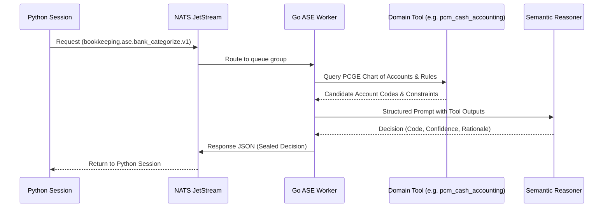

# Extending the Bookkeeping Runtime

This guide provides step-by-step instructions for safely extending Toro's **BookkeepingState** platform. It outlines how to add new semantic tools to the Go ASE worker, declare new operator inspection tools in Python, implement authoritative transition commands, and construct new synthetic evaluation scenarios without compromising accounting invariants.

---

## The Frozen Architectural Invariants (Non-Negotiable)

Before extending any component, understand the five non-negotiable architectural invariants that protect ledger integrity across the entire codebase:

> [!CAUTION]
> ### The 5 Non-Negotiable Invariants
> 1. **Integer `AmountUnits` ($10,000$ Scale)**:
>    All internal solvers, state models, database amounts, and reconciliation balances use exact integer units scaled by $10,000$ ($1\text{ MAD} = 10,000\text{ units}$). Floating-point numbers are strictly forbidden in accounting calculations.
> 2. **0.98 Policy Confidence Threshold**:
>    Autonomous residual bank classification requires $\ge 0.98$ confidence. Any classification below $0.98$ MUST enter a `HOLD` state with an explicit hold reason and required evidence. This threshold cannot be lowered.
> 3. **LLMs Reason, Solvers and Kernel Post**:
>    Large Language Models and semantic classifiers are strictly advisory. They suggest classifications, reasons, and account codes. Double-entry journal entries, payment settlements, and reconciliations are executed solely by deterministic mathematical solvers and the Django accounting kernel.
> 4. **Posting Reconciliations are Protected**:
>    A direct reconciliation created as part of a residual journal entry posting (`BookkeepingResidualBankPosting`) cannot be invalidated independently (`CANNOT_INVALIDATE_POSTING_RECONCILIATION`). Posting and reconciliation are atomically tied.
> 5. **Durable Mutation Requires Rehydration**:
>    Any command that commits mutations to PostgreSQL marks `BookkeepingState` closed (`APPLIED_REQUIRES_REHYDRATION`). The caller must rehydrate a fresh state ($P_{k+1} \to S_0$). In-memory state is never manually patched across durable commits.

---

## 1. Adding New Go ASE Domain Tools

The Autonomous Semantic Engine (ASE) runs as a compiled Go microservice subscribing to `worker.inbox.bookkeeping_ase_bank_categorizer`. It evaluates bank line items using structured domain tools, such as `pcm_cash_accounting` (which queries the Moroccan *Plan Comptable Général des Entreprises*).

### Architecture Overview



### Step 1: Implement the Domain Tool in Go

Domain tools are implemented in the Go worker repository under `services/ase/tools/`. Each tool implements a standard interface:

```go
package tools

import (
    "context"
    "github.com/usetoro/toro/pkg/accounting"
)

// TelecomExpenseTool specializes in identifying Moroccan telecom & utility transactions.
type TelecomExpenseTool struct {
    catalog *accounting.PCGECatalog
}

type TelecomAnalysis struct {
    IsTelecom       bool    `json:"is_telecom"`
    SuggestedCode   string  `json:"suggested_code"`
    DefaultVATRate  float64 `json:"default_vat_rate"`
    ConfidenceScore float64 `json:"confidence_score"`
}

func (t *TelecomExpenseTool) Analyze(ctx context.Context, description string) (*TelecomAnalysis, error) {
    normalized := normalizeBankDescription(description)
    
    // PCGE 61455: Téléphone et télécommunications
    if matchesVendor(normalized, []string{"MAROC TELECOM", "ORANGE", "INWI"}) {
        return &TelecomAnalysis{
            IsTelecom:       true,
            SuggestedCode:   "61455000",
            DefaultVATRate:  0.20,
            ConfidenceScore: 0.99,
        }, nil
    }
    
    return &TelecomAnalysis{IsTelecom: false}, nil
}
```

### Step 2: Register the Tool in the ASE Categorizer Pipeline

Add the tool to the categorizer's tool registry:

```go
// In services/ase/bank_categorizer.go
func (c *BankCategorizer) executeTools(ctx context.Context, item *BankItemPayload) (*ToolContext, error) {
    telecomTool := tools.NewTelecomExpenseTool(c.pcgeCatalog)
    telecomResult, err := telecomTool.Analyze(ctx, item.Description)
    if err != nil {
        return nil, err
    }
    
    // Attach to LLM context payload
    return &ToolContext{
        PCMContext:     c.pcmTool.Lookup(item.AmountUnits),
        TelecomContext: telecomResult,
    }, nil
}
```

### Step 3: Maintain NATS Contract Compatibility

Ensure any tool addition preserves the wire contract defined in `bookkeeping.ase.bank_categorize.v1`:
- Request must contain: `bank_item_id`, `amount_units`, `currency`, `description`, `direction`, `transaction_date`.
- Response must return: `status` (`CLASSIFIED` or `HOLD`), `account_code`, `confidence` (float in $[0.0, 1.0]$), `rationale`, and `hold_reason`.

---

## 2. Adding New Read-Only Operator Tools in Python

The `BookkeepingOperator` (`ledger/bookkeeping_state/operator/agent.py`) enables accountants and developers to query hydrated `BookkeepingState` in natural language.

### Rules for Operator Tools
1. **Strictly Read-Only**: Operator tools must query state or derived views. They must **never** call `TransitionEngine.apply_batch()` or execute SQL writes.
2. **Deterministic Inputs/Outputs**: Return JSON-serializable dictionaries formatted with `format_money()`.

### Step 1: Declare the Tool Schema in `operator/tools.py`

Add the JSON schema definition to `OPERATOR_TOOLS`:

```python
# In ledger/bookkeeping_state/operator/tools.py

OPERATOR_TOOLS.append({
    "type": "function",
    "name": "get_vat_exposure_summary",
    "description": (
        "Calculates estimated deductible VAT across all classified and posted "
        "residual bank expenses in the current state."
    ),
    "parameters": {
        "type": "object",
        "properties": {
            "period": {
                "type": "string",
                "description": "Optional ISO period filter, e.g. '2026-03'.",
            }
        },
        "required": [],
    },
})
```

### Step 2: Implement the Dispatcher Handler

Handle the tool invocation inside `execute_operator_tool()`:

```python
# In ledger/bookkeeping_state/operator/tools.py

def execute_operator_tool(
    workbench: BookkeepingWorkbench,
    tool_name: str,
    arguments: dict[str, Any],
) -> dict[str, Any]:
    # ... existing dispatch branches ...

    if tool_name == "get_vat_exposure_summary":
        period = arguments.get("period")
        state = workbench.state
        
        # Pure read-only computation over hydrated state
        total_deductible_vat_units = 0
        expense_count = 0
        
        for posting in state.residual_bank_postings.values():
            if not posting.is_active:
                continue
            # Check if contra account is deductible expense (PCGE Class 6)
            if posting.account_code.startswith("6"):
                # Estimate 20% standard Moroccan VAT rate: units * 20 / 120
                vat_portion = (posting.amount_units * 20) // 120
                total_deductible_vat_units += vat_portion
                expense_count += 1

        from ledger.bookkeeping_state_eval.money import format_money
        return {
            "period": period or "ALL",
            "qualifying_expense_count": expense_count,
            "estimated_deductible_vat": format_money(total_deductible_vat_units, currency=state.currency),
            "estimated_deductible_vat_units": total_deductible_vat_units,
        }
```

---

## 3. Adding New Authoritative Transition Commands

State mutations flow through typed `BookkeepingCommand` objects and registered `CommandHandler` classes.

### Step 1: Define the Command Dataclass

Create the command in `ledger/bookkeeping_state/commands/`:

```python
from dataclasses import dataclass
from typing import Optional
from ledger.bookkeeping_state.commands.base import BookkeepingCommand

@dataclass(frozen=True)
class AnnotateBankItemAuditNoteCommand(BookkeepingCommand):
    bank_item_id: str
    audit_note: str
    author_user_id: str
    expected_state_revision: Optional[int] = None
    expected_persistence_revision: Optional[int] = None

    @property
    def command_type(self) -> str:
        return "ANNOTATE_BANK_ITEM_AUDIT_NOTE"
```

### Step 2: Implement the Command Handler

Create the handler in `ledger/bookkeeping_state/transitions/handlers/`:

```python
from ledger.bookkeeping_state.transitions.handlers.base import CommandHandler
from ledger.bookkeeping_state.transitions.delta import StateDelta
from ledger.bookkeeping_state.transitions.result import CommandExecutionResult

class AnnotateBankItemAuditNoteHandler(CommandHandler[AnnotateBankItemAuditNoteCommand]):
    def check_preconditions(self, state: BookkeepingState, command: AnnotateBankItemAuditNoteCommand) -> None:
        if command.bank_item_id not in state.bank_items:
            raise ValueError(f"BankItem {command.bank_item_id} not found in state.")
        if not command.audit_note.strip():
            raise ValueError("Audit note cannot be blank.")

    def execute(self, state: BookkeepingState, command: AnnotateBankItemAuditNoteCommand) -> CommandExecutionResult:
        # Check OCC preconditions
        self.verify_revisions(state, command)
        
        # Create delta representing state mutation
        delta = StateDelta(
            delta_type="BANK_ITEM_NOTE_ADDED",
            entity_id=command.bank_item_id,
            payload={
                "audit_note": command.audit_note,
                "author_user_id": command.author_user_id,
            }
        )
        
        # In-memory only mutation does NOT require rehydration
        return CommandExecutionResult(
            success=True,
            deltas=[delta],
            rehydration_required=False,
        )
```

### Step 3: Register the Handler in `TransitionEngine`

Register the handler during engine initialization in `ledger/bookkeeping_state/transitions/engine.py`:

```python
self.register_handler(
    AnnotateBankItemAuditNoteCommand,
    AnnotateBankItemAuditNoteHandler(),
)
```

---

## 4. Adding New Synthetic Scenarios for E2E Evaluation

Synthetic scenarios in `ledger/bookkeeping_state_eval/scenarios/` provide reproducible test worlds for adversarial validation and benchmarking.

### Structure of a Scenario

Each scenario subclass defines an initial world of bank statement lines, accounts payable/receivable, and expected convergence criteria:

```python
from ledger.bookkeeping_state_eval.scenarios.base import BaseBookkeepingScenario
from ledger.bookkeeping_state.domain.bank import BankItem
from ledger.bookkeeping_state.domain.book import BookItem

class MultiCurrencyStagedSettlementScenario(BaseBookkeepingScenario):
    scenario_id = "CATALOG_20_MULTI_CURRENCY"
    description = "Tests multi-currency Stage 1 settlement with exchange variance."

    def build_initial_state(self) -> BookkeepingState:
        builder = self.create_state_builder()
        
        # Add bank items
        builder.add_bank_item(
            id="bank-eur-001",
            amount_units=100_000_000, # 10,000.00 EUR
            currency="EUR",
            description="WIRE IN - OVERSEAS CLIENT",
            date="2026-03-15",
        )
        
        # Add book obligations (Invoices)
        builder.add_book_item(
            id="inv-mad-001",
            amount_units=108_000_000, # 10,800.00 MAD equivalent
            currency="MAD",
            description="Facture Export FA-2026-088",
            date="2026-03-10",
        )
        
        return builder.build()

    def assert_expectations(self, final_state: BookkeepingState) -> None:
        # Define assertions
        assert final_state.queries.count_unreconciled_bank_items() == 0
```

### Registering and Running the Scenario

1. Register in `ledger/bookkeeping_state_eval/scenarios/catalog.py`:
   ```python
   SCENARIOS["CATALOG_20_MULTI_CURRENCY"] = MultiCurrencyStagedSettlementScenario
   ```
2. Run via the evaluation suite:
   ```bash
   ./.venv/bin/python ledger/bookkeeping_state_eval/lab.py --scenario CATALOG_20_MULTI_CURRENCY
   ```
3. Verify test coverage:
   ```bash
   make run_python_test test=python-worker/app/bookkeeping_state_eval/tests
   ```

---

## 5. Architectural Checklist for Reviewing PRs

When reviewing or submitting pull requests modifying the bookkeeping runtime, verify this checklist:

| Verification Item | Requirement | Passed? |
|---|---|:---:|
| **Zero Float Arithmetic** | All monetary amounts use `AmountUnits` (scaled integer $10,000$). | [ ] |
| **0.98 Threshold Intact** | Residual classifications strictly enforce $\ge 0.98$ for `CLASSIFIED`. | [ ] |
| **OCC Preconditions** | Any persistent command specifies and checks `expected_persistence_revision`. | [ ] |
| **Rehydration Boundary** | Any handler that writes to PostgreSQL sets `rehydration_required=True`. | [ ] |
| **Posting Protection** | `CANNOT_INVALIDATE_POSTING_RECONCILIATION` is preserved. | [ ] |
| **Case E Invariant** | Residuals with active posting history raise `ResidualBankInvariantCorruptionError`. | [ ] |
| **Test Coverage** | Unit tests added under `tests/` covering both happy path and edge failures. | [ ] |
