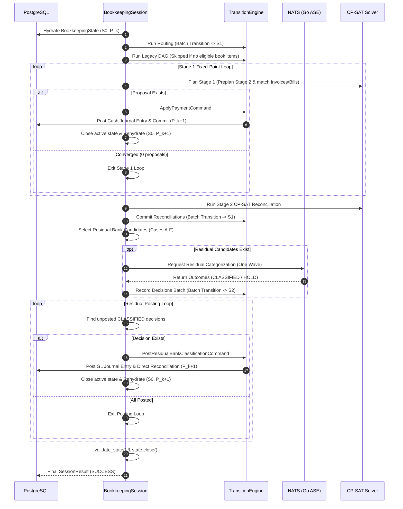

# The Bookkeeping Session Lifecycle

This document provides a step-by-step walkthrough of the production execution sequence orchestrated by `BookkeepingSession.run()` (`ledger/bookkeeping_state/session/bookkeeping_session.py`).

---

## 1. High-Level Execution Sequence

---

## 2. Detailed Stage Walkthrough

### Stage 1: State Hydration
- **Action**: `hydrator.hydrate(company_id, session_id)` loads company context, chart of accounts, bank accounts, bank items, book items, active reconciliations, payment applications, residual classifications, and evidence assertions.
- **State Transition**: Initializes `BookkeepingState` at local revision **$S_0$** and database persistence revision **$P_k$**.

### Stage 2: Routing Stage
- **Action**: `RoutingService.run()` evaluates every unrouted book item and finds candidate bank accounts based on currency and routing rules.
- **Transition**: If routing commands exist, builds `TransitionBatch` and applies through `TransitionEngine.apply_batch()`. Local revision advances ($S_0 \to S_1$). If zero commands exist, stage result is `SKIPPED`.

### Stage 3: Legacy BookItem DAG Stage
- **Action**: Calls `build_dag_view()` to collect unclassified book items.
- **Production Behavior**: Modern book items are approved invoice/bill obligations or posted cash transactions, which are ineligible for generic DAG re-classification. This stage is cleanly marked `SKIPPED` without invoking external models.

### Stage 4: Stage 1 Payment Application (Fixed-Point Loop)
Matches bank movements against approved, open obligations (`InvoiceModel` and `BillModel`):
1. **Two-Stage Coordination**: Invokes `plan_two_stage_bookkeeping()`. This runs a Stage 2 preplan that finds bank items already matchable to existing `POSTED_BOOK_ITEM` transactions and strictly excludes them from Stage 1.
2. **Canonical Proposal Selection**: Proposes payment applications for remaining bank items. Proposals are sorted canonically:
   $$\text{sort key} = (\text{bank\_item\_id}, \text{total\_amount\_units}, \text{sorted}(\text{obligation\_ids}))$$
3. **Execution**: The top proposal is executed with `ApplyPaymentCommand` authorized by an HMAC `Stage1ExecutionCapability`.
4. **GL Posting**: The Django accounting kernel executes `make_payment_with_result(commit=True)`, creating a posted cash transaction and updating invoice/bill balances.
5. **Rehydration**: Status `applied_requires_rehydration` closes the current state. The session rehydrates a fresh state at $P_{k+1}$ and repeats the loop until 0 proposals remain.
6. **Safety Bound**: Maximum iterations bounded by `len(bank_items)`. Duplicate bank item proposals abort with `FailureStage.LOOP_INVARIANT`.

### Stage 5: Stage 2 CP-SAT Reconciliation
- **Action**: `ReconciliationService.run()` formulates remaining bank items and all `POSTED_BOOK_ITEM` cash transactions into a Google OR-Tools CP-SAT discrete integer model.
- **Optimization**: Maximizes total reconciled value, minimizes lingering transaction fragments, and maximizes semantic compatibility score.
- **Transition**: Formulates accepted reconciliations as a `TransitionBatch`. Committed atomically to PostgreSQL.

### Stage 6: Residual Bank Selection (Cases A–F)
- **Action**: Calls `residual_bank_items_needing_semantic_evaluation()` on remaining bank items with positive unallocated units.
- **Eligibility Verification**:
  - **Case A**: Fresh residual item $\to$ **Eligible** (`supersedes_decision_id = None`).
  - **Case B**: Active `HOLD` exists $\to$ **Ineligible** (left unresolved).
  - **Case C**: Active unposted `CLASSIFIED` exists $\to$ **Ineligible** for ASE (reserved for posting loop).
  - **Case D**: Invalidated tip with no active successor $\to$ **Eligible** (`supersedes_decision_id = latest.id`).
  - **Case E**: Residual item has a durably posted decision in history $\to$ **Invariant Corruption Error** (aborts session immediately).
  - **Case F**: Fully reconciled items are omitted.

### Stage 7: Exactly One Bounded ASE Wave over NATS
- **Action**: If eligible candidates exist, compiles a `ResidualBankCategorizationView` and dispatches via `NatsAseBankCategorizer` to NATS subject `worker.inbox.bookkeeping_ase_bank_categorizer`.
- **Validation**:
  - Verifies whole-envelope response completeness: requested bank item IDs must match response outcome IDs exactly.
  - Verifies confidence threshold: decisions with $\ge 0.98$ confidence and valid account code become `CLASSIFIED`; otherwise `HOLD`.
- **Transition**: Applies a `TransitionBatch` of `RecordResidualBankClassificationCommand`s, atomically recording all decisions into persistence.

### Stage 8: Bounded Residual Posting Loop
- **Action**: Calls `get_unposted_classified_residual_decisions()`.
- **Execution**: Iterates through unposted `CLASSIFIED` decisions in deterministic date/ID order:
  1. Issues `PostResidualBankClassificationCommand`.
  2. Verifies account code belongs to entity default Chart of Accounts and is active.
  3. Obtains deterministic bank ledger (`get_or_create_bank_ledger`).
  4. Commits balanced 2-legged Journal Entry (debit vs. credit).
  5. Creates direct reconciliation linking the staged bank transaction and the newly created bank cash transaction.
  6. Creates `BookkeepingResidualBankPosting` provenance record.
  7. Advances persistence revision ($P_k \to P_{k+1}$) and rehydrates state.
- **Loop Bound**: Bounded by `len(bank_items)`. Loop completes when 0 unposted classified decisions remain.

### Stage 9: Final Validation & State Closure
- **Action**: Executes `validate_state(self._state)`.
- **Closure**: Marks `self._state.close()`. The state can never again be read or mutated.
- **Result**: Constructs and returns a sealed `SessionResult` containing stage execution statuses, failure reasons (if any), execution counts, and final persistence revision.

---

## 3. Worked Example: The Synthetic 7-Case Company

Here is how the 7 synthetic production cases progress across this exact lifecycle:

| Case | Description | Amount | Stage 1 (Payment App) | Stage 2 (Recon) | Stage 4.5 (Residual ASE) | Stage 4.5 (Posting Loop) | Final State |
|---|---|---|---|---|---|---|---|
| **Case 1** | Customer Invoice `INV-SYNTH-2026-001` + Bank Deposit | +10,000.00 MAD | **Applied**: Posts cash JE, settles invoice. | Reconciled via Stage 1 link. | Excluded (rem = 0) | None | Reconciled |
| **Case 2** | Supplier Bill `BILL-SYNTH-2026-001` + Bank Withdrawal | -4,500.00 MAD | **Applied**: Posts cash JE, settles bill. | Reconciled via Stage 1 link. | Excluded (rem = 0) | None | Reconciled |
| **Case 3** | Pre-posted Cash GL + Bank Deposit | +2,500.00 MAD | Excluded (Stage 2 preplan locks it). | **Reconciled**: CP-SAT links deposit to GL leg. | Excluded (rem = 0) | None | Reconciled |
| **Case 4** | DGI TVA Tax Outflow | -3,400.00 MAD | No open obligation match. | Unreconciled. | **Evaluated**: Case A $\to$ `CLASSIFIED` (Account `4456`). | **Posted**: Dr 4456 / Cr 5141, direct recon. | Reconciled |
| **Case 5** | Bank Account Maintenance Fee Outflow | -150.00 MAD | No open obligation match. | Unreconciled. | **Evaluated**: Case A $\to$ `CLASSIFIED` (Account `6147`). | **Posted**: Dr 6147 / Cr 5141, direct recon. | Reconciled |
| **Case 6** | Scrap Material Sales Inflow | +1,200.00 MAD | No open obligation match. | Unreconciled. | **Evaluated**: Case A $\to$ `CLASSIFIED` (Account `7127`). | **Posted**: Dr 5141 / Cr 7127, direct recon. | Reconciled |
| **Case 7** | Ambiguous Outflow Narrative | -7,850.00 MAD | No open obligation match. | Unreconciled. | **Evaluated**: Case A $\to$ `HOLD` (`HOLD_AMBIGUOUS`). | None (HOLD cannot be posted). | **Active HOLD** (Unresolved) |

### Net Outcome:
- **7 Bank Items Total**
- **6 Reconciled**: Cases 1, 2, 3, 4, 5, 6
- **1 Unresolved**: Case 7 (durable `HOLD`, surfaces in REPL with explicit hold reason)
- **Revision Progression**: $P_0 \to P_8$ (Initial seed $P_1$, 2 payment applications $\to P_3$, 3 residual postings $\to P_6$, direct recons $\to P_8$).
