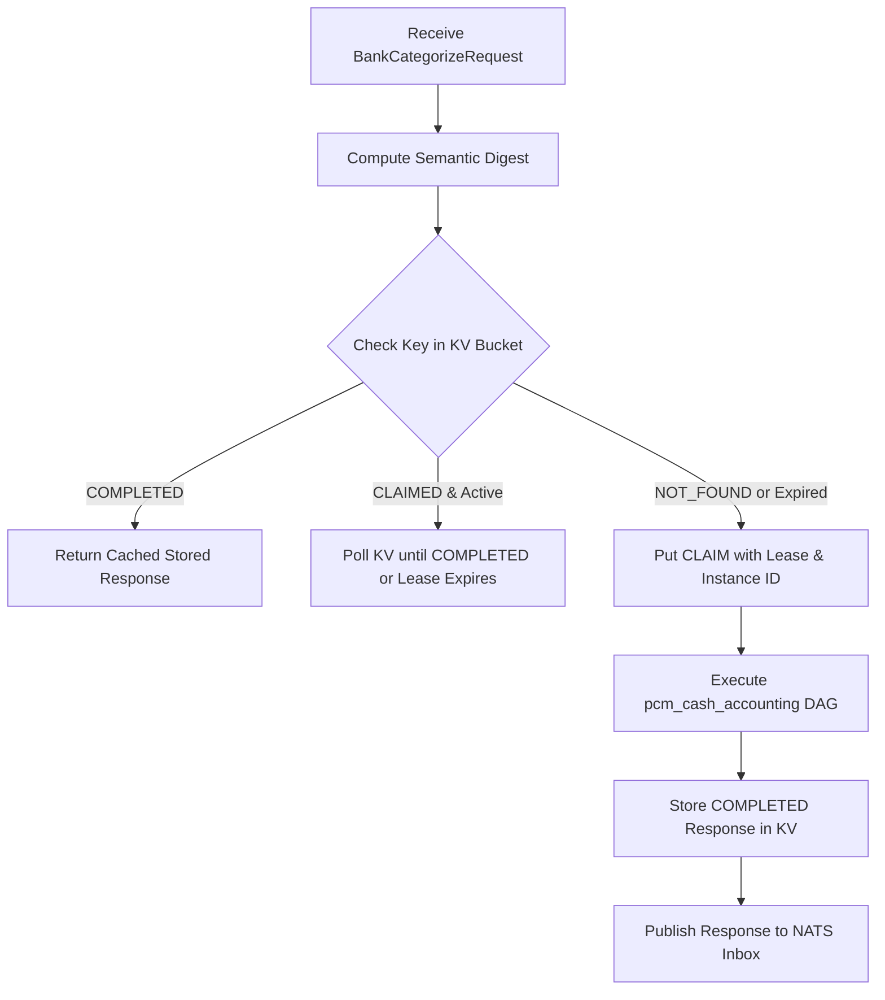

# NATS ASE Wire Contract & Transport Protocol

This document specifies the exact JSON wire protocol, NATS subject topology, JetStream KV idempotency mechanics, and distributed leasing between the Python bookkeeping core and the Go Autonomous Semantic Engine (ASE) worker.

---

## 1. Network Topology & Routing

| Attribute | Value |
|---|---|
| **Request Subject** | `worker.inbox.bookkeeping_ase_bank_categorizer` |
| **Queue Group** | `bookkeeping_ase_bank_categorizer_group` |
| **Schema Version** | `bookkeeping.ase.bank_categorize.v1` |
| **Authoritative DAG ID** | `bookkeeping_bank_categorization_v1` |
| **Caller Client** | `NatsAseBankCategorizer` (`bookkeeping_state/bank_categorization/nats_bank_categorizer.py`) |
| **Worker Implementation** | `BookkeepingAseBankCategorizerWorker` (`go/internal/workers/bookkeeping_ase_bank_categorizer_worker.go`) |
| **Default Timeout** | **10.0 seconds** |

---

## 2. Request Envelope Specification

The Python caller dispatches a JSON request envelope conforming to `BankCategorizeRequest`:

```json
{
  "schema_version": "bookkeeping.ase.bank_categorize.v1",
  "request_id": "req-bank-2026-04-15-001",
  "idempotency_key": "idemp-d0e1a1a0-7080-4500-a000-000070705001-s1",
  "company_id": "d0e1a1a0-7080-4500-a000-000070705001",
  "session_id": "synth-session-1726742400",
  "state_revision": 2,
  "persistence_revision": 3,
  "dag_id": "bookkeeping_bank_categorization_v1",
  "requested_at": "2026-04-15T12:00:00Z",
  "bank_items": [
    {
      "bank_item_id": "staged:cd9653bd-0e7a-4eff-b5a7-bf80da63ddbd",
      "bank_account_id": "acc-operating-mad",
      "residual_amount_units": 34000000,
      "original_amount_units": 34000000,
      "direction": "OUTFLOW",
      "date": "2026-04-15",
      "currency": "MAD",
      "description": "TELEPAIEMENT DIRECTION GENERALE DES IMPOTS TVA DGI REF 202604",
      "reference": "202604",
      "provenance_refs": ["import-job-2026-04"],
      "bank_account_name": "Attijariwafa Bank Principal",
      "institution_name": "Attijariwafa Bank",
      "counterparty_name": "DIRECTION GENERALE DES IMPOTS"
    }
  ]
}
```

### Request Fields Reference

| Field | Type | Description |
|---|---|---|
| `schema_version` | String | Must equal `"bookkeeping.ase.bank_categorize.v1"`. |
| `request_id` | String | Unique invocation ID for correlation. |
| `idempotency_key` | String | Deterministic key used for JetStream KV deduplication. |
| `company_id` | String | Entity UUID or slug. |
| `session_id` | String | Active session identifier. |
| `state_revision` | Integer | Local state revision at request generation ($S_k$). |
| `persistence_revision` | Integer | Database revision at request generation ($P_k$). |
| `dag_id` | String | Must equal `"bookkeeping_bank_categorization_v1"`. |
| `requested_at` | String (ISO 8601) | Timestamp of request creation. |
| `bank_items` | Array of Objects | Non-empty list of candidate movements. |

### Bank Item Fields Reference

| Field | Type | Description |
|---|---|---|
| `bank_item_id` | String | Must start with `"staged:"` or `"plaid:"`. |
| `bank_account_id` | String | Unique bank account ID. |
| `residual_amount_units` | Integer (int64) | Positive integer units ($10,000$ scale factor). |
| `original_amount_units` | Integer (int64) | Original statement units. Must be $\ge \text{residual\_amount\_units}$. |
| `direction` | String | Exactly `"INFLOW"` or `"OUTFLOW"`. |
| `date` | String (`YYYY-MM-DD`) | Transaction date. |
| `currency` | String | Exactly 3 uppercase letters (e.g. `"MAD"`). |
| `description` | String | Non-empty raw bank statement narrative. |
| `reference` | String \| null | Optional reference / check number. |
| `provenance_refs` | Array of Strings | Optional list of import job or source references. |
| `counterparty_name` | String \| null | Optional resolved counterparty name. |

---

## 3. Canonical Semantic Digest Computation

To guarantee distributed idempotency regardless of JSON key reordering or whitespace variance, both Python and Go compute an identical 64-hex SHA-256 hash:

1. **Sort Items**: Bank items are sorted ascending by `bank_item_id`.
2. **Normalize Fields**: Empty optionals become `""`; `provenance_refs` are deduplicated and sorted lexicographically.
3. **Deterministic UTF-8 Encoding**: Enforces strict key sorting with no HTML escaping and no trailing newline.
4. **Digest**: Computes $\text{SHA-256}(\text{Canonical Bytes})$.

```python
# Python implementation in bookkeeping_state.bank_categorization.transport_models
digest = compute_canonical_bank_payload_digest(
    schema_version=...,
    dag_id=...,
    company_id=...,
    session_id=...,
    state_revision=...,
    persistence_revision=...,
    bank_items=...,
)
```

---

## 4. Response Envelope Specification

The Go ASE worker returns a `BankCategorizeResponse`:

```json
{
  "schema_version": "bookkeeping.ase.bank_categorize.v1",
  "request_id": "req-bank-2026-04-15-001",
  "idempotency_key": "idemp-d0e1a1a0-7080-4500-a000-000070705001-s1",
  "session_id": "synth-session-1726742400",
  "state_revision": 2,
  "dag_id": "bookkeeping_bank_categorization_v1",
  "dag_run_id": "run-dag-88491",
  "status": "COMPLETED",
  "outcomes": [
    {
      "bank_item_id": "staged:cd9653bd-0e7a-4eff-b5a7-bf80da63ddbd",
      "status": "CLASSIFIED",
      "account_code": "4456",
      "confidence": 0.99,
      "rationale": "Matched Moroccan DGI TVA tax keyword in narrative",
      "evidence_refs": [],
      "ase_node_id": "node-pcge-tax-resolver",
      "terminal_property": "ACCOUNT_RESOLVED"
    },
    {
      "bank_item_id": "staged:144668c8-772d-4717-8357-f5a2e179b992",
      "status": "HOLD",
      "account_code": null,
      "confidence": 0.45,
      "rationale": "Description is ambiguous or missing source context",
      "hold_reason": "HOLD_AMBIGUOUS",
      "required_evidence": ["PROOF_OF_PAYMENT", "VENDOR_CONTRACT"],
      "ase_node_id": "node-classifier-ambiguity-gate"
    }
  ],
  "provider_issues": []
}
```

### Outcome Validation Rules
- If `status == "CLASSIFIED"`:
  - `account_code` is **required** and non-empty.
  - `hold_reason` must be **null**.
  - `confidence` must be between $0.0$ and $1.0$.
- If `status == "HOLD"`:
  - `account_code` must be **null**.
  - `hold_reason` is **required** and non-empty.

---

## 5. Distributed Idempotency & Claim Leasing

The Go worker (`BookkeepingAseBankCategorizerWorker`) uses a dedicated NATS JetStream Key-Value (KV) bucket to coordinate claims across distributed worker instances:



1. **Claim Lease Duration**: Defaults to 30 seconds. The worker sends heartbeats while inference executes.
2. **CAS Takeover**: If an instance crashes mid-execution, another worker takes over the claim using Compare-And-Swap (CAS) after lease expiration.
3. **Response Replay**: If the Python caller retries a request with the same semantic digest, the worker returns the completed response immediately from KV without re-running classification.

---

## 6. Error Handling: Operational vs. Semantic

Toro strictly distinguishes between **operational infrastructure failures** and **semantic business holds**:

| Failure Type | Example | Handling | Session Impact |
|---|---|---|---|
| **Operational Failure** | NATS down, worker timeout (10s), JSON serialization error, unhandled Go exception. | Handled as network/transport exception. | **Fails Closed**: `FailureStage.RESIDUAL_CATEGORIZATION`. Session aborts without modifying database. |
| **Semantic Hold** | Ambiguous transfer, insufficient context, confidence $0.92 < 0.98$. | Worker returns HTTP/NATS 200 with `status = "HOLD"` and `hold_reason`. | **Succeeds**: Persisted as a durable `HOLD` record. Session completes successfully. |

> [!CAUTION]
> **Operational Failures Never Convert to Holds**:
> If NATS is unreachable or the Go worker times out, the system will **never** silently convert the failure into a `HOLD` decision. Doing so would record false business truth in persistence. Operational failures must terminate the session with a non-zero exit code.
