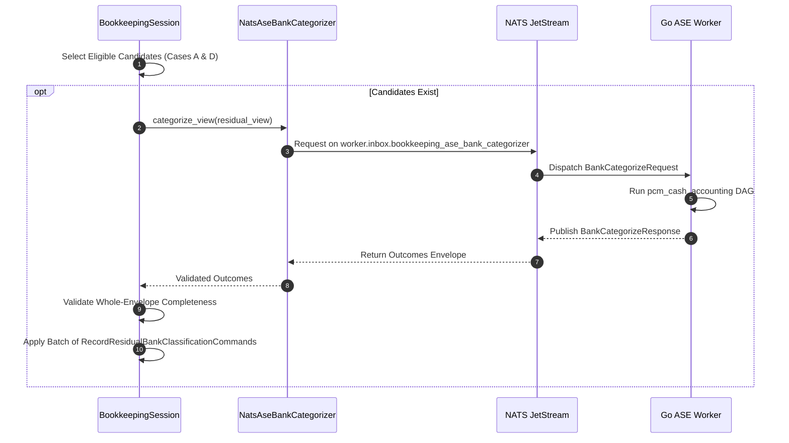
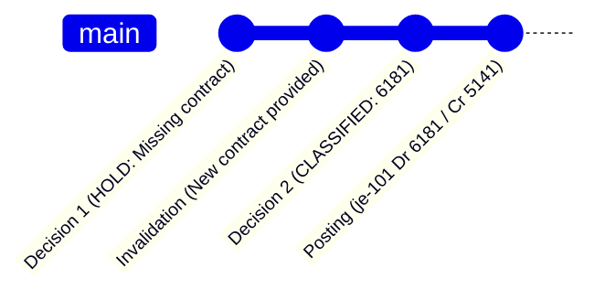

# Residual Bank Categorization & Semantic Evaluation

This document details the selection criteria, NATS protocol, and decision lifecycles of **Residual Bank Categorization** (`ledger/bookkeeping_state/bank_categorization/`).

---

## 1. What is an Economic Residual?

An **economic residual bank item** is an observed statement movement (`BankItem`) that retains positive unallocated units after both Stage 1 (Payment Application) and Stage 2 (Bank Reconciliation) have executed:

$$\text{remaining\_units}(b) = \text{original\_amount\_units}(b) - \text{allocated\_units}(b) > 0$$

These movements did not match any open invoices or bills, nor did they match any pre-posted General Ledger cash transactions. They represent bank-originated activities:
- Direct taxes (e.g. VAT, corporate tax)
- Bank service fees, agios, and commissions
- Miscellaneous revenues or asset sales
- Payroll disbursements
- Inter-account transfers
- Ambiguous deposits or withdrawals lacking clear documentation

---

## 2. Semantic Eligibility: Cases A through F

Not all residual bank items should be evaluated by the Autonomous Semantic Engine (ASE). Toro enforces a strict eligibility filter implemented in `residual_bank_items_needing_semantic_evaluation()` (`ledger/bookkeeping_state/bank_categorization/selection.py`):

| Case | Scenario | Eligibility | Engine Action |
|---|---|---|---|
| **Case A** | Fresh residual bank item with no prior classification history. | **ELIGIBLE** | Sent to Go ASE with `supersedes_decision_id = None`. |
| **Case B** | Residual bank item has an active `HOLD` decision in current state. | **INELIGIBLE** | **Leave unresolved**. Do not re-evaluate until human accountant supplies new evidence. |
| **Case C** | Residual bank item has an active unposted `CLASSIFIED` decision. | **INELIGIBLE** | **Skip ASE**. Eligible immediately for the Residual Posting Loop. |
| **Case D** | The latest decision tip was invalidated and no active successor exists. | **ELIGIBLE** | Sent to Go ASE with `supersedes_decision_id = latest.id` to append a new chain tip. |
| **Case E** | Residual item has positive remaining balance, but history shows a durably posted decision. | **CORRUPTION** | **Raises `ResidualBankInvariantCorruptionError`**. Aborts session immediately to protect accounting truth. |
| **Case F** | Bank item has `remaining_units == 0` (fully reconciled). | **EXCLUDED** | Filtered out by `residual_unmatched_bank_items()`. |

---

## 3. Exactly ONE Bounded ASE Wave over NATS

To prevent unbounded network loops and infinite agent polling, Toro enforces that **exactly one wave** of semantic categorization is issued per session:

### Whole-Envelope Completeness Check
The response envelope must satisfy exact set equality with the request:
$$\{ \text{outcome.bank\_item\_id} \} = \{ \text{requested.bank\_item\_id} \}$$
If the Go ASE returns missing items or unexpected IDs, the session fails closed (`FailureStage.RESIDUAL_CATEGORIZATION`).

---

## 4. Decision Outcomes: CLASSIFIED vs. HOLD

The Go ASE classifies each bank item according to policy thresholds:

### 1. `CLASSIFIED` (Account Identified)
- **Condition**: Confidence $\ge 0.98$, valid entity Chart of Accounts code, and no ambiguous flags.
- **Payload**:
  - `status`: `"CLASSIFIED"`
  - `account_code`: e.g. `"4456"`
  - `confidence`: e.g. `0.99`
  - `rationale`: Description matches catalog pattern.
- **Downstream**: Moves to the **Residual Posting Loop** for automated journal creation.

### 2. `HOLD` (Needs Attention)
- **Condition**: Confidence $< 0.98$ or ambiguous narrative lacking counterparty/context.
- **Payload**:
  - `status`: `"HOLD"`
  - `account_code`: `None`
  - `hold_reason`: e.g. `"HOLD_AMBIGUOUS"`, `"HOLD_INSUFFICIENT_EVIDENCE"`
  - `required_evidence`: e.g. `["PROOF_OF_PAYMENT", "VENDOR_CONTRACT"]`
- **Downstream**: Recorded as an active durable `HOLD`. **No journal entry is posted**. The bank item remains unresolved and surfaces in the REPL for accountant review.

---

## 5. Linear History, Supersession, and Invalidations

Decisions form an append-only, tamper-evident linear history:

1. **Initial Decision**: Root decision created with `supersedes_id = None`.
2. **Invalidation**: If new evidence emerges, `InvalidateResidualBankClassificationCommand` marks Decision 1 as retired.
3. **Supersession**: Next evaluation creates Decision 2 with `supersedes_id = Decision 1.id`.
4. **Permanent Seal**: Once posted to the ledger, a decision can **never be invalidated or superseded** (`CANNOT_INVALIDATE_POSTED_DECISION`).

---

## 6. Worked Production Examples

### Case 4: DGI VAT Payment $\to$ `CLASSIFIED` (Account `4456`)
- **Statement Line**: Outflow of -3,400.00 MAD ($34,000,000$ units), narrative `"TELEPAIEMENT DIRECTION GENERALE DES IMPOTS TVA DGI REF 202604"`.
- **ASE Evaluation**: Matches Moroccan tax administration keyword `DIRECTION GENERALE DES IMPOTS` and tax code `TVA`.
- **Outcome**: `CLASSIFIED`, Account `4456` (Etat, TVA due), Confidence `0.99`.
- **Posting Action**: Generates journal entry: Dr `4456` 3,400 MAD / Cr `5141` 3,400 MAD.

### Case 5: Bank Maintenance Fee $\to$ `CLASSIFIED` (Account `6147`)
- **Statement Line**: Outflow of -150.00 MAD ($1,500,000$ units), narrative `"COMMISSION BANCAIRE ET FRAIS TENUE DE COMPTE ATT-0426"`.
- **ASE Evaluation**: Matches bank charges keyword `COMMISSION BANCAIRE`.
- **Outcome**: `CLASSIFIED`, Account `6147` (Services bancaires), Confidence `0.99`.
- **Posting Action**: Generates journal entry: Dr `6147` 150 MAD / Cr `5141` 150 MAD.

### Case 6: Scrap Material Sale $\to$ `CLASSIFIED` (Account `7127`)
- **Statement Line**: Inflow of +1,200.00 MAD ($12,000,000$ units), narrative `"VENTE DE PRODUITS ACCESSOIRES MATERIEL REBUT"`.
- **ASE Evaluation**: Matches ancillary revenue keyword `PRODUITS ACCESSOIRES MATERIEL REBUT`.
- **Outcome**: `CLASSIFIED`, Account `7127` (Ventes de produits accessoires), Confidence `0.99`.
- **Posting Action**: Generates journal entry: Dr `5141` 1,200 MAD / Cr `7127` 1,200 MAD.

### Case 7: Ambiguous Transfer $\to$ `HOLD`
- **Statement Line**: Inflow of +7,850.00 MAD ($78,500,000$ units), narrative `"VIREMENT DIVERS REF 999888777 SANS OBJET PRECUS"`.
- **ASE Evaluation**: Narrative contains generic transfer keywords with no identifiable counterparty, invoice reference, or economic intent. Confidence $< 0.98$.
- **Outcome**: `HOLD`, `hold_reason = "HOLD_AMBIGUOUS"`, `rationale = "Description is ambiguous or missing source context"`.
- **Posting Action**: None. The item remains unresolved in state.
