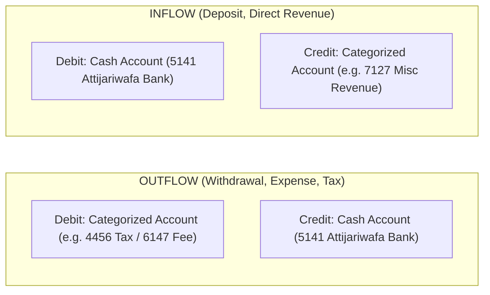

# Residual Bank Journal Posting & Direct Reconciliation

This document details the deterministic accounting execution phase: **Residual Bank Journal Posting** (`ledger/bookkeeping_state/transitions/handlers/residual_bank_classification.py` and `ledger/bookkeeping_state/persistence/writer.py`).

---

## 1. What is Residual Bank Posting?

When the Autonomous Semantic Engine (ASE) classifies a residual bank item with high confidence ($\ge 0.98$) into an entity-valid account code, that decision enters the **Residual Posting Loop**.

The posting engine converts the advisory semantic decision into authoritative General Ledger truth by:
1. Creating a balanced double-entry `JournalEntryModel`.
2. Establishing a **direct deterministic reconciliation** between the bank statement line and the newly created bank cash transaction.
3. Recording an immutable `BookkeepingResidualBankPosting` provenance record.
4. Advancing the database persistence revision ($P_k \to P_{k+1}$) and rehydrating state.

---

## 2. Pre-Execution Eligibility & Safety Checks

Before a `PostResidualBankClassificationCommand` is accepted, the transition handler and persistence writer enforce 10 preconditions under database row locks:

1. **OCC Revision Consistency**: `expected_state_revision == state.revision` and `expected_persistence_revision == state.persistence_revision`.
2. **Status Invariant**: The target decision status must be `CLASSIFIED`. (Decisions with status `HOLD` are strictly rejected with `CANNOT_POST_NON_CLASSIFIED_DECISION`).
3. **Chain Tip Invariant**: The decision must be the current latest tip of the bank item's classification history (`CANNOT_POST_NON_TIP_DECISION`).
4. **Active State**: The decision must not be invalidated and must not be superseded.
5. **Confidence Policy**: The decision confidence must meet or exceed the frozen policy threshold of **$0.98$** (`CONFIDENCE_BELOW_THRESHOLD`).
6. **Chart of Accounts Membership**: The account code must exist in the entity's active default Chart of Accounts (`default_coa_id`).
7. **Active Account Status**: The target account must be active (`account.active = True`).
8. **No Stage 1 Consumption**: The bank movement must not have been consumed by an executed payment application.
9. **Residual Capacity Match**: The residual amount units under database lock must exactly match the decision's `residual_amount_units`.
10. **Closed Period Protection**: The transaction date must not fall within a closed accounting period (`entity.last_closing_date`).

---

## 3. Deterministic Bank Ledger Resolution

Toro assigns transactions to dedicated, isolated sub-ledgers.
Residual bank postings are committed to a deterministic bank sub-ledger resolved via `get_or_create_bank_ledger(bank_account=ba)` (`ledger/bookkeeping_state/persistence/bank_ledger.py`):

- **Ledger XID**: Derived deterministically as `f"bank-ledger-{bank_account.uuid}"`.
- **Status Checks**: Verifies that the bank ledger is posted and not locked (`BANK_LEDGER_LOCKED`).

---

## 4. Double-Entry Direction Rules

The persistence writer converts the normalized cash movement direction into standard double-entry accounting transactions:



### Exact Rules:

#### 1. Bank Outflow (Withdrawal)
- **Debit**: Contra Account (increases expense or settles liability)
- **Credit**: Bank Cash Account (`ASSET_CA_CASH`, decreases asset)
- **Example (Case 4 - DGI VAT)**:
  - **Debit**: Account `4456` (Etat, TVA due) $\to 3,400.00$ MAD
  - **Credit**: Account `5141` (Attijariwafa Bank) $\to 3,400.00$ MAD

#### 2. Bank Inflow (Deposit)
- **Debit**: Bank Cash Account (`ASSET_CA_CASH`, increases asset)
- **Credit**: Contra Account (increases revenue or equity)
- **Example (Case 6 - Scrap Material Sale)**:
  - **Debit**: Account `5141` (Attijariwafa Bank) $\to 1,200.00$ MAD
  - **Credit**: Account `7127` (Ventes de produits accessoires) $\to 1,200.00$ MAD

---

## 5. Direct Deterministic Reconciliation

When an ordinary bank item is reconciled in Stage 2, it matches an existing transaction posted earlier by another subsystem.
In residual bank posting, **the posting and reconciliation occur atomically**:

1. The kernel posts the Journal Entry, creating two `TransactionModel` rows:
   - `bank_tx`: The cash leg on account `5141`.
   - `contra_tx`: The counterparty leg on the categorized account.
2. The writer immediately creates a `BookkeepingReconciliation`:
   - `BookkeepingReconciliationBankAllocation`: Links the external `StagedTransactionModel` line for its residual units.
   - `BookkeepingReconciliationBookAllocation`: Links the newly created `bank_tx` row for the exact same amount.
3. Both the bank movement and the ledger cash leg are simultaneously cleared (`remaining_units = 0`).

---

## 6. Immutable Provenance: `BookkeepingResidualBankPosting`

To bind all related artifacts into one immutable unit, the writer inserts a row into `BookkeepingResidualBankPosting`:

```python
BookkeepingResidualBankPosting.objects.create(
    id=f"rbp_{uuid.uuid4().hex[:16]}",
    entity=entity,
    classification=dec_row,              # OneToOne -> Decision
    staged_transaction=stx,             # ForeignKey -> Staged Transaction
    journal_entry=je,                   # OneToOne -> Journal Entry
    bank_cash_transaction=bank_tx,      # OneToOne -> Bank Cash Leg
    contra_transaction=contra_tx,       # OneToOne -> Contra Leg
    reconciliation=recon,               # OneToOne -> Direct Reconciliation
    persistence_revision=new_rev,       # Authoritative revision committed
    posted_at=now_ts,
)
```

### Table Invariants Enforced in Database:
- `check_res_bank_posting_persistence_rev_positive`: Revision must be $> 0$.
- `check_res_bank_posting_distinct_tx_legs`: `bank_cash_transaction != contra_transaction`.

---

## 7. Replay Semantics & Sealed Decisions

### Idempotent Replay (NOOP)
If `PostResidualBankClassificationCommand` is issued for a decision that was already posted:
1. The handler compares the command's expected values (`bank_item_id`, `amount`, `account_code`, `direction`) against the existing posted decision.
2. If all values match identically, it returns an empty `PersistenceWriteSet` (NOOP). The engine treats this as an idempotent success without incrementing revisions or raising errors.
3. If any field conflicts, it rejects with `DECISION_ALREADY_POSTED`.

### Sealed Decisions & No Reversal Workflow Yet
> [!IMPORTANT]
> **No Standalone Reversal**:
> Once a decision is durably posted, it is **permanently sealed**.
> - It cannot be invalidated (`CANNOT_INVALIDATE_POSTED_DECISION`).
> - It cannot be superseded by a new decision.
> - Its reconciliation cannot be invalidated (`CANNOT_INVALIDATE_POSTING_RECONCILIATION`).
> 
> A formal posting reversal workflow (issuing reversing journal entries and un-reconciling legs) is planned for future releases. Until then, posted decisions are irrevocable.
