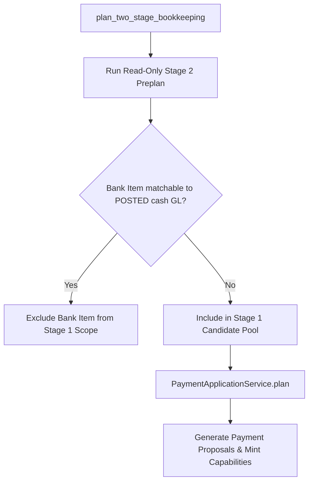

# Stage 1: Payment Application & Obligation Settlement

This document details the mechanics, capability security, and accounting execution of **Stage 1: Payment Application** (`ledger/bookkeeping_state/payment_application/`).

---

## 1. What is Stage 1?

Stage 1 is the accounting execution phase where observed bank movements are matched against **approved, unposted obligations**:
- Customer Invoices (`InvoiceModel` where `invoice_status = APPROVED`)
- Vendor Bills (`BillModel` where `bill_status = APPROVED`)

Unlike Stage 2 (which merely reconciles bank movements with existing General Ledger entries), **Stage 1 mutates the General Ledger**: it issues real double-entry cash payments via the Django accounting kernel (`make_payment_with_result(commit=True)`), settles receivable or payable balances, and creates immutable provenance records.

---

## 2. Two-Stage Settlement Coordination

Before Stage 1 can propose settlements, it must guarantee that it never intercepts a bank item that was already matched to a posted cash transaction in the General Ledger.

This invariant is enforced by `plan_two_stage_bookkeeping()` (`ledger/bookkeeping_state/payment_application/coordinator.py`):



1. **Stage 2 Preplan**: Evaluates all bank items against `POSTED_BOOK_ITEM` cash transactions using the reconciliation optimizer.
2. **Exclusion**: Any bank item with selectable posted authority is strictly excluded from Stage 1 consideration.
3. **Stage 1 Candidate Pool**: Only truly unposted bank movements enter Stage 1.

---

## 3. Cryptographic Execution Capability

To prevent race conditions, unauthorized command injection, or execution against stale state, Stage 1 uses an HMAC-signed token: `Stage1ExecutionCapability` (`ledger/bookkeeping_state/payment_application/capability.py`).

```python
@dataclass(frozen=True, slots=True)
class Stage1ExecutionCapability:
    capability_token: str
    bank_item_id: str
    bank_account_id: str
    direction: Direction
    currency: str
    amount_units: int
    date: date
    obligation_allocations: tuple[PaymentObligationAllocation, ...]
    session_id: str
    state_revision: int
    state_fingerprint: str
    issued_at: datetime
```

### Verification Under Lock
When `ApplyPaymentCommand` arrives at `_handle_apply_payment`:
1. The capability token is verified against the coordinator's secret key.
2. The command parameters must match the capability token exactly.
3. `state.revision` must match `capability.state_revision`.
4. `state_fingerprint(state)` must match `capability.state_fingerprint`.

If any check fails, the transition is rejected with `RejectionCode.CAPABILITY_VERIFICATION_FAILED`.

---

## 4. The Fixed-Point Loop

Because each payment application commits real accounting rows and modifies invoice/bill balances, Stage 1 executes as a **bounded fixed-point loop** inside `BookkeepingSession`:

```python
executed_bank_items = set()
iteration = 0
max_iterations = max(1, len(self._state.bank_items))

while True:
    two_stage_plan = plan_two_stage_bookkeeping(...)
    if not two_stage_plan.payment_application_plan.proposals:
        break  # Converged; proceed to Stage 2

    # Canonical single-intent selection rule:
    # Sort by bank_item_id, then total_amount_units, then sorted obligation book_item_ids
    selected_proposal = sorted(two_stage_plan.payment_application_plan.proposals, ...)[0]

    if selected_proposal.bank_item_id in executed_bank_items:
        raise LoopInvariantError("Duplicate bank item proposed in Stage 1")

    if iteration >= max_iterations:
        raise LoopInvariantError("Stage 1 safety bound exceeded")

    cmd = ApplyPaymentCommand.from_intent(selected_proposal.intent, capability=...)
    apply_res = self._engine.apply(state=self._state, command=cmd)

    if apply_res.applied_requires_rehydration:
        executed_bank_items.add(selected_proposal.bank_item_id)
        # Close current state and rehydrate fresh from database
        self._state = self._hydrator.hydrate(company_id=company_id, session_id=session_id)
        iteration += 1
```

---

## 5. Kernel Accounting Execution & Provenance

When the `PersistenceWriter` processes `ApplyPaymentCommand`:

1. **Row Lock**: Acquires row lock on `EntityModel` and `BookkeepingRevision` via `select_for_update()`.
2. **Obligation Lock**: Resolves target `InvoiceModel` or `BillModel` and acquires row lock.
3. **Execution**: Invokes the Django ledger payment engine:
   ```python
   # For Invoices:
   invoice.make_payment_with_result(
       amount=amount_dec,
       cash_account=cash_account,
       date_paid=payment_date,
       commit=True,
   )
   ```
4. **GL Journal Entry**: The kernel creates a posted `JournalEntryModel` balancing cash and AR/AP:
   - Customer Invoice Settlement: Dr Cash (`5141`) / Cr Accounts Receivable (`3421`).
   - Supplier Bill Settlement: Dr Accounts Payable (`4411`) / Cr Cash (`5141`).
5. **Durable Provenance**:
   - Inserts `BookkeepingPaymentApplication`:
     - Records `plaid_transaction` or `staged_transaction` foreign key.
     - Records `total_amount_units`, `direction`, `currency`, `session_id`.
   - Inserts `BookkeepingPaymentApplicationAllocation`:
     - Records foreign keys to the settled `InvoiceModel` or `BillModel`.
     - Links directly to the resulting posted cash `TransactionModel` row.
6. **Revision Increment**: Increments `BookkeepingRevision.revision` by $+1$.

---

## 6. Worked Example: Invoice & Bill Settlement

### Scenario A: Customer Invoice Settlement (Case 1)
- **Approved Invoice**: `INV-SYNTH-2026-001` for 10,000.00 MAD ($100,000,000$ units), AR account `3421`.
- **Bank Statement Line**: Staged deposit of 10,000.00 MAD, description `"VIREMENT CLIENT ATLAS SARL REF INV-SYNTH-2026-001"`.
- **Stage 1 Execution**:
  1. Matches customer identity and exact invoice reference.
  2. Executes `invoice.make_payment_with_result(10000.00, cash_account=5141, commit=True)`.
  3. Journal Entry committed:
     - **Debit**: `5141` Attijariwafa Bank $\to 10,000.00$ MAD
     - **Credit**: `3421` Clients $\to 10,000.00$ MAD
  4. Invoice `amount_due` drops from `10000.00` to `0.00` (`is_paid = True`).
  5. Inserts `BookkeepingPaymentApplication` linking staged bank item `FIT-SYNTH-CASE1-INVOICE` to the new cash transaction.

### Scenario B: Supplier Bill Settlement (Case 2)
- **Approved Bill**: `BILL-SYNTH-2026-001` for 4,500.00 MAD ($45,000,000$ units), AP account `4411`.
- **Bank Statement Line**: Staged withdrawal of -4,500.00 MAD, description `"VIREMENT FOURNISSEUR EQUIPEMENT SARL BILL-SYNTH-2026-001"`.
- **Stage 1 Execution**:
  1. Matches vendor identity and exact bill reference.
  2. Executes `bill.make_payment_with_result(4500.00, cash_account=5141, commit=True)`.
  3. Journal Entry committed:
     - **Debit**: `4411` Fournisseurs $\to 4,500.00$ MAD
     - **Credit**: `5141` Attijariwafa Bank $\to 4,500.00$ MAD
  4. Bill `amount_due` drops from `4500.00` to `0.00` (`is_paid = True`).
  5. Inserts `BookkeepingPaymentApplication` linking staged bank item `FIT-SYNTH-CASE2-BILL` to the new cash transaction.
