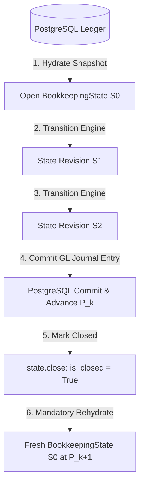

# State Model & In-Memory Lifecycle

This document describes the internal structure, indexing, concurrency controls, validation mechanisms, and lifecycle semantics of `BookkeepingState`.

---

## 1. The BookkeepingState Object

`BookkeepingState` (`ledger/bookkeeping_state/state/bookkeeping_state.py`) represents an in-memory, immutably indexed working view of a company's financial reality at a specific point in time.

### Contained Collections

An active state instance contains internal dictionaries of frozen domain entities:

- **`context`**: `BookkeepingContext` (company ID, period boundaries, base currency, accounting policy).
- **`bank_accounts`**: Map of `bank_account_id -> BankAccount`.
- **`bank_items`**: Map of `bank_item_id -> BankItem` (observed statement transactions).
- **`book_items`**: Map of `book_item_id -> BookItem` (staging obligations and posted cash transactions).
- **`routing_decisions`**: Map of `book_item_id -> RoutingDecision`.
- **`classifications`**: Map of `book_item_id -> ClassificationDecision` (legacy DAG decisions).
- **`reconciliations`**: Map of `reconciliation_id -> Reconciliation`.
- **`reconciliation_invalidations`**: Map of `invalidation_id -> ReconciliationInvalidation`.
- **`executed_payment_applications`**: Map of `payment_app_id -> ExecutedPaymentApplication`.
- **`residual_bank_classifications`**: Map of `decision_id -> ResidualBankClassificationDecision`.
- **`residual_bank_classification_invalidations`**: Map of `invalidation_id -> ResidualBankClassificationInvalidation`.
- **`residual_bank_postings`**: Map of `posting_id -> ResidualBankPosting`.
- **`book_item_evidence_assertions`**: Map of `assertion_id -> BookItemEvidenceAssertion`.
- **`book_item_evidence_invalidations`**: Map of `invalidation_id -> BookItemEvidenceInvalidation`.

---

## 2. Revisions and State Fingerprints

### Local State Revision ($S_k$) vs. Persistence Revision ($P_k$)

Toro maintains a strict dual-revision system:

```text
Persistence Revision (P_k):   P0 ──────────────> P1 ──────────────> P2 (Authoritative in DB)
                               │                  │                  │
Hydration:                     ▼                  ▼                  ▼
Local State Revision (S_k):   S0 ──> S1 ──> S2   S0 ──> S1          S0 (Ephemeral in Memory)
```

1. **`persistence_revision` ($P_k$)**:
   - Represents the monotonic version of the durable PostgreSQL ledger (`BookkeepingRevision.revision`).
   - Remains constant throughout an in-memory session until an atomic commit advances it.
2. **`revision` ($S_k$)**:
   - Represents the monotonic step index of the in-memory session.
   - Always resets to **$S_0$** upon fresh hydration.
   - Advances by $+1$ for every applied in-memory transition command or batch.

### State and Artifact Fingerprints

To ensure deterministic state comparison and detect unexpected memory mutations, Toro computes SHA-256 state fingerprints:

- **`state_fingerprint(state: BookkeepingState) -> str`**:
  Computes a 64-hex SHA-256 digest over the canonical JSON serialization of all contained domain entities, sorted by primary IDs.
- **`artifact_fingerprint(artifact: Any) -> str`**:
  Computes a canonical hash for an individual domain entity.

Before executing sensitive mutations (such as Stage 1 payment execution), the coordinator verifies that the state fingerprint matches the capability token minted during planning.

---

## 3. The Query Layer (`BookkeepingQueries`)

`BookkeepingQueries` (`ledger/bookkeeping_state/state/queries.py`) is the read-only projection layer wrapping `BookkeepingState`. Callers never inspect raw state dictionaries directly; they invoke query methods.

### Cached Derived State (`BookkeepingDerivedState`)
To ensure high-performance evaluations during combinatorial solving, `BookkeepingQueries` computes and memoizes a `BookkeepingDerivedState` (`ledger/bookkeeping_state/state/derived.py`):

- **Active Reconciliations**: Filters out reconciliations that have entries in `reconciliation_invalidations`.
- **Allocated Units**: Calculates total allocated units per `bank_item_id` and `book_item_id`.
- **Remaining Units**:
  ```python
  def bank_remaining_units(self, bank_item_id: str) -> int:
      item = self.bank_item(bank_item_id)
      allocated = self._derived.bank_allocated_units.get(bank_item_id, 0)
      return amount_units_to_int(item.amount_units) - allocated
  ```
- **Active Residual Classifications**: Evaluates the latest decision tip per bank item and verifies that no invalidation record exists for that tip.
- **Posting Lookup Indexes**:
  - `get_residual_bank_posting_for_decision(decision_id: str) -> ResidualBankPosting | None`
  - `get_residual_bank_posting_for_reconciliation(reconciliation_id: str) -> ResidualBankPosting | None`

---

## 4. State Validation (`validate_state`)

Before a bookkeeping session concludes or seals a result, it executes `validate_state(state)` (`ledger/bookkeeping_state/state/validation.py`).

### Invariant Checks Performed:
1. **Conservation of Money**:
   For every active reconciliation, total bank allocations must exactly equal total book allocations:
   $$\sum_{a \in \text{bank\_alloc}} a.\text{amount\_units} = \sum_{b \in \text{book\_alloc}} b.\text{amount\_units}$$
2. **Allocation Non-Overconsumption**:
   For every `BankItem` and `BookItem`, total active allocated units cannot exceed original units:
   $$\text{allocated\_units} \le \text{original\_amount\_units}$$
3. **Currency Homogeneity**:
   All allocations within a reconciliation must match the currency of the reconciled items.
4. **Active Unposted Decisions Invariant**:
   No economic residual bank item may possess an active `CLASSIFIED` decision that lacks a corresponding `ResidualBankPosting`.
5. **Posting Reconciliation Ownership**:
   Every `ResidualBankPosting` must reference a valid, active direct reconciliation whose allocations match the residual amount and accounts.

If any invariant fails, `StateValidationReport.is_valid` is `False`, and the session terminates with an error.

---

## 5. State Closure & Rehydration Lifecycle



### Why Committed Accounting Mutations Require Rehydration

When an engine command performs a real accounting transaction (such as `ApplyPaymentCommand` or `PostResidualBankClassificationCommand`), the Django kernel:
1. Locks database rows (`SELECT FOR UPDATE`).
2. Creates a posted `JournalEntryModel`.
3. Creates new `TransactionModel` debit and credit legs.
4. Updates bank account running balances and invoice `amount_due` balances.
5. Advances the persistence revision in `BookkeepingRevision`.

Because authoritative ledger rows have changed outside the memory graph, **it is unsafe to attempt to patch in-memory state via synthetic delta objects**.

Instead:
1. The transition engine returns status `applied_requires_rehydration = True`.
2. The active `BookkeepingState` is immediately closed (`state.close()`, setting `is_closed = True`). Any subsequent read or write to this state raises `RuntimeError("State is closed")`.
3. The session invokes `hydrator.hydrate()` to load a clean, authoritative snapshot from PostgreSQL, resetting the local state to **$S_0$** at the new persistence revision **$P_{k+1}$**.
