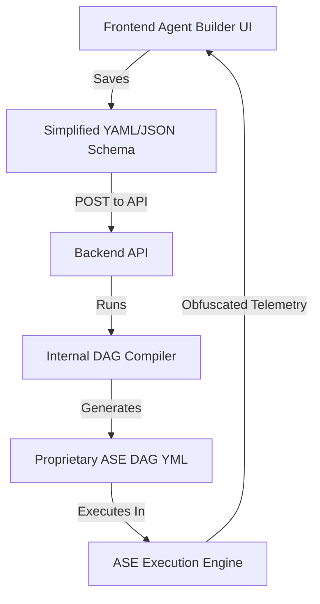

# Design Memo: Dynamic Workflow Abstraction & Trade Secret Protection

## Objective
To enable users to dynamically create custom agents and workflows without exposing our proprietary, high-complexity DAG (Directed Acyclic Graph) architecture, prompts, and execution topologies.

---

## 1. The Core Strategy: Abstraction & Compilation
We must decouple the **User Representation** of an agent/workflow from the **Internal Execution Graph (DAG)**. 

Users should write simple, intent-based declarations. Our backend will act as a **Compiler** that translates these declarations into our proprietary, highly complex `ase` DAG configurations (`.yml`).



---

## 2. Defining the User-Facing Schema (The "Recipe")
Instead of exposing nodes, gates, parent-child transitions, and prompt blocks, the user configures a simplified **"Agent Recipe"** focused on **Triggers, Rules, and Outflows**.

### Example User-Facing JSON (Dynamic Configuration)
```json
{
  "agent_id": "contractor_auditor",
  "name": "Contractor Tax Compliance Agent",
  "rules": [
    {
      "trigger": "outflow_transaction",
      "conditions": {
        "category": "services",
        "amount_gt": 1000
      },
      "actions": [
        {
          "type": "require_document",
          "document_type": "Tax_ID_or_ICE",
          "fail_action": "email_request",
          "email_template": "Please reply with your Identifiant Fiscal."
        }
      ]
    }
  ]
}
```

---

## 3. The Backend Compiler (`DAGBuilder`)
On the backend, we implement a translation layer that hydrates this simplified recipe into our proprietary DAG nodes.

### Compilation Mapping Example:
*   `require_document` compiles to:
    *   A `holding_gate` node.
    *   An injection of our custom `universal_outflow_compliance_specialist` prompt.
    *   The creation of a specialized `recovery_policy` block referencing `queue_client_request` and the custom email template.
    *   The creation of target edges routing to an `account_selection` terminal node.

By keeping the compiler entirely on our backend and database layers, the user **never** sees:
1.  Our prompt guardrails (`_shared_guardrails`, accounting rules).
2.  Our internal classification node list (`macro_classifier_inflow_specialist`, etc.).
3.  Our internal Go action provider names (`qbo_w9_lookup`, `db_receipt_lookup`).

---

## 4. Execution & Logging Obfuscation
Even if the DAG is compiled privately, exposing raw node executions during runtime could leak the graph's structure. We must mask telemetry:

*   **Internal Node States**: Nodes like `macro_classifier_outflow_specialist` $\rightarrow$ `account_type_expense_specialist` $\rightarrow$ `expense_compliance_router` $\rightarrow$ `universal_outflow_compliance_gate` execute normally.
*   **Obfuscated Progress Reporting**: The client-side status is rolled up into a simplified progress bar:
    1.  `Ingested` (Trigger)
    2.  `Checking Compliance` (All intermediate classification & compliance gates)
    3.  `Action Required` (If held) / `Approved` (If terminal reached)
*   **Prompt Hiding**: When debugging via the UI, the system only shows the user-provided rules and the LLM's final reasoning/explanation, stripping out system prompts and structural YAML keys.

---

## 5. Summary of Benefits
*   **IP Protection**: Our secret sauce (the CGI rules, confidence guardrails, gate topology) remains entirely hidden inside our Go backend.
*   **User Experience**: Users get a clean "If/Then" rule builder rather than a complex node-graph editor.
*   **System Integrity**: We prevent users from writing invalid graph paths or infinite loops.
