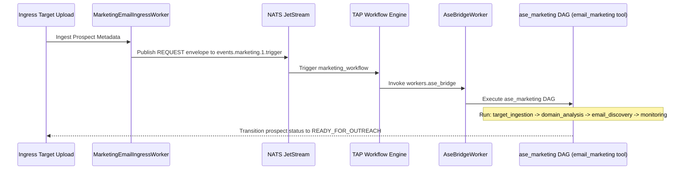
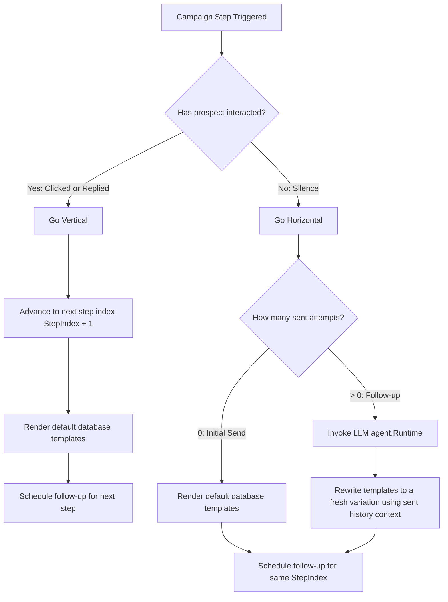

# Product Requirement Document (PRD)

## Project Name: Toro GTM "Infinite Survival" Engine (Virtual Staff)

---

## 1. Executive Summary & Philosophy

### 1.1 Core Mission

The Toro GTM Engine is an AI-native outbound outreach and relationship nurturing virtual staff designed specifically for introverted solo founders. Its primary objective is to turn cold customer acquisition into an **infinitely repeated game**, completely decoupling the founder’s psychological capital from market rejection and silence.

### 1.2 The "Infinite Game" Axiom

In a standard vertical drip sequence, a non-response drops the prospect further down a linear path, leading to exhaustion of both the lead list and messaging angles.

This engine operates on an **Asymmetric Horizontal Iteration** model: if a prospect is silent at a specific structural workflow level (e.g., Initial Outreach), the system refuses to move forward vertically. Instead, it systematically executes horizontal permutations at that same level until a deterministic outcome (Positive Engagement, Explicit Opt-Out, or Axis Exhaustion) occurs. Failure is rendered mathematically irrelevant because every non-response is absorbed as telemetry data to dynamically optimize subsequent prompts and templates.

```
Linear (Traditional) vs Horizontal (Toro) Sequence Path:

Traditional: [Hook A] ──(Silence)──> [Follow-up A2] ──(Silence)──> [Case Study A3] ──> Drop
Toro GTM:   [Hook A] ──(Silence)──> [Hook B (Retrieved from Vector memory)] ──(Silence)──> [Hook C...Z] ────> Match/Opt-out
```

---

## 2. System Architecture & Native Toro Integration

The GTM Engine runs natively on top of the existing Toro platform primitives, avoiding new infrastructure complexity by leveraging NATS JetStream events, Redis-based state serialization, and local in-memory batch execution.

| Abstract Component | Native Toro Implementation |
| --- | --- |
| **Workflow State Ledger** | Redis cache via [MarketingStore](file:///Users/Yankz/programming/usetoro/go/internal/erp/ase/domain_tools/marketing_store.go#L16) mapping to the key prefix `ase:active:` and tracking history in the `ExecutionTrace` array of [AutonomousSemanticEngineNode](file:///Users/Yankz/programming/usetoro/go/internal/erp/ase/node.go#L59) |
| **Pipeline Core Logic** | Encapsulated in [dag.go](file:///Users/Yankz/programming/usetoro/go/internal/erp/ase/dag.go) and constructed dynamically using [BuildDAGFromConfig](file:///Users/Yankz/programming/usetoro/go/internal/erp/ase/dag.go#L542) from [ase_marketing.yml](file:///Users/Yankz/programming/usetoro/go/internal/erp/ase/dags/ase_marketing.yml) and [marketing_email.yml](file:///Users/Yankz/programming/usetoro/go/internal/erp/ase/dags/marketing_email.yml) |
| **Failure/Rejection Capture** | Fed back as a programmatic `HoldReason` when classification confidence falls below the `confidence_threshold` (0.98 default) |
| **Human Gatekeeper Intercept** | Managed by transitioning items to durable hold states like [StateHoldAmbiguous](file:///Users/Yankz/programming/usetoro/go/internal/erp/ase/node.go#L24) or [StateHoldMissingCtx](file:///Users/Yankz/programming/usetoro/go/internal/erp/ase/node.go#L25) |

---

## 3. Detailed Functional Requirements

### 3.1 Horizontal Ingestion and Copy Generation Module

The engine treats non-response not as a signal to advance the timeline, but as a trigger to swap semantic hooks at the identical structural depth of the graph.

* **Target Ingestion & Validation:** Leads are ingested via the [MarketingEmailIngressWorker](file:///Users/Yankz/programming/usetoro/go/internal/workers/marketing_email_ingress_worker.go#L15) and passed to the target validation flow inside [ase_marketing.yml](file:///Users/Yankz/programming/usetoro/go/internal/erp/ase/dags/ase_marketing.yml). This does CSV ingestion, domain analysis, SMTP discovery, and deliverability checks, resolving valid leads into `READY_FOR_OUTREACH`.
* **Vector Memory Integration:** The copywriter node in [marketing_email.yml](file:///Users/Yankz/programming/usetoro/go/internal/erp/ase/dags/marketing_email.yml) queries the semantic retrieval layer ([vector_store.go](file:///Users/Yankz/programming/usetoro/go/internal/erp/ase/vector_store.go)) using a ScaNN vector database wrapper to retrieve the top $K$ (default: 3) highest-converting historic email variants to inject as prompt context.
* **Enrichment and Recovery Paths:** If profile parameters are missing (e.g. invalid first name), the DAG routes to an `autonomous_enrichment_runner` executing Clearbit/LinkedIn scrapers, or flags the state as `HOLD_INSUFFICIENT_METADATA` waiting for human parameters.

### 3.2 The Variance Shield (Macro-Intent Router)

Direct filtering of all emotional and logistical friction away from the founder's active view is handled by classifying incoming messages into structured intents:

* **Lead Traffic Direction Classifier:** When an event is routed by `lead_source_router`, it branches based on traffic direction:
  * **INBOUND (Client Initiated):** Classified by `macro_intent_inbound` into `DEMO_REQUEST`, `CONTENT_DOWNLOAD`, `WEBINAR_REGISTRATION`, or `CHATBOT_ENGAGEMENT`. Free email providers (e.g. Gmail) trigger lower confidence score paths (< 0.90) to force background clear-bit/enrichment updates.
  * **OUTBOUND (Outreach targets):** Evaluated by `macro_intent_outbound` into `COLD_OUTREACH`, `ACCOUNT_BASED_MARKETING` (ABM), or `WIN_BACK_CAMPAIGN` frameworks.
* **Muting/Opt-Outs:** Out-of-office (OOO) signatures and explicit opt-out responses are classified programmatically. Hard opt-outs are isolated and muted dynamically to prevent founder escalations.

### 3.3 The Asymmetric Gatekeeper (Handoffs & Approvals)

The engine protects the solo founder's schedule by keeping the interaction 100% autonomous until high-intent threshold metrics or compliance alerts are tripped.

* **VIP Executive Sign-off:** If the target enterprise organisation has an ARR >= $50M, the `high_value_deal_gate` routes the node to `hold_vip_account_review` (`HOLD_HUMAN_SIGN_OFF`), triggering a human-in-the-loop (HITL) Slack approval webhook notification.
* **Compliance & Spam Quarantine:** Brand compliance is checked at `compliance_guard_gate` via the `brand_tone_compliance_specialist` prompt. If the opt-out mechanism is missing or high-density spam words are present, the node transitions to `hold_spam_quarantine` (`HOLD_COMPLIANCE_ALERT`), halting automated dispatch.
* **Meeting Intent Detection:** High-intent meeting requests (e.g., booking links requested) are classified and parked in `StateHoldAmbiguous`, signaling the founder dashboard with full historic conversation traces.

---

## 4. State Management Schema

State tracking is modeled via the thread-safe [AutonomousSemanticEngineNode](file:///Users/Yankz/programming/usetoro/go/internal/erp/ase/node.go#L59) struct serialized to Redis.

```json
{
  "node_id": "8f3b2c9d-4e1a-7b8c-9d0e-1f2a3b4c5d6e",
  "tenant_id": "partner_acme_accounting_01",
  "realm_id": "realm-us-east-1",
  "dag_name": "marketing_email",
  "prompt_key": "copy_generation_agent_specialist",
  "payload": {
    "email": "partner@acmeaccounting.io",
    "lead_first_name": "Sarah",
    "lead_company": "Acme Accounting",
    "niche_specialty": "Real Estate Portfolios",
    "lead_traffic_direction": "OUTBOUND"
  },
  "context_updates": [
    "Enrichment API successfully resolved company URL"
  ],
  "current_state": "THINKING",
  "current_entropy": 1.25,
  "unified_confidence": 0.99,
  "hold_reason": "",
  "property_entropies": {
    "macro_intent": 0.05,
    "campaign_strategy": 0.12
  },
  "candidates": {
    "macro_intent": [
      {
        "value": "COLD_OUTREACH",
        "confidence": 0.99,
        "reasoning": "High-confidence outbound target match for GAAP CPA firms."
      },
      {
        "value": "ACCOUNT_BASED_MARKETING",
        "confidence": 0.01
      }
    ]
  },
  "execution_trace": [
    {
      "dag_node_id": "lead_source_router",
      "kind": "initial_router",
      "selected_edge": "OUTBOUND",
      "timestamp": "2026-07-18T20:15:00Z"
    },
    {
      "dag_node_id": "macro_intent_outbound",
      "kind": "macro_classifier",
      "property_key": "macro_intent",
      "candidates": [
        {
          "value": "COLD_OUTREACH",
          "confidence": 0.99
        }
      ],
      "selected_edge": "campaign_strategy_outbound",
      "timestamp": "2026-07-18T20:15:05Z"
    }
  ],
  "lifetime_probes": 2,
  "human_approved": false,
  "created_at": "2026-07-18T20:14:00Z",
  "updated_at": "2026-07-18T20:15:05Z"
}
```

---

## 5. Non-Functional Requirements & Guardrails

### 5.1 SMTP Dispatch & Unsubscribe Processing
* **Deliverability Infrastructure:** Outbound emails are processed by the [EmailDispatchWorker](file:///Users/Yankz/programming/usetoro/go/internal/workers/email_dispatch_worker.go#L21) listening on the `ase.events.email.pipeline.dispatch` NATS topic.
* **Link Rewriting and Tracking:** The worker intercepts HTML email bodies, appends a hidden 1x1 tracking pixel (`/api/track/open`), and programmatically rewrites all outbound hyperlinks to route through the campaign click-tracking proxy `/api/track/click`.
* **RFC 8058 Compliance:** The worker automatically injects `List-Unsubscribe` and `List-Unsubscribe-Post: List-Unsubscribe=One-Click` headers to protect IP sender reputation.

### 5.2 Token-Cost & LLM Optimization
* **DAG Queue Flush Batching:** Rather than initiating expensive single-request API calls to the LLM backend, each [DAGNode](file:///Users/Yankz/programming/usetoro/go/internal/erp/ase/dag.go#L18) runs a periodic flush loop. Transaction nodes are queued up to `batch_size` (e.g. 50 leads) and processed by a singular, batched [ThinkFunc](file:///Users/Yankz/programming/usetoro/go/internal/erp/ase/dag.go#L71) invocation to minimize token expenditures and improve throughput.

---

# End-to-end execution flow of the GTM virtual staff engine:

Here is the complete, end-to-end execution flow of the GTM virtual staff engine, detailing how targets are ingested, how the campaigns execute A/B variations horizontally, and how engagement slots are tracked in the database:

---

### Step 1: Bootstrapping & Loading Configs
When you spin up the environment:
1. On startup, [main.go](file:///Users/Yankz/programming/usetoro/go/cmd/protocol/main.go#L281) reads the `.yml` files in [internal/erp/ase/dags/](file:///Users/Yankz/programming/usetoro/go/internal/erp/ase/dags).
2. It parses and upserts the `ase_marketing` and `marketing_email` DAG configurations, prompts, and parameters into the database configuration table (`toro_core.toro_core_ase_dags`).
3. The configuration directory is monitored at runtime to support hot-reloading.

---

### Step 2: Target Ingestion & Deliverability Checks (The Ingestion Flow)
This phase validates and prepares target prospect lists to ensure deliverability before outreach.



1. **Ingest Target:** Prospects are uploaded via spreadsheet or API payload.
2. [MarketingEmailIngressWorker](file:///Users/Yankz/programming/usetoro/go/internal/workers/marketing_email_ingress_worker.go) wraps the prospect metadata in a FIPA request envelope and publishes it to the NATS trigger topic `events.marketing.1.trigger`.
3. The **TAP Workflow Engine** detects the trigger and initiates [marketing_workflow.yml](file:///Users/Yankz/programming/usetoro/tap/workflows/marketing_workflow.yml).
4. **Execute `ase_marketing` DAG:** The workflow delegates execution to [AseBridgeWorker](file:///Users/Yankz/programming/usetoro/go/internal/workers/ase_bridge_worker.go), which builds and starts the [ase_marketing.yml](file:///Users/Yankz/programming/usetoro/go/internal/erp/ase/dags/ase_marketing.yml) DAG using the `email_marketing` domain tool:
   * **`target_ingestion`** extracts raw details.
   * **`domain_analysis`** filters catch-all domains.
   * **`email_discovery`** validates mailbox existence via SMTP checks.
   * **`ongoing_monitoring`** checks deliverability.
   * **`terminal_smtp_handoff`** transitions clean prospects to the status `READY_FOR_OUTREACH`.

---

### Step 3: Asymmetric Horizontal Sequencing (The Campaign Flow)
When a campaign triggers a sequence step for a prospect, the engine checks for engagement to decide whether to advance vertically or loop horizontally using the LLM.



1. **Campaign Trigger:** The scheduler publishes a check event to NATS topic `ase.events.email.campaign.triggered`.
2. The [EmailSequencerWorker](file:///Users/Yankz/programming/usetoro/go/internal/workers/email_sequencer_worker.go) intercepts the event and runs the **Asymmetric Horizontal Iteration** check:
   * **`HasProspectInteracted` check:** Queries the email logs.
     * **If Engaged (Vertical):** The prospect clicked or replied. The sequencer advances the campaign to the next structural step index (`StepIndex + 1`), updates the prospect's `current_step_id`, and schedules the follow-up.
     * **If Silent (Horizontal):** The prospect has not responded. The sequencer keeps the prospect at the **same** step index. 
       * **Initial Send (`attempts == 0`):** It renders the default template defined in the database for the step.
       * **Subsequent Follow-ups (`attempts > 0`):** It invokes the LLM (`agent.Runtime`) with the prospect's metadata, original templates, and the history of sent emails to dynamically compile a completely fresh, highly personalized hook (Variant B, Variant C, Variant D... infinitely).
       * It schedules the next check for the **same** step index after the step's delay duration, preventing duplicates while persisting outreach.
   * **Page & Form Tagging:** It extracts the campaign step's default `landing_page_id` and `email_form_id` columns (slots) and attaches them to the NATS `EmailDispatchEvent` payload.

---

### Step 4: decoupled SMTP Dispatch & Auditing
This phase handles SMTP credentials, proxy tracking rewrites, and registers slots in the audit trail.

1. **Dispatch Trigger:** The sequencer publishes the rendered variation payload to `ase.events.email.pipeline.dispatch`.
2. [EmailDispatchWorker](file:///Users/Yankz/programming/usetoro/go/internal/workers/email_dispatch_worker.go) pulls the event:
   * Fetches the next available active/warming SMTP account and decrypts its password.
   * Rewrites links to go through the Toro click proxy (`/api/track/click`), embeds a hidden 1x1 tracking pixel (`/api/track/open`), and appends RFC-8058 `List-Unsubscribe` headers.
   * Dispatches the email via SMTP.
   * Logs a `"sent"` record in `marketing.email_logs`, storing the generated email `subject` and `body_html` in the metadata column, and explicitly linking the `landing_page_id` and `email_form_id` slots to trace conversion metrics.