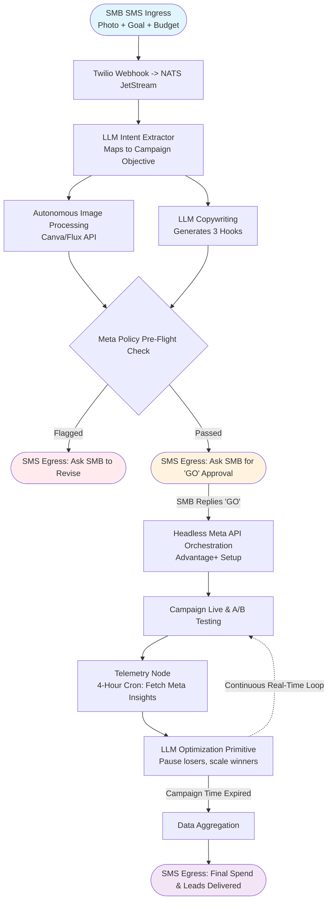

# **PRODUCT REQUIREMENTS DOCUMENT (PRD) v2.0**
**PROJECT:** Meta marketing automation for SMBs

**1. EXECUTIVE SUMMARY**
Small and Medium Businesses (SMBs) require the revenue-generating power of Facebook and Instagram ads but lack the technical expertise and agency budgets to navigate a professional 12-step marketing workflow. Toro OS will deploy an autonomous "Ad-Buyer Sidecar" that compresses complex Directed Acyclic Graph (DAG) enterprise marketing logic into a completely headless, omni-channel experience. The SMB texts an objective and a photo to their Toro number, and the Go backend automatically orchestrates the research, creative generation, campaign deployment, and real-time optimization via the Meta Marketing API.

**2. CORE OBJECTIVES**
* **Zero-UI Abstraction:** The SMB must never see the Meta Ads Manager. All campaign briefings, approvals, and reporting happen natively via SMS, WhatsApp, or Slack.
* **Agentic DAG Execution:** Toro OS will map the 12 distinct steps of a professional marketing campaign to isolated, specialized LLM and API primitives.
* **Strict Financial Governance:** The system must implement hard-coded budget locks to guarantee the AI cannot overspend the SMB's authorized daily limit.

---

**3. SYSTEM ARCHITECTURE: THE SMB AD-BUYER DAG**

This Directed Acyclic Graph outlines how Toro OS compresses standard enterprise marketing operations into an autonomous, event-driven loop.

---

**4. FUNCTIONAL REQUIREMENTS**

**Feature 4.1: Omni-Channel Briefing (Intent Parsing)**
* **Requirement:** Toro OS must ingest unstructured SMB intent and convert it into a structured Meta campaign objective and budget.
* **Logic:** * The SMB texts their Toro number: *"Run a weekend special for my roofing business. Get me leads. Spend $150 max. Here is a picture of a roof we just fixed."* (Attaches image).
    * The Twilio webhook pushes the event to NATS JetStream.
    * The Go orchestrator catches the event and triggers `tool.llm.intent_extractor`.
* **Data Output:** `{"objective": "LEAD_GENERATION", "budget": 150, "duration": "3_days", "geo": "[SMB_Local_Zip]"}`.

**Feature 4.2: Autonomous Creative & Copy Engine**
* **Requirement:** The system must autonomously generate A/B testable assets from the SMB's raw input.
* **Logic:**
    * *Image Pipeline:* Go routes the raw photo to an image enhancement primitive (e.g., standardizing aspect ratios for IG Reels and FB Feed, adding basic text overlays like "Weekend Special" via the Canva/Cloudinary API).
    * *Copy Pipeline:* Go triggers a specialized copywriting LLM primitive fed with the SMB's business context from the Postgres database. It generates three distinct hooks (e.g., Pain-point focus, Offer focus, Urgency focus).
* **Egress Approval Gate:** Toro texts the SMB: *"I generated 3 ads based on your photo. Reply 'GO' to launch, or 'CANCEL'."*

**Feature 4.3: Headless Meta Execution**
* **Requirement:** The Go backend must translate the approved assets into a fully compliant Meta Advantage+ Campaign architecture.
* **Logic:** Upon receiving the "GO" command, the Go orchestrator executes a sequence of API calls to the `graph.facebook.com/v19.0` endpoints:
    1.  `POST /{ad_account_id}/campaigns` (Creates Advantage+ Campaign structure).
    2.  `POST /{ad_account_id}/adsets` (Injects the geo-locked local audience constraints and budget).
    3.  `POST /{ad_account_id}/adcreatives` (Uploads the generated images and 3 copy variants for dynamic A/B testing).
    4.  `POST /{ad_account_id}/ads` (Publishes the campaign live).

**Feature 4.4: Event-Driven Optimization & Reporting**
* **Requirement:** The system must monitor spend efficiency without requiring IMAP polling or manual dashboard reviews.
* **Logic:**
    * *The Telemetry Loop:* A Go cron job queries the Meta Insights API every 4 hours for `spend`, `cpc`, and `leads`.
    * *Optimization Primitive:* If Variant A has a Cost-Per-Lead (CPL) of $10, and Variant B has a CPL of $45, the Go orchestrator fires a PUT request to the Meta API to pause Variant B, dynamically shifting the remaining budget to the winner.
* **Egress Reporting:** At the end of the campaign, Toro OS sends a single SMS to the business owner: *"Campaign finished. We spent $148.50 and generated 7 new roofing leads (Avg $21 per lead). I have added their phone numbers to your Toro CRM."*

---

**5. TECHNICAL ARCHITECTURE MAPPING**

To achieve zero-UI automation, the standard 12-step enterprise marketing flow is compressed into Toro OS primitives:

| Enterprise Meta DAG Step | Toro OS SMB Execution Model | Tool / Primitive |
| :--- | :--- | :--- |
| **Market/Audience Research** | Hard-coded to local geo-radius + Advantage+ ML | Postgres `tenant_profile` |
| **Budgeting Allocation** | Extracted from SMS natural language | LLM Intent Router |
| **Creative & Copy Generation**| Autonomous generation via base photo | Flux API / Llama-3 |
| **Campaign Setup** | Headless API sequence | Meta Graph API (Go) |
| **A/B Testing** | Dynamic Creative Optimization (DCO) payload | Meta Graph API (Go) |
| **Monitoring & Optimization**| Scheduled Go workers analyzing ROAS/CPL | NATS + Meta Insights API |
| **Reporting** | SMS summary message | Twilio API |

---

**6. SECURITY, COMPLIANCE & GUARDRAILS**

**Feature 6.1: The "Meta Ban" Pre-Flight Check**
* **Requirement:** SMBs often accidentally violate Meta's strict ad policies (e.g., making guaranteed health claims, using restricted words). A banned ad account ruins the SMB's trust in Toro OS.
* **Logic:** Before Feature 4.3 (Campaign Setup) is executed, the generated copy and image must pass through a secondary, highly-constrained LLM primitive prompted specifically with Meta's Restricted Content Policies. If flagged, the system halts the DAG and texts the SMB asking for a revision, preventing the account from being disabled.

**Feature 6.2: Hard-Coded Spend Limits**
* **Requirement:** Software bugs cannot be allowed to drain an SMB's credit card.
* **Logic:** The Go backend must enforce a strict `daily_spend_cap` variable at the database level. Before any API call increases a budget, it must be validated against the SMB's pre-authorized Stripe billing limit. Furthermore, campaign end-dates are explicitly hard-coded into the Meta API payload to ensure campaigns automatically terminate if the Toro OS backend loses connectivity.