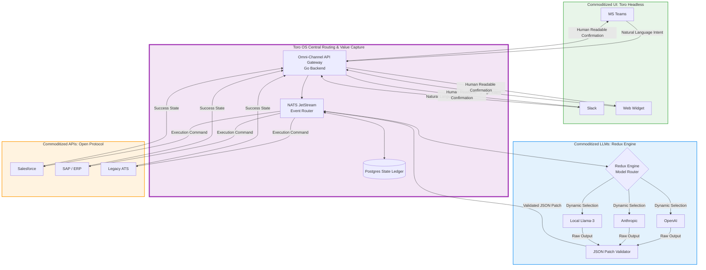

# **PRODUCT REQUIREMENTS DOCUMENT (PRD) v1.0**
**PROJECT:** Toro OS "Omni-Abstraction" Protocol (Commoditizing the Complements)
**DATE:** May 7, 2026
**LEAD ENGINEER:** Office of the CEO (Casablanca HQ)

**1. EXECUTIVE SUMMARY**
To achieve total market capture in the B2B sector, Toro OS will execute an aggressive "Commoditize Your Complement" strategy. Rather than competing directly on isolated features, Toro OS will systematically devalue and abstract the three core pillars of legacy enterprise software: **API Connectors** (destroying middleware lock-in), **Foundational LLMs** (destroying AI provider lock-in), and **User Interfaces** (destroying SaaS dashboard lock-in). By giving these complements away for free or rendering them invisible, Toro OS positions its core NATS routing and execution engine as the inescapable, default operating system for enterprise automation.

---

**2. CORE STRATEGY: THE THREE COMMODITIZED LAYERS**

### **Module 2.1: The Open Connector Protocol (Commoditizing APIs)**
* **Strategic Intent:** Eradicate the Zapier/MuleSoft business model by treating API integrations as a free, open-source public good, driving all execution volume to Toro OS.
* **Functional Requirements:**
    * **Open-Source Connector Library:** A centralized GitHub repository containing 1,000+ pre-built, standardized REST/GraphQL wrappers for major legacy enterprise systems (Salesforce, SAP, Workday, Bullhorn).
    * **Zero-Cost Ingestion:** Enterprise clients do not pay per connection or per basic webhook payload. 
    * **Monetization Trigger:** Toro OS only charges when the incoming payload triggers an intelligent agentic workflow via the NATS JetStream.

### **Module 2.2: The Redux Engine (Commoditizing LLMs)**
* **Strategic Intent:** Prevent OpenAI, Anthropic, or any foundational model provider from establishing a monopoly over the enterprise. Treat them as interchangeable compute utilities.
* **Functional Requirements:**
    * **Unified Developer SDK:** Developers write prompts and logic for the *Toro Protocol*, not a specific model API. 
    * **Dynamic Model Switching:** The Go backend can hot-swap the underlying LLM (e.g., shifting from GPT-4 to Llama-3) based on real-time cost, latency, or API outages without breaking the enterprise's deployed workflows.
    * **RFC 6902 Patch Enforcement:** To guarantee safe mutation of enterprise data, the Redux Engine forces all LLMs—regardless of the provider—to output strict JSON Patches, validating the structural integrity of the output before it touches the enterprise database.

### **Module 2.3: Toro Headless (Commoditizing the UI)**
* **Strategic Intent:** Sever the enterprise user's reliance on legacy SaaS dashboards by injecting Toro OS directly into the communication channels they already use.
* **Functional Requirements:**
    * **Native Chat Integrations:** One-click deployment of Toro OS Agents into Microsoft Teams, Slack, and internal enterprise web portals via a customizable widget.
    * **Natural Language to CRUD:** Users execute complex operations (e.g., "Pull Q3 sales data and update the client status") via natural language in Teams. Toro OS handles the translation to code, executes the API calls, and returns the result in the chat.
    * **The Dashboard Bypass:** By providing a flawless chat-based UX, the underlying legacy software (e.g., Oracle ERP) is reduced to a "dumb database," stripping the legacy vendor of their daily active user engagement.

---

**3. SYSTEM ARCHITECTURE: THE OMNI-ABSTRACTION DAG**

This architecture maps how Toro OS acts as the central intelligence layer, completely flanked by commoditized inputs and outputs.

---

**4. TECHNICAL IMPLEMENTATION MILESTONES**

**Phase 1: The UI & LLM Sandwich (Weeks 1-4)**
* Deploy the Slack and MS Teams official Toro OS integration apps.
* Build the core Redux routing layer in Go that allows developers to toggle between Anthropic Claude 3 and OpenAI GPT-4 via a single line in their configuration YAML.

**Phase 2: The JSON Patch Enforcer (Weeks 5-8)**
* Implement the RFC 6902 Go validation logic.
* Ensure that if the commoditized LLM generates a hallucinated data path, the Redux Engine automatically rejects the payload and prompts the LLM for a correction without exposing the error to the user.

**Phase 3: The Open API Assault (Weeks 9-12)**
* Launch the public GitHub repository for the Toro OS Open Connector protocol.
* Seed the repository with the 50 most heavily used B2B enterprise connectors (CRMs, ERPs, HRIS).
* Release developer documentation encouraging third parties to maintain and update the connectors in exchange for platform reputation within the Almanac directory.