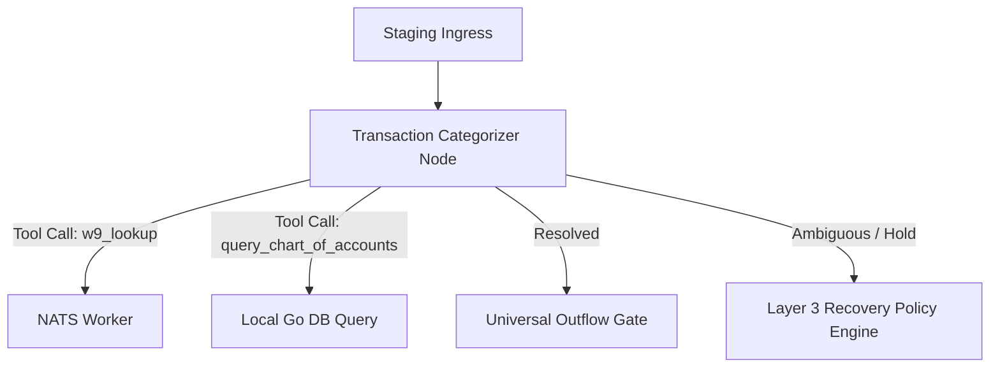

# Product Requirements Document (PRD)

## Autonomous Semantic Engine (ASE) - Hierarchical Reasoning & NATS Tool Calling

**Status:** Draft v1.1  
**Owner:** Runtime & AI Infrastructure Engineering  
**Audience:** Runtime Engineering, AI Infrastructure, ASE Core  

---

## 1. Objective

This document defines the requirements for transitioning Toro's Autonomous Semantic Engine (ASE) from a linear, multi-node sequential Directed Acyclic Graph (DAG) architecture to a **Hierarchical Reasoning & NATS Tool Calling** architecture.

By combining multiple sequential classification gates into single prompts with reduced transaction batch sizes (e.g., from 50 to 20) and exposing decentralized NATS action workers directly as LLM tools (function calls), we reduce overall execution latency, prevent hallucinations, and optimize cost.

Additionally, to prevent token context bloat and LLM confusion, we enforce strict **least-privilege tool scoping** at the individual DAG node configuration level.

---

## 2. Problem Statement

The current linear/sequential DAG architecture (e.g., `ase_gaap_us.yml` and `pcm_bank_reconciliation.yml`) relies on separate nodes for each classification step:
1. **Compounding Latency**: Running sequential LLM calls (e.g., Cash Direction $\rightarrow$ Macro Class $\rightarrow$ Account Type $\rightarrow$ Account Selection) requires up to 4 sequential network hops, resulting in high total runtime.
2. **Context Fragmentation**: The LLM must reason with isolated context at each node rather than evaluating the complete transaction lifecycle (e.g., checking parent and child accounts together).
3. **Static Lookup Limitations**: To suggest specific accounts or check attachment files, the system must inject large, static context arrays (like lists of 500 accounts) into prompt templates. This increases token consumption and runs the risk of using stale data.
4. **Decoupled Executable Redundancy**: NATS Action Workers (like W-9 search or database lookups) are currently represented as separate nodes in the DAG. This makes the DAG layout unnecessarily complex and prevents mid-flight checks during the main reasoning loops.

---

## 3. Design Principles

1. **Hierarchical Prompting**: Consolidate multiple levels of classification (Macro Class, Account Type, and Sub-categories) into a single, unified prompt context where the LLM resolves parent-child relations recursively.
2. **Least-Privilege Tool Scoping**: Each DAG node must explicitly declare which tools it has access to. We do not naively expose all available tools to every LLM invocation.
3. **Dynamic Tool Calling**: Rather than hardcoding lookups (such as checking W-9s or querying the Chart of Accounts) as separate DAG nodes, expose these NATS-based action workers and native local helpers as standard LLM tools (function calls) that the agent can invoke dynamically during the reasoning cycle.
4. **Adaptive Batch Sizing**: Reduce transaction batch sizes (e.g. to 20 transactions) when performing hierarchical reasoning to ensure the agent has ample context window space to explain its reasoning and call tools.
5. **Unified NATS Decoupling**: Keep workers fully decoupled and running on their own servers. The orchestrator translates LLM tool calls into NATS request-reply messages on standard subjects (`worker.inbox.action.<action_name>`).

---

## 4. Proposed Architecture

### 4.1 Simplified DAG Topology
Consolidate sequential classification nodes into a high-level reasoning gate (e.g. `transaction_categorizer`) which only has access to a scoped subset of tools:



### 4.2 Least-Privilege Scoped Node Configuration (YAML Example)
Nodes declare their permitted tools within the DAG YAML file:

```yaml
    # Node that handles initial categorization
    transaction_categorizer:
      name: transaction_categorizer
      kind: hierarchical_classifier
      prompt_key: categorization_agent
      tools:
        - db_receipt_lookup             # NATS Action Worker
        - w9_lookup                     # NATS Action Worker
        - query_chart_of_accounts       # Built-in local tool

    # Node that handles complex long-term liabilities
    long_term_liability_gate:
      name: long_term_liability_gate
      kind: holding_gate
      prompt_key: liability_agent
      tools:
        - db_loan_matrix_lookup         # NATS Action Worker
        - check_loan_amortization_cache # Built-in local tool
```

---

## 5. Technical Requirements

### 5.1 The Unified Tool Interface (Go)
Both NATS-based action workers and built-in local operations are unified under the same Go interface:

```go
package ase

import "context"

type Tool interface {
	Name() string
	Description() string
	JSONSchema() map[string]interface{}
	Execute(ctx context.Context, args []byte, node *AutonomousSemanticEngineNode) (any, error)
}
```

#### Example NATS Worker Tool Implementation:
```go
type NatsWorkerTool struct {
	nc         *nats.Conn
	toolName   string
	desc       string
	schemaJson map[string]interface{}
}

func (t *NatsWorkerTool) Name() string        { return t.toolName }
func (t *NatsWorkerTool) Description() string { return t.desc }
func (t *NatsWorkerTool) JSONSchema() map[string]interface{} {
	return t.schemaJson
}
func (t *NatsWorkerTool) Execute(ctx context.Context, args []byte, node *AutonomousSemanticEngineNode) (any, error) {
	subject := "worker.inbox.action." + t.toolName
	msg, err := t.nc.RequestWithContext(ctx, subject, args)
	if err != nil {
		return nil, err
	}
	return msg.Data, nil
}
```

#### Example Built-In Local Tool Implementation:
```go
type QueryChartOfAccountsTool struct {
	queries *database.Queries
}

func (t *QueryChartOfAccountsTool) Name() string { return "query_chart_of_accounts" }
func (t *QueryChartOfAccountsTool) Description() string {
	return "Queries the live database chart of accounts by parent account classification"
}
func (t *QueryChartOfAccountsTool) JSONSchema() map[string]interface{} {
	return map[string]interface{}{
		"type": "object",
		"properties": map[string]interface{}{
			"parent": map[string]interface{}{"type": "string"},
		},
		"required": []string{"parent"},
	}
}
func (t *QueryChartOfAccountsTool) Execute(ctx context.Context, args []byte, node *AutonomousSemanticEngineNode) (any, error) {
	var params struct {
		Parent string `json:"parent"`
	}
	if err := json.Unmarshal(args, &params); err != nil {
		return nil, err
	}
	// Query local database directly
	return t.queries.GetAccountsByParent(ctx, params.Parent)
}
```

### 5.2 Dynamic Schema Compiling at Invocation
When the ASE Bridge Worker invokes the LLM think function for a node:
1. **Scope Check**: Query the node's config to fetch the list of allowed tool names (e.g. `["db_receipt_lookup", "w9_lookup"]`).
2. **Schema Bundling**: Select only those tools from the central registry and bundle their `JSONSchema()` into the OpenAI/Gemini payload's `tools` parameter.
3. **Execution Guard**: If the LLM requests a tool call, verify the requested tool name is in the allowed list for the node before executing it.

---

## 6. Verification & Test Plan

### 6.1 Unit Testing
*   Verify tool schemas are correctly generated from the action provider registry.
*   Test mid-flight tool execution loops using mock NATS servers and mock LLM tool response structures.

### 6.2 Staging Integration Tests
*   Run the unified categorizer DAG with a subset of 20 staging transactions.
*   Verify that tool execution correctly retrieves data (like parent accounts or receipts) and resolves classification accurately in a single DAG hop.
