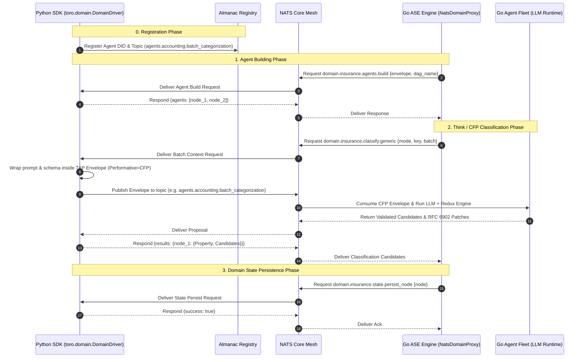
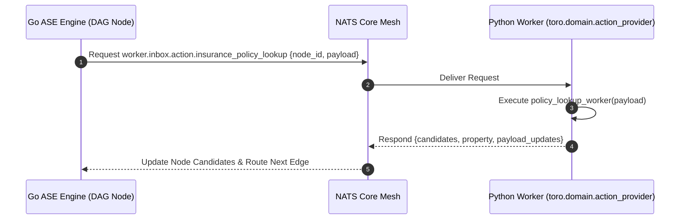

# PRODUCT REQUIREMENT DOCUMENT (PRD)

## Project: TORO Enterprise Open-Source Python SDK (`toro-sdk`)

---

## 1. Executive Summary & Vision

### 1.1 The Microservice & Hybrid Runtime Vision
The Toro Autonomous AI Architecture separates **High-Velocity Graph Orchestration** from **Domain-Specific Cognitive Execution**:

* **Go Core Engine (`go/internal/erp/ase`)**: Manages high-throughput Directed Acyclic Graph (DAG) routing, in-memory channel batching, state machine transitions, Shannon entropy mathematical validation ($C \ge 0.98$), and Redis lock coordination.
* **Python SDK (`toro-sdk`)**: Enables enterprise developers and third-party AI builders to author specialized domain agents, proprietary ML models, local SQL database persistence, and node action handlers in native Python.

The **`toro-sdk`** is an open-source, enterprise-grade Python library built on `asyncio`, `nats-py`, and `pydantic` v2. It seamlessly bridges Python services to the Toro NATS mesh using the **`NatsDomainProxy`** protocol, **TAP Envelopes**, **Agent Runtimes in `toro.core`**, and **Almanac Agent Discovery**.

```
┌─────────────────────────────────────────────────────────────────────────────┐
│                           Go Core Platform (Toro)                            │
│  - ASE Engine (DAG Graph Routing & Channel Batching)                         │
│  - NatsDomainProxy Adapter (go/internal/erp/ase/domain_tools)                │
│  - TAP Workflow Orchestrator (tap/workflows)                                │
│  - Almanac Discovery Registry (internal/almanac)                            │
└──────────────────────────────────────┬──────────────────────────────────────┘
                                       │
                                       │ NATS Mesh (Request-Reply & JetStream)
                                       │
┌──────────────────────────────────────▼──────────────────────────────────────┐
│                    Python SDK Subsystem (toro-sdk)                          │
│                                                                             │
│  ┌───────────────────────────┐           ┌──────────────────────────────┐   │
│  │  toro.domain.DomainDriver │           │ toro.domain.ActionProvider   │   │
│  │   - Agents Build          │           │   - Deterministic Node Calls │   │
│  │   - Classifiers / Think   │           │   - DB / API Lookups         │   │
│  │   - Domain SQL Persistence│           │   - Action Candidates        │   │
│  └─────────────┬─────────────┘           └──────────────┬───────────────┘   │
│                │                                        │                   │
│  ┌─────────────▼─────────────┐           ┌──────────────▼───────────────┐   │
│  │   toro.core.Envelope      │           │   toro.almanac.Client        │   │
│  │   - TAP FIPA Verbs        │           │   - DID Registration         │   │
│  │   - AgentRuntime/Harness  │           │   - Capability Schema        │   │
│  └───────────────────────────┘           └──────────────────────────────┘   │
└─────────────────────────────────────────────────────────────────────────────┘
```

---

## 2. Platform Component Matrix

The `toro-sdk` maps directly to Toro's Go core architecture components:

| Go Core Component | Go Location | Python SDK Module | Functional Responsibility in Python |
| :--- | :--- | :--- | :--- |
| **TAP Envelope & Protocol** | [tap/pkg/core](file:///Users/Yankz/programming/usetoro/tap/pkg/core) | `toro.core.Envelope` | Type-safe FIPA message parsing (`INFORM`, `REQUEST`, `CFP`, `PROPOSE`). |
| **Harness & Agent Runtime** | [tap/pkg/agent](file:///Users/Yankz/programming/usetoro/tap/pkg/agent) | `toro.core.Runtime` | LLM patch verification (RFC 6902), Redux engine validation, prompt construction. |
| **Almanac Registry** | `internal/almanac` | `toro.almanac` | Agent registration, heartbeats, DID identity publishing (`did:toro:...`). |
| **ASE NatsDomainProxy** | [nats_domain_proxy.go](file:///Users/Yankz/programming/usetoro/go/internal/erp/ase/domain_tools/nats_domain_proxy.go) | `toro.domain.DomainDriver` | Handling domain agent building, prompt evaluation, and domain SQL state persistence. |
| **Action Provider Workers** | [action_provider_workers.go](file:///Users/Yankz/programming/usetoro/go/internal/workers/action_provider_workers.go) | `toro.domain.ActionProvider` | Decorator for deterministic node-level function calls (`worker.inbox.action.*`). |

---

## 3. Core Functional Requirements & Python Specifications

### 3.1 TAP Envelope & Protocol Layer (`toro.core`)

The SDK implements the full TAP Envelope contract, Agent Runtime harness, and Redux patch validation inside `toro.core`:

```python
# toro/core/envelope.py
from enum import Enum
from typing import Any, Dict, Optional
from pydantic import BaseModel, Field
import datetime, uuid

class Performative(str, Enum):
    INFORM = "INFORM"
    REQUEST = "REQUEST"
    CFP = "CFP"
    PROPOSE = "PROPOSE"
    ACCEPT_PROPOSAL = "ACCEPT_PROPOSAL"
    REJECT_PROPOSAL = "REJECT_PROPOSAL"

class Envelope(BaseModel):
    id: str = Field(default_factory=lambda: str(uuid.uuid4()))
    timestamp: datetime.datetime = Field(default_factory=lambda: datetime.datetime.now(datetime.timezone.utc))
    sender_did: str = Field(..., example="did:toro:python-agent-01")
    receiver_did: str = Field(..., example="did:toro:ase-bridge")
    performative: Performative = Performative.INFORM
    conversation_id: str
    body: Dict[str, Any]
```

### 3.2 Domain Driver (`toro.domain.DomainDriver`)

The `DomainDriver` class in `toro.domain` allows Python microservices to handle complete domain lifecycles. It subscribes to `domain.<domain_name>.*` subjects and handles NATS Request-Reply operations sent from Go's `NatsDomainProxy`.

When classifying batch tasks or initiating LLM evaluation requests:
1. **Almanac Registration**: The driver first registers its agent DID (`did:toro:<domain>-agent`) and target capability topic with the Almanac service (`almanac.register`).
2. **TAP Envelope Packaging**: The driver wraps the prompt definition, schema guardrails, and transaction batch inside a type-safe TAP `Envelope` from `toro.core` with performative `CFP` (Call For Proposal).
3. **NATS Publishing**: It publishes the Envelope to the designated NATS topic (such as `agents.accounting.batch_categorization` or custom `agents.<domain>.<capability>`).

```python
# toro/domain/domain_driver.py
from abc import ABC, abstractmethod
from typing import List, Dict, Any
from toro.core import Envelope, Performative

class DomainDriver(ABC):
    def __init__(self, domain_name: str, agent_did: str, nats_url: str = "nats://localhost:4222"):
        self.domain_name = domain_name
        self.agent_did = agent_did
        self.nats_url = nats_url

    @abstractmethod
    async def build_agents(self, envelope: Envelope, dag_name: str) -> List[Dict[str, Any]]:
        """Extract domain data and return initial ASE node payloads."""
        pass

    async def publish_cfp_task(self, nc, topic: str, conversation_id: str, task_def: Dict[str, Any]) -> Envelope:
        """Wraps task definition inside a TAP Envelope and publishes to NATS topic."""
        env = Envelope(
            sender_did=self.agent_did,
            receiver_did="did:toro:general-agent-fleet",
            performative=Performative.CFP,
            conversation_id=conversation_id,
            body=task_def
        )
        await nc.publish(topic, env.model_dump_json().encode())
        return env

    @abstractmethod
    async def classify_batch(self, mode: str, key: str, batch: List[Dict[str, Any]]) -> Dict[str, Any]:
        """Perform LLM evaluation or heuristic rules on a batch of nodes."""
        pass

    @abstractmethod
    async def persist_state(self, action: str, payload: Dict[str, Any]) -> bool:
        """Persist node state/trace to domain-specific database (Postgres, Mongo, etc.)."""
        pass

    @abstractmethod
    async def generate_alert(self, node_data: Dict[str, Any]) -> Dict[str, Any]:
        """Generate alert prompt payload when node enters a HOLD_ gate."""
        pass
```

### 3.3 Node Action Provider Decorator (`toro.domain.action_provider`)

Action Providers execute node-level function calls. The `toro.domain` module provides a clean decorator syntax:

```python
# toro/domain/action_provider.py
import functools
from typing import Callable, Dict, Any, List
from pydantic import BaseModel

class ActionResponse(BaseModel):
    candidates: List[Dict[str, Any]] # e.g. [{"value": "APPROVED", "probability": 0.99}]
    property: str                     # e.g. "policy_status"
    payload_updates: Dict[str, Any] = {}
    context_updates: List[str] = []

def action_provider(name: str):
    def decorator(func: Callable[[Dict[str, Any]], ActionResponse]):
        @functools.wraps(func)
        async def wrapper(req_data: Dict[str, Any]) -> ActionResponse:
            return await func(req_data)
        wrapper.action_name = name
        return wrapper
    return decorator
```

### 3.4 Almanac Agent Discovery Client (`toro.almanac`)

Agents **must** register their identity (DID), capability schemas, and target NATS inbox topics with Almanac prior to publishing CFP tasks:

```python
# toro/almanac/client.py
import datetime, json
from typing import Dict, Any

class AlmanacClient:
    def __init__(self, nc, agent_did: str, domain_name: str):
        self.nc = nc
        self.agent_did = agent_did
        self.domain_name = domain_name

    async def register_agent_capability(self, capability_name: str, topic: str, schema: Dict[str, Any]):
        """Registers agent DID and capability topic (e.g. agents.accounting.batch_categorization) with Almanac."""
        payload = {
            "did": self.agent_did,
            "domain": self.domain_name,
            "capability": capability_name,
            "nats_topic": topic,
            "schema": schema,
            "timestamp": datetime.datetime.now(datetime.timezone.utc).isoformat()
        }
        await self.nc.publish("almanac.register", json.dumps(payload).encode())

    async def send_heartbeat(self):
        payload = {"did": self.agent_did, "status": "UP"}
        await self.nc.publish("almanac.heartbeat", json.dumps(payload).encode())
```

### 3.5 Agent DID Issuance & Cryptographic Signing (`toro.core.did`)

Every agent instantiated by third-party or enterprise developers via `toro-sdk` must obtain a cryptographically signed Decentralized Identifier (DID) from Toro's central authority backend before joining the NATS mesh:

1. **DID Request**: The SDK invokes `toro.core.did.issue_signed_did(agent_name="finance-bot", domain="acme.com")`.
2. **Backend Signing Authority**: Toro's backend API (`/api/v1/dids/issue` or NATS `almanac.did.issue`) verifies developer credentials and issues a signed DID string: `did:toro:<tenant_or_domain>:<agent_name>`.
3. **Envelope Signature**: All outgoing TAP `Envelope` messages generated by `toro-sdk` automatically include this signed `sender_did` and cryptographic signature payload in `Envelope.id` / metadata.

```python
# toro/core/did.py
from typing import Dict, Any
import hmac, hashlib

class DIDManager:
    def __init__(self, api_key: str, base_url: str = "https://api.usetoro.com"):
        self.api_key = api_key
        self.base_url = base_url

    async def issue_signed_did(self, agent_name: str, domain: str) -> Dict[str, Any]:
        """Contacts Toro Backend to issue a cryptographically signed DID for an agent."""
        # Returns {"did": "did:toro:acme.com:finance-bot-01", "signature": "0x7f...", "issued_at": ...}
        pass
```

### 3.6 Enterprise Custom Domain DID & DNS Verification (`toro.domain.dns`)

Enterprise customers can verify ownership of their custom domain (e.g. `acme.com`) to brand their agent DIDs and send authenticated outbound emails via Toro's Postmark integration:

1. **DNS Verification Initiation**: Enterprise admins run `toro.domain.dns.initiate_verification("acme.com")` via SDK or CLI.
2. **DNS Challenge Generation**: Toro generates:
   - **TXT Record**: `_toro-challenge.acme.com` -> `toro-verification-token-88192`
   - **CNAME / DKIM Records**: `pm._domainkey.acme.com` -> Postmark DKIM key for custom domain outbound mail.
3. **Verification Check**: Executing `toro.domain.dns.verify("acme.com")` performs backend DNS queries (TXT/CNAME). Upon success, `acme.com` is marked as `VERIFIED`.
4. **Custom Domain Agent DIDs & Email Sending**:
   - Verified domains allow agents to register DIDs formatted as `did:toro:acme.com:<agent_name>`.
   - Agents can send outbound transactional emails via Postmark using **any custom email address under their verified domain** (e.g. `billing@acme.com` or `agent-01@acme.com`).

```python
# toro/domain/dns.py
class EnterpriseDomainManager:
    def __init__(self, client):
        self.client = client

    async def initiate_verification(self, domain: str) -> Dict[str, Any]:
        """Generates required TXT & CNAME DNS records for custom domain verification and Postmark email sending."""
        # Returns {"domain": "acme.com", "txt_record": "_toro-challenge.acme.com", "txt_value": "..."}
        pass

    async def verify_domain_dns(self, domain: str) -> bool:
        """Triggers backend DNS check to confirm TXT/DKIM records."""
        pass
```

---

## 4. Sequence Diagrams & NATS Data Contracts

### 4.1 NATS Domain Driver Execution Lifecycle



### 4.2 NATS Action Provider Lifecycle



---

## 5. Developer Experience (DX) & Code Examples

### 5.1 Authoring a Full Insurance Domain Microservice in Python

```python
# app/insurance_service.py
import asyncio
from toro.domain import DomainDriver, action_provider, ActionResponse
from toro.core import Envelope
from toro.client import ToroClient

class InsuranceDomainService(DomainDriver):
    def __init__(self):
        super().__init__(domain_name="insurance", agent_did="did:toro:insurance-agent-01")

    async def build_agents(self, envelope: Envelope, dag_name: str):
        # Extract payload from TAP envelope
        session_id = envelope.body.get("session_id")
        
        # Build initial agent payloads
        return [
            {
                "node_id": f"claim_{session_id}_01",
                "tenant_id": envelope.body.get("tenant_id", "default"),
                "dag_name": dag_name,
                "payload": {"policy_no": "POL-9921", "claim_amount": 3500.0}
            }
        ]

    async def classify_batch(self, mode: str, key: str, batch: list):
        results = {}
        for node in batch:
            node_id = node.get("node_id")
            # Python AI / LLM / Rule evaluation
            results[node_id] = {
                "Property": "underwriting_decision",
                "Candidates": [{"value": "APPROVED", "probability": 0.99}]
            }
        return results

    async def persist_state(self, action: str, payload: dict):
        print(f"[Python DB] Persisting {action} for node: {payload.get('node', {}).get('node_id')}")
        return True

    async def generate_alert(self, node_data: dict):
        return {"prompt": f"Manual underwriter review for claim {node_data.get('node_id')}"}

# Define a deterministic node action provider
@action_provider(name="insurance_policy_lookup")
async def handle_policy_lookup(req: dict) -> ActionResponse:
    payload = req.get("payload", {})
    policy_no = payload.get("policy_no", "")
    is_valid = policy_no.startswith("POL-")
    
    return ActionResponse(
        candidates=[{"value": "ACTIVE" if is_valid else "EXPIRED", "probability": 1.0}],
        property="policy_status",
        payload_updates={"verified_by": "python_policy_lookup_worker"}
    )

async def main():
    client = ToroClient(nats_url="nats://localhost:4222")
    
    # Register Domain Driver & Action Providers
    client.register_domain_driver(InsuranceDomainService())
    client.register_action_provider(handle_policy_lookup)
    
    print("🚀 Toro Python SDK Service Started. Listening on NATS...")
    await client.start()

if __name__ == "__main__":
    asyncio.run(main())
```

---

## 6. Enterprise Non-Functional Requirements (NFRs)

### 6.1 Performance & Latency Targets
* **NATS Request-Reply Overhead**: Sub-5ms serialization/deserialization overhead in Python using `ujson` / `orjson` and `pydantic` v2 compiled rust core.
* **Concurrency Model**: Native `asyncio.TaskGroup` handling up to 10,000 concurrent NATS subscriptions per worker process.

### 6.2 Data Security & Privacy
* **Zero Database Contamination**: Domain database credentials and raw SQL rows remain entirely within the enterprise developer's private Python environment. Only structured `Envelope` data, probability candidates, and patch deltas transit NATS.

### 6.3 Packaging & Open-Source Distribution
* **PyPI Package**: `pip install toro-sdk`
* **Type Stubs**: Fully typed codebase with `py.typed` marker (PEP 561 compliant).
* **Dependencies**: `nats-py>=2.8.0`, `pydantic>=2.7.0`, `opentelemetry-api>=1.24.0`.
