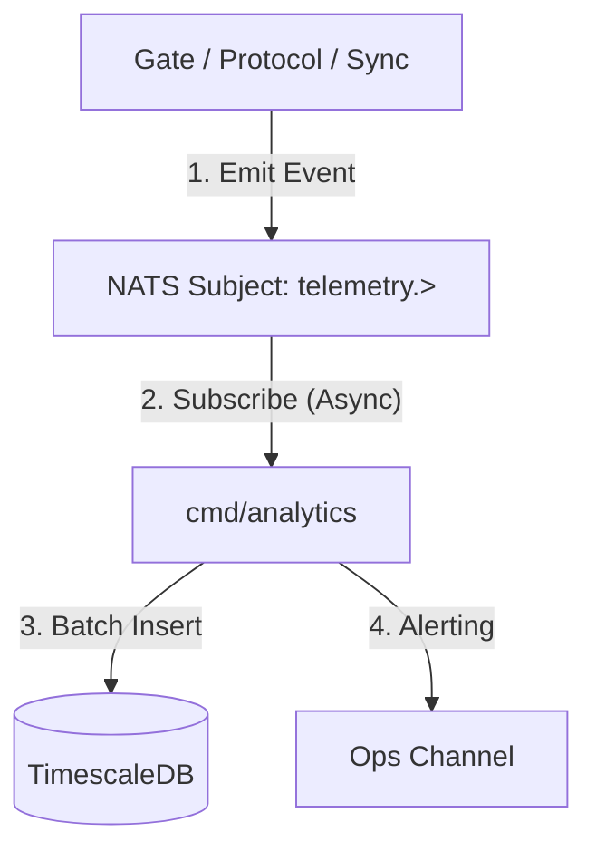

# Technical PRD: Analytics & DataOps Service

**Service:** `cmd/analytics`  
**Version:** 1.0  
**Objective:** Build the "Black Box Flight Recorder" for the Toro Financial Reactor.

---

## 1. Core Philosophy: "Observability as a Feature"

We are not just logging errors. We are tracking the Economic Health of our Agents and the Data Integrity of our pipeline.

*   **Traceability:** Every financial action (Payment, Categorization) must be traceable back to the specific Agent, Model Version, or Human who authorized it.
*   **Drift Detection:** We must know if our AI is getting dumber or if data patterns are changing.

---

## 2. Architecture: The Telemetry Pipeline

We decouple Observation from Execution. The core services (Gate, Protocol) emit events to NATS; the Analytics Service consumes and stores them.



### 2.1 The NATS Subject Hierarchy

We organize telemetry by Source and Type.

*   `telemetry.trace.{trace_id}`: Full lifecycle events for a specific transaction.
*   `telemetry.agent.{agent_id}.{event}`: Agent-specific actions (e.g., decision, tool_use).
*   `telemetry.system.{service_id}.{metric}`: Infrastructure health (e.g., cpu, latency).

### 2.2 The Standard Payload (JSON)

Every telemetry event MUST include:

```json
{
  "trace_id": "uuid-v4",       // The "Thread" (follows request across services)
  "timestamp": "ISO8601",
  "source_service": "cmd/protocol",
  "event_type": "agent_decision",
  "meta": {
    "agent_id": "agent_55",
    "model": "gpt-4-turbo",
    "confidence": 0.95,
    "cost_usd": 0.004
  }
}
```

---

## 3. Storage Layer: TimescaleDB

We use TimescaleDB (Postgres Extension) because it handles high-ingest rates and time-series queries while integrating with our existing Postgres knowledge.

### 3.1 Schema Definition

**File:** `sql/schema/005_analytics.sql`

```sql
-- Enable Timescale
CREATE EXTENSION IF NOT EXISTS timescaledb;

-- 1. The Event Log (Hypertable)
CREATE TABLE telemetry_events (
    time TIMESTAMPTZ NOT NULL,
    trace_id UUID NOT NULL,
    tenant_id UUID,
    service TEXT NOT NULL,
    event_type TEXT NOT NULL,
    duration_ms INT,
    meta JSONB
);

-- Convert to Hypertable (Partition by time)
SELECT create_hypertable('telemetry_events', 'time');

-- 2. Agent Performance (Aggregated View)
CREATE MATERIALIZED VIEW agent_performance_hourly
WITH (timescaledb.continuous) AS
SELECT
    time_bucket('1 hour', time) AS bucket,
    meta->>'agent_id' AS agent_id,
    COUNT(*) AS total_tasks,
    AVG((meta->>'confidence')::float) AS avg_confidence,
    SUM((meta->>'cost_usd')::float) AS total_cost
FROM telemetry_events
WHERE event_type = 'agent_decision'
GROUP BY bucket, agent_id;
```

---

## 4. The Service Implementation (cmd/analytics)

This is a high-throughput Go service.

### 4.1 Responsibilities

1.  **Ingest:** Subscribe to `telemetry.>` using a NATS Queue Group (`analytics_workers`) to load balance.
2.  **Buffer:** Do not insert every row individually. Use a Memory Buffer (e.g., flush every 500ms or 1,000 events) to use Postgres COPY for speed.
3.  **Alert:** Check critical thresholds in memory.
    *   **Rule:** If `error_rate > 5%` in last minute -> Send Slack Alert.

### 4.2 Batch Writer (Go Code Concept)

```go
func (s *Service) processingLoop() {
    batch := make([]Event, 0, 1000)
    ticker := time.NewTicker(500 * time.Millisecond)

    for {
        select {
        case msg := <-s.natsChan:
            batch = append(batch, parse(msg))
            if len(batch) >= 1000 {
                s.flush(batch)
                batch = batch[:0]
            }
        case <-ticker.C:
            if len(batch) > 0 {
                s.flush(batch)
                batch = batch[:0]
            }
        }
    }
}
```

---

## 5. DataOps Dashboards (Grafana / Internal Admin)

We expose this data to our internal admin panel.

### 5.1 The "Lineage" View

**Query:** `SELECT * FROM telemetry_events WHERE trace_id = '...' ORDER BY time ASC`

**Visualization:** A timeline showing:
*   `10:00:00` - Ingested (Gate)
*   `10:00:01` - OCR Complete (Python)
*   `10:00:02` - Agent Decision (Protocol) - Confidence 40%
*   `10:05:00` - Human Correction (Fignode) - **User: Ahmed**
*   `10:05:01` - Synced to QBO (Sync)

### 5.2 The "Drift" Monitor

*   **Metric:** Average Confidence Score per Agent per Day.
*   **Alert:** If Average Confidence drops below 80%, flag the Agent for Retraining.

---

## 6. Strategic Value

This service transforms "Logs" into "Assets."

1.  **Audit Defense:** When a bank asks "Why did you approve this loan?", we show the full immutable trace.
2.  **Model Improvement:** We export the `telemetry_events` (specifically the Human Corrections) to fine-tune our LLMs.
3.  **Billing:** We use the `total_cost` aggregations to calculate the customer's bill accurately.

### Verdict
*   Build `cmd/analytics`.
*   Use TimescaleDB.
*   Enforce TraceID propagation in `pkg/protocol`.