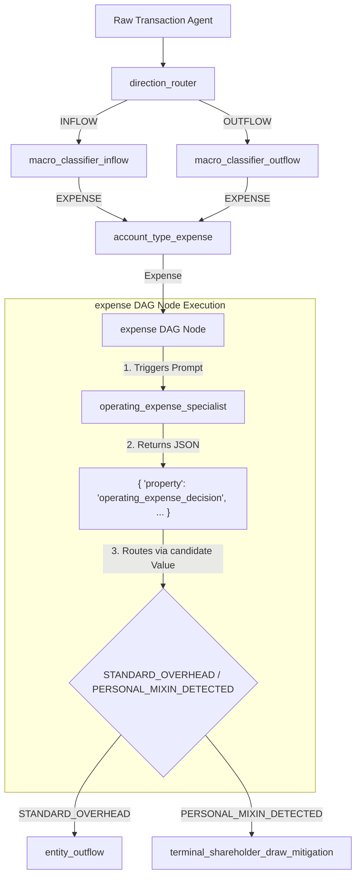

# Autonomous Semantic Engine (ASE) Architecture

The Autonomous Semantic Engine (ASE) is a high-performance, concurrent, and event-driven transaction classification system. Transactions function as autonomous micro-agents (`AutonomousSemanticEngineNode`), managing their own classification dimensions, Shannon entropy states, and routing logic through a Directed Acyclic Graph (DAG) topology defined in `ase.yml`.

---

## 1. Core Architecture Concepts

The system separates the **physical layout of the DAG**, the **LLM evaluation slot**, and the **state memory map** of the transaction micro-agent.



### 1.1 `DAGNodeID` (The Topology Node)
Identifies the specific step/node within the routing pipeline in `ase.yml` (e.g., `direction_router`, `expense`, `fixed_assets`). Each node defines:
* A `prompt_key` to map to LLM system instructions.
* A `children` routing map mapping candidate values to downstream nodes.

### 1.2 `PropertyKey` (The Classification Dimension)
Specifies the individual **dimension slot** (e.g., `"operating_expense_decision"`, `"macro_class"`, `"account_type"`) returned by the LLM response JSON in the `"property"` field. 
* A single agent tracks its decisions in the `Candidates` map using this `PropertyKey` as the key (e.g., `node.Candidates["operating_expense_decision"]`).
* This enables multiple distinct DAG nodes to populate or refine identical classification dimensions without collision.

### 1.3 Classification `Value` (The Edge Key)
The actual decision value chosen by the LLM (e.g., `"STANDARD_OVERHEAD"`, `"PERSONAL_MIXIN_DETECTED"`). This value dictates the next DAG edge transition.

---

## 2. Understanding the Node-to-Property Nuance

A common point of confusion is when the name of a DAG node (e.g., `expense`) differs from the property key returned by the LLM (e.g., `"operating_expense_decision"`):

```yaml
    expense:
      kind: holding_gate
      prompt_key: operating_expense_specialist
      batch_size: 50
      edge_type: static
      children:
        STANDARD_OVERHEAD: entity_outflow
        PERSONAL_MIXIN_DETECTED: terminal_shareholder_draw_mitigation
```

### Why is this not a problem?
The engine handles this mismatch cleanly because the storage key and the routing selector serve completely independent roles:

1. **State Storage**: The LLM returns `"property": "operating_expense_decision"`. The engine extracts this value and stores the candidates on the micro-agent node using this key:
   ```go
   node.SetPropertyCandidates("operating_expense_decision", candidates)
   ```
2. **Path Routing**: To determine which downstream edge to traverse, the engine extracts the top candidate's **`Value`** (e.g., `"STANDARD_OVERHEAD"`), converts it to lowercase, and does a lookup in the node's configured child nodes:
   ```go
   // routeToChild inside dag.go
   top := node.TopCandidate("operating_expense_decision")
   routeKey := top.Value // "STANDARD_OVERHEAD"
   
   // Match against configured children (STANDARD_OVERHEAD maps to entity_outflow)
   child := dn.children[strings.ToLower(routeKey)]
   ```

Because routing is driven by the **selected candidate value** matching a child key in the configuration—and NOT the name of the property—any node name can map to any property key.

---

## 3. Confidence Guardrails and Shannon Entropy

Each node transitions through states like `THINKING` and `ACTIVATING` based on decisions and math.

### 3.1 Shannon Entropy ($H$)
Uncertainty across options is measured using Shannon entropy, normalized between `0.0` (complete certainty) and `1.0` (maximum uncertainty/unbiased random guess):

$$H = -\sum (p_i \log_2 p_i)$$

When candidates are set on a property, the engine calculates the slot's entropy and updates the agent's overall **Unified Confidence Score** ($C$):

$$C = 1.0 - \frac{\sum H(k)}{\text{Total Properties}}$$

### 3.2 Sync Guardrails
If the transaction agent completes classification and lands in `StateClassified`, the system enforces a strict confidence guardrail:
* **$C \ge 0.98$**: Micro-agent successfully collapses state and transitions to `READY_FOR_SYNC` for automated entry.
* **$C < 0.98$**: The transaction is halted and placed in a `HOLD_AMBIGUOUS` or `HOLD_MISSING_CONTEXT` state for human review.
