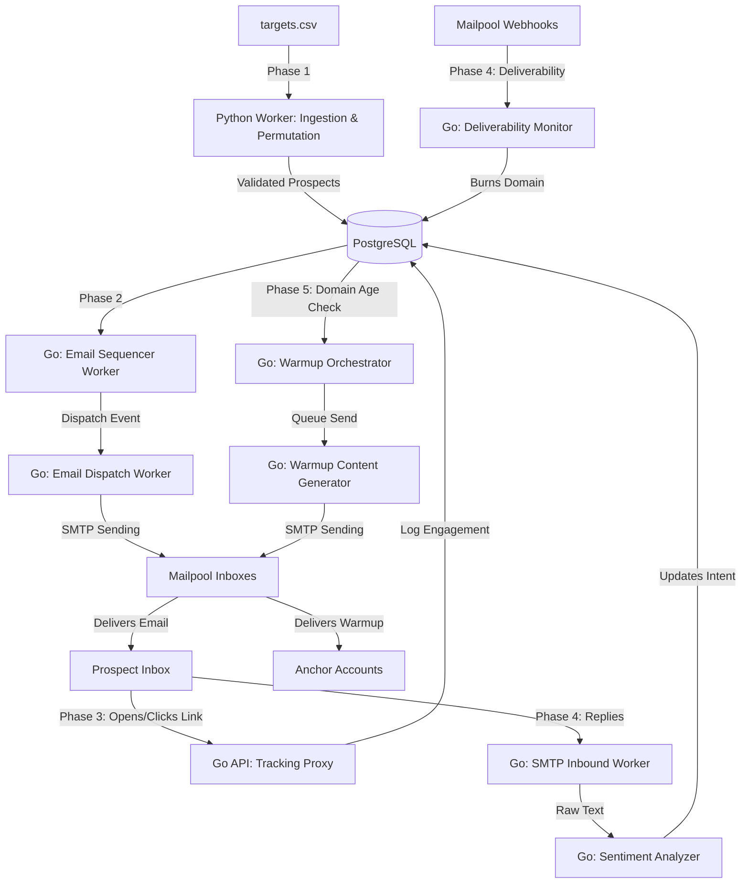

# Toro Email Marketing System: User & Developer Guide

This document provides a comprehensive overview of the Toro Email Marketing Infrastructure. It serves as both a **User Manual** for operators managing campaigns and a **Developer Guide** for engineers maintaining or extending the codebase. 

The system is designed as an autonomous, high-velocity, and resilient outbound engine split across Python and Go microservices communicating via NATS.

---

## 🏗 System Architecture Overview

The system is divided into five distinct phases, transitioning from raw data ingestion to intelligent, LLM-driven feedback loops, ending with automated inbox warm-up routines.

---

## 📖 User Manual: How the System Works

As an operator, you don't need to manually send emails or manage spreadsheets. The system handles the entire lifecycle of a prospect automatically.

### Phase 1: Data Ingestion (Finding the Leads)
You provide a list of targets (e.g., `targets.csv`) containing `first_name`, `last_name`, and `company_domain`. The system's **Python Worker** automatically ingests this data and uses specialized logic (`mailscout`) to permute, guess, and SMTP-verify the correct corporate email address for that person.

### Phase 2: Autonomous Sequencing
Once a valid email is found, the prospect is enrolled in a Campaign. 
- The **Sequencer** checks daily to see who needs an email.
- The **Dispatcher** sends the email. It automatically rotates through different "burner" inboxes provided by Mailpool to ensure your main domain doesn't get flagged for spam.

### Phase 3: Engagement Tracking
Every link inside your emails is automatically wrapped in a secure tracking link. When a prospect opens the email or clicks a link, the system logs this engagement statelessly. You can track this performance without any manual UTM tagging.

### Phase 4: Autonomous Feedback & Safety
> [!TIP]
> **LLM Sentiment Analysis:** You do not need to read every single reply!

When a prospect replies:
1. The reply is routed directly to our internal server.
2. An AI (GPT-5.4-mini) reads the reply and classifies it:
   - **Positive Interest**: The system flags the prospect as a hot opportunity and pauses automated follow-ups so you can take over manually.
   - **Out of Office (OOO)**: The AI extracts the return date and schedules the sequence to resume when they get back.
   - **Not Interested**: The prospect is permanently opted-out.

> [!WARNING]
> **Deliverability Guardian:** If Mailpool detects that one of your burner domains is landing in spam or has been blacklisted, the system will instantly flag it as `burned`. The Sequencer will immediately stop using that inbox, protecting your overall sender reputation.

### Phase 5: Automated Warm-Up Engine
To protect domains from strict 2026 bulk-sender policies, all new inboxes are subjected to a strict 5-week volume ramp-up schedule.
- The **Warmup Orchestrator** monitors inbox age. It will not use any domain younger than 14 days.
- **Anchor Strategy:** To avoid detection as a "warmup ring," the system generates and routes unique AI plain-text emails specifically targeting your designated aged, high-reputation anchor accounts (e.g., your personal Gmails).
- You manually interact with these warm-up emails inside your anchor inboxes to boost the sender's reputation organically.

---

## 💻 Developer Documentation

This section details the technical implementation, file structures, and state management for engineers taking over the codebase.

### Phase 1: Ingestion & Permutation (Python)
**Location:** `/python-worker/app/marketing/`
- `ingestion.py`: Reads prospect data from CSV files and normalizes schemas.
- `permutation.py`: Utilizes the `mailscout` package to generate email permutations and validate them via live SMTP handshakes without sending an email.
- `handlers.py`: Listens to NATS events to orchestrate this workload.

### Phase 2: Sequencing & Dispatch (Go)
**Location:** `/go/internal/workers/`
- `email_sequencer_worker.go`: A chron-triggered worker that queries `marketing.prospects` for active users whose `delay_duration` has elapsed since their last step. It publishes `ase.events.email.pipeline.dispatch`.
- `email_dispatch_worker.go`: Consumes dispatch events. Responsibilities include:
  - Fetching the template.
  - Decrypting the Mailpool App Password via AES-GCM (`crypto.Decrypt`).
  - Rewriting HTML links to route through the tracking proxy.
  - Formatting MIME payloads with RFC 8058 One-Click Unsubscribe headers.
  - Sending the email via SMTP (`net/smtp`).

### Phase 3: Stateless Tracking (Go)
**Location:** `/go/internal/api/` and `/go/internal/infra/crypto/`
- **Crypto Engine** (`url_crypto.go`): Uses AES-GCM to securely encrypt `prospect_id` and `campaign_id` into a base64 URL-safe hash. This avoids heavy database lookups when generating tracking links.
- **Ingress Router** (`ingress_router.go`): 
  - `GET /c/{hash}`: Decrypts the hash, logs a click event to NATS, and redirects to the original destination.
  - `GET /o/{hash}`: Logs an open event and serves a 1x1 transparent GIF.

### Phase 4: Feedback Loops & Deliverability (Go)
**Location:** `/go/internal/workers/`, `/go/internal/api/`, and `/go/internal/services/mailpool/`
- **SMTP Inbound Worker** (`smtp_inbound_worker.go`): Runs a lightweight raw TCP server on port `2525`. Mailpool is configured to route incoming replies to this port via SMTP forwarding. It parses the raw MIME, extracts the text, and publishes `email.inbound.reply.parsed`.
- **Sentiment Analyzer** (`email_sentiment_worker.go`): Consumes parsed replies. It leverages the `agent.Runtime` package to invoke an LLM (GPT-5.4-mini). It enforces structured JSON output to categorize the intent (`positive_interest`, `out_of_office`, `not_interested`) and executes database updates (`UpdateProspectStatus`) accordingly.
- **Webhook Integrations & Security**: 
  - **Schema Generation:** `Webhooks.yaml` is merged dynamically via a Python script into `Mailpool-API.yaml` and compiled by `oapi-codegen` via a dummy path, giving us native structs like `mailpool.MailboxesCreated`.
  - **Ingress Authentication (`ingress_router.go`)**: `HandleMailpoolWebhook` intercepts all Mailpool webhooks. It securely verifies the `X-Signature` using `HMAC-SHA256` hashing and `crypto.subtle.ConstantTimeCompare` against `MAILPOOL_WEBHOOK_SECRET` before publishing to NATS (`webhooks.mailpool.received`).
  - **Webhook Worker (`mailpool_webhook_worker.go`)**: Consumes the authenticated webhook payloads from NATS. It seamlessly extracts sensitive data (like `password` in `mailboxes.created`) securely leveraging the natively generated typed structs and encrypts them at rest into PostgreSQL.

### Phase 5: Warm-Up Engine (Go)
**Location:** `/go/internal/workers/`
- **Warmup Orchestrator** (`warmup_orchestrator.go`): A chron worker that dynamically calculates daily volume limits based on domain age (e.g., Phase 1: 5-10, Phase 5: 30-50). It publishes `email.warmup.generate` events targeting a static list of personal anchor accounts to safely build reputation without exposing the cluster to algorithm detection.
- **Warmup Content Worker** (`warmup_content_worker.go`): Consumes generation events and invokes `agent.Runtime` (GPT-5.4-mini) to produce a plain-text email under 50 words using heavy spintax. Explicitly strips links and tracking pixels. Sends directly via `net/smtp`.

### Database Schema
**Location:** `/sql/schema/014_email_engine.sql`
- `marketing.email_accounts`: Stores encrypted Mailpool credentials, daily send limits, and statuses (`active`, `warming`, `burned`).
- `marketing.prospects`: Tracks the individual targets, their current step, and overall sequence status (`active`, `paused`, `opted_out`).
- `marketing.email_logs`: An append-only ledger for all engagements (`sent`, `opened`, `clicked`, `replied`).

> [!CAUTION]
> **Extending the System:** When adding new LLM prompts to the Sentiment Analyzer, ensure you test the output formatting. The system relies on strict JSON generation (`{"intent": "..."}`). If the LLM drifts, the parsing in `email_sentiment_worker.go` will fail and drop the event.
