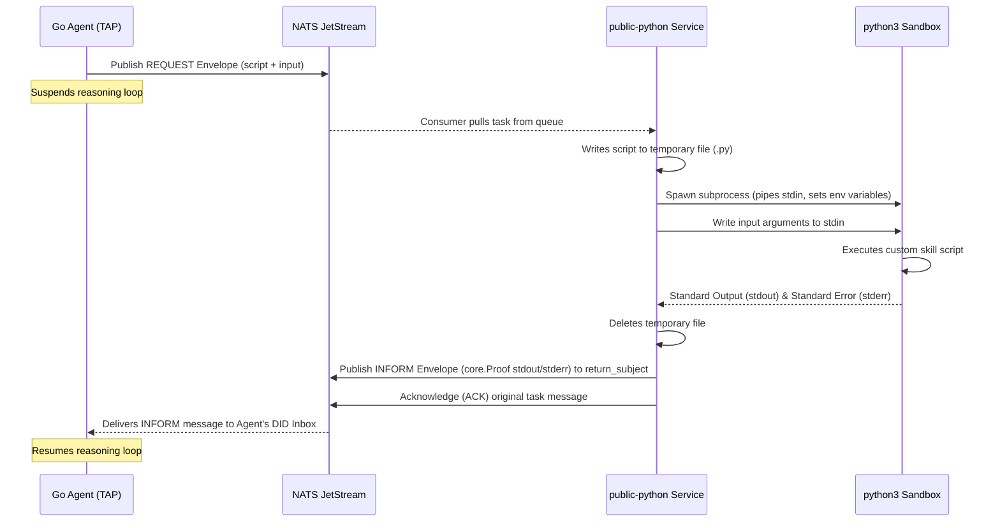

# Public Python Execution Service (`public-python`)

The `public-python` service is a lightweight, dedicated Python microservice designed to safely run custom third-party Python skills inside isolated subprocesses. It decouples code execution from the core Go agent protocol engine using **NATS JetStream** for reliable, event-driven, and asynchronous task delivery.

---

## Why This Service Exists

1. **Security Isolation (Sandbox Boundary)**: Running untrusted, user-defined Python code directly in the Go agent process could compromise system resources, configuration environments, or database credentials. Running python execution as subprocesses inside a dedicated container provides an additional layer of isolation.
2. **Asynchronous Execution Protocol**: Custom scripts can have long execution times (fetching external APIs, data processing, etc.). By using NATS JetStream, Go agents can publish task envelopes and suspend their execution context immediately without blocking resources.
3. **Resilience & Backpressure Handling**: NATS JetStream ensures durable queueing. If the worker pool is busy or temporarily offline, tasks are safely persisted and processed sequentially when resources become available.
4. **Tenant Context Enforcement**: The service maps NATS subjects by tenant boundary (`public_python.execute.<tenant_id>.<skill_name>`) and sets environment variables (`TENANT_ID`, `REALM_ID`) corresponding to the tenant context of execution.

---

## How It Works

The microservice interacts with Go agents and custom python skills via the following execution workflow:



### 1. Subscription & Setup
Upon start, the service:
- Connects to NATS cluster servers (`NATS_URL`).
- Automatically bootstraps or registers the JetStream stream: `public_python_stream` for subject prefix `public_python.execute.>`.
- Subscribes with a durable queue group name `public-python-worker` to load-balance task requests across replicas.

### 2. Sandbox Execution
For each task request envelope pulled:
- Generates a unique temporary `.py` script file.
- Spawns a `python3` subprocess.
- Pipes the payload input dictionary as JSON to the process's standard input (`stdin`).
- Enforces a strict execution timeout of **30 seconds**.
- Cleans up and deletes the temporary script file immediately.

### 3. Proof Packaging & Delivery
- Standard output (`stdout`) and standard error (`stderr`) are captured.
- Packages output into a `core.Proof` payload:
  ```json
  {
    "task_id": "request-envelope-uuid",
    "type": "proof.api",
    "ts": 1718399430,
    "data": {
      "stdout": "...script printed results...",
      "stderr": "...errors/logs...",
      "error": null
    }
  }
  ```
- Wraps the proof in a FIPA-compliant `core.Envelope` (performative `INFORM`).
- Publishes the response back to the NATS subject specified by the requester's `return_subject`.
- Explicitly acknowledges (`ACK`) the JetStream message.

---

## Protocol Spec

### 1. Request Subject Schema
Requests must be published to:
```text
public_python.execute.<tenant_id>.<skill_name>
```

### 2. Request Envelope Structure
```json
{
  "id": "unique-message-uuid",
  "ts": "2026-06-14T22:00:00Z",
  "src": "did:toro:agent:<requester_id>",
  "dst": "did:toro:public-python",
  "perf": "request",
  "cid": "conversation-uuid",
  "body": {
    "script": "import sys\nimport json\n# ... Python source code ...",
    "input": {
      "param1": "value1",
      "param2": 123
    },
    "tenant_id": "test-realm-id",
    "return_subject": "did.toro.agent.test-realm-id.inbox"
  },
  "sig": ""
}
```

### 3. Response Envelope Structure
Published back to the `return_subject` specified in the request:
```json
{
  "id": "unique-response-uuid",
  "ts": "2026-06-14T22:00:05Z",
  "src": "did:toro:public-python",
  "dst": "did:toro:agent:<requester_id>",
  "perf": "inform",
  "cid": "conversation-uuid",
  "body": {
    "task_id": "unique-message-uuid",
    "type": "proof.api",
    "ts": 1718399430,
    "data": {
      "stdout": "{\"result\": \"success\"}\n",
      "stderr": "",
      "error": null
    }
  },
  "sig": ""
}
```

---

## How to Write & Use Custom Skills

To create a dynamic skill that can run inside the `public-python` execution engine, configure it using the following script structure:

### 1. Standard Input Argument Parser
The custom python skill receives inputs as JSON piped straight into `sys.stdin`. Parse them as shown below:
```python
import sys
import json

# Read input parameters from stdin
raw_input = sys.stdin.read()
params = json.loads(raw_input)

# Extract your parameters
op = params.get("op", "add")
a = params.get("a", 0)
b = params.get("b", 0)
```

### 2. Environment Variables
The execution worker sets execution context variables in the subprocess:
- `TENANT_ID`: The UUID/String representing the tenant boundary.
- `REALM_ID`: The UUID/String representing the active tenant boundary.

```python
import os
tenant_id = os.environ.get("TENANT_ID", "default")
```

### 3. Outputting Results
All outputs must be written directly to stdout. It is best practice to format your stdout as JSON so calling agents can parse the response programmatically:
```python
if op == "add":
    result = {"sum": a + b}
else:
    result = {"sum": 0}

# Print JSON string directly to stdout
print(json.dumps(result))
```

---

## Running the Service Locally

Ensure NATS server with JetStream enabled is running, then start the service using:

```bash
# Set NATS endpoint
export NATS_URL="nats://localhost:4222"

# Install dependencies
pip install -r requirements.txt

# Run service
python main.py
```
