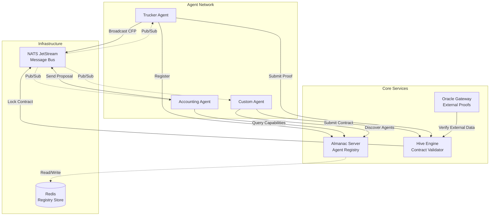

# TAP: Toro Agent Protocol

[](https://go.dev/)
[](https://nats.io/)
[](https://github.com/Yankzy/usetoro/tap)

**The universal standard for autonomous economic agents.**

> TAP is a distributed communication protocol that enables autonomous agents to discover each other, negotiate contracts, execute tasks, and submit cryptographically verifiable proofs—all over a decentralized messaging infrastructure.

---

## 🌟 Overview

**Toro Agent Protocol (TAP)** is a language-agnostic, NATS-based framework for building multi-agent systems where agents can:

- 🔍 **Discover** each other via capabilities (e.g., "I can do logistics")
- 💬 **Negotiate** terms using standardized speech acts (CFP, PROPOSE, ACCEPT)
- 📝 **Execute contracts** with cryptographic signatures and state validation
- ✅ **Submit proofs** of work completion for automatic settlement

Built on **NATS JetStream** for high-throughput messaging and **Redis** for agent registry, TAP provides the primitives needed to create marketplaces of autonomous workers—from trucking agents to accounting bots.

### Why TAP?

Traditional multi-agent systems are often:
- **Tightly coupled** to specific programming languages or frameworks
- **Centralized** with single points of failure
- **Difficult to audit** without cryptographic verification
- **Hard to scale** across organizational boundaries

TAP solves this by providing:
- **Language-agnostic JSON schemas** that any language can implement
- **Decentralized identities (DIDs)** based on Ed25519 cryptography
- **NATS-native routing** for massive scalability
- **Contract state machines** with cryptographic proof requirements

---

## ✨ Key Features

- **🔐 Cryptographic Identity**: Every agent has a DID derived from Ed25519 keys
- **📨 Envelope-Based Messaging**: Standardized message format with signatures
- **🗣️ Rich Performatives**: CFP, PROPOSE, ACCEPT, INFORM, QUERY, and more
- **📖 Almanac Registry**: Agents register capabilities and can be discovered
- **⚙️ Hive Contract Engine**: Validates signatures and manages contract lifecycle
- **🎯 Type-Safe SDK**: Go library with primitives for Tasks, Contracts, and Proofs
- **🔌 Extensible**: Add custom validators, proof types, and business domains

---

## 🚀 Quick Start

### Prerequisites

- **Go 1.25+**
- **NATS Server** (with JetStream enabled)
- **Redis** (for Almanac registry)

### Installation

```bash
# Install as a Go module
go get github.com/Yankzy/usetoro/tap
```

### Running a Simple Agent in 5 Minutes

1. **Start Infrastructure** (in separate terminals):

```bash
# Terminal 1: Start NATS
nats-server -js

# Terminal 2: Start Redis
redis-server

# Terminal 3: Start Hive Engine (Contract Processor)
cd cmd/hive
NATS_URL=nats://localhost:4222 REDIS_URL=redis://localhost:6379 go run main.go

# Terminal 4: Start Almanac (Agent Registry)
cd cmd/almanac-server
NATS_URL=nats://localhost:4222 REDIS_URL=redis://localhost:6379 go run main.go
```

2. **Run the Example Trucker Agent**:

```bash
cd examples/simple-trucker
go run main.go
```

You should see:
```
🚚 Trucker Agent Online. DID: did:toro:a1b2c3...
✅ Registered with Almanac
👂 Listening for work on tasks.accounting.1.>...
```

3. **Run the Swipe Validator** (broadcasts work):

```bash
cd examples/swipe-validator
go run main.go
```

The Trucker will automatically:
- Receive the task broadcast
- Send a proposal
- Sign the contract
- Submit proof of completion

Check the logs to see the full negotiation flow! 🎉

---

## 🏗️ Architecture

TAP consists of **three core services** and **one SDK**:



### Component Breakdown

| Component | Purpose | Technology |
|-----------|---------|------------|
| **Almanac** | Agent registry and discovery service. Agents heartbeat their capabilities, and others query for workers. | Go + Redis |
| **Hive Engine** | Contract state machine. Validates dual signatures, locks contracts, and processes settlement requests. | Go + Redis |
| **Oracle Gateway** | External verification gateway for validating proofs from APIs, GPS, or manual review. | Go + NATS |
| **SDK (`pkg/`)** | Go library providing primitives (Envelope, Task, Contract, Proof) and utilities (Identity, Transport). | Pure Go |

---

## 💡 Core Concepts

### 1️⃣ **Envelopes**

Every message in TAP is wrapped in an **Envelope**:

```json
{
  "id": "msg_001",
  "ts": "2026-02-07T01:00:00Z",
  "src": "did:toro:sender",
  "dst": "did:toro:receiver",
  "perf": "cfp",
  "cid": "conversation_888",
  "body": { ...task... },
  "sig": "abc123..."
}
```

- **`src`/`dst`**: DIDs (Decentralized Identifiers) for sender and receiver
- **`perf`**: Performative (the intent: `cfp`, `propose`, `accept-proposal`, etc.)
- **`cid`**: Correlation ID to thread messages into conversations
- **`sig`**: Cryptographic signature of the body

See the full schema: [`api/json-schema/v1/envelope.json`](api/json-schema/v1/envelope.json)

### 2️⃣ **Performatives ([Speech Acts](https://en.wikipedia.org/wiki/Speech_act))**

TAP defines standardized message types:

| Performative | Meaning | Example Use |
|--------------|---------|-------------|
| **`cfp`** | Call For Proposal | Broadcaster: "I need a truck driver" |
| **`propose`** | Bid/Offer | Worker: "I'll do it for $100" |
| **`accept-proposal`** | Accept Bid | Broadcaster: "Deal, here's the contract" |
| **`reject-proposal`** | Decline Bid | Broadcaster: "No thanks" |
| **`inform`** | Status Update | Worker: "I'm 50% done" |
| **`query-ref`** | Ask for Info | Broadcaster: "Where are you?" |
| **`request`** | Generic Request | Any agent can ask another to do something |

### 3️⃣ **Decentralized Identities (DIDs)**

Each agent has a **DID** derived from its Ed25519 public key:

```go
kp, _ := identity.GenerateKeyPair()
did := identity.CreateDID(kp.Public)
// => "did:toro:a1b2c3d4e5f6..."
```

Messages are signed with the private key and verified using the DID's embedded public key. This ensures authenticity without a central authority.

### 4️⃣ **Business Primitives**

TAP defines three core data structures:

- **Task**: A unit of work to be done (domain, complexity, reward, payload)
- **Contract**: A binding agreement between two agents with dual signatures
- **Proof**: Evidence of task completion (GPS trace, classification result, API response)

See: [`pkg/core/primitives.go`](pkg/core/primitives.go)

### 5️⃣ **NATS Topics**

Agents communicate via structured NATS subjects:

| Topic Pattern | Purpose |
|---------------|---------|
| `almanac.register` | Agent heartbeat/registration |
| `almanac.query` | Discover agents by capability |
| `tasks.{domain}.{complexity}.>` | Broadcast work (e.g., `tasks.logistics.5.urgent`) |
| `agents.{did}.inbox` | Direct messages to a specific agent |
| `contracts.request` | Submit signed contracts to Hive |
| `proof.submit` | Submit proofs for settlement |

**Wildcard Subscriptions:** NATS supports powerful [subject-based wildcards](https://docs.nats.io/nats-concepts/subjects) that enable flexible routing:
- **`>`** (multi-token wildcard) - Matches one or more tokens. Example: `tasks.logistics.>` matches `tasks.logistics.5`, `tasks.logistics.10.urgent`, etc.
- **`*`** (single-token wildcard) - Matches exactly one token. Example: `tasks.*.5` matches `tasks.logistics.5`, `tasks.accounting.5`, etc.

This allows agents to subscribe broadly (e.g., all logistics jobs regardless of complexity) or narrowly (e.g., only complexity 5 jobs across all domains).

---

## 📦 Installation

### Using as a Library

Add TAP to your Go project:

```bash
go get github.com/Yankzy/usetoro/tap
```

Import the SDK:

```go
import (
    "github.com/Yankzy/usetoro/tap/pkg/core"
    "github.com/Yankzy/usetoro/tap/pkg/identity"
    "github.com/Yankzy/usetoro/tap/pkg/transport"
)
```

### Running the Services

#### Almanac Server (Agent Registry)

```bash
cd cmd/almanac-server
NATS_URL=nats://localhost:4222 REDIS_URL=redis://localhost:6379 go run main.go
```

**Environment Variables:**
- `NATS_URL`: NATS connection string (default: `nats://localhost:4222`)
- `REDIS_URL`: Redis connection string (default: `redis://localhost:6379`)

#### Hive Engine (Contract Processor)

```bash
cd cmd/hive
NATS_URL=nats://localhost:4222 go run main.go
```

#### Oracle Gateway (External Verification)

```bash
cd cmd/oracle-gateway
NATS_URL=nats://localhost:4222 go run main.go
```

### Docker Compose (Coming Soon)

We're working on a `docker-compose.yml` for one-command startup.

---

## 🛠️ Building Your First Agent

Let's build a simple agent that listens for accounting tasks and processes them.

### Step 1: Generate Identity

```go
kp, _ := identity.GenerateKeyPair()
did := identity.CreateDID(kp.Public)
log.Printf("Agent DID: %s", did)
```

### Step 2: Connect to NATS

```go
nc, err := transport.Connect("nats://localhost:4222")
if err != nil {
    log.Fatal(err)
}
defer nc.Close()
```

### Step 3: Register with Almanac

```go
registration := resolver.RegistrationPayload{
    DID: did,
    Endpoints: []string{core.BuildAgentInbox(did)},
    Capabilities: []resolver.RegistrationCapability{
        {Type: "accounting.audit"},
    },
    Expiry: time.Now().Add(1 * time.Hour),
}
data, _ := json.Marshal(registration)
nc.Publish("almanac.register", data)
```

### Step 4: Subscribe to Work

```go
nc.Subscribe("tasks.accounting.>", func(msg *nats.Msg) {
    var env core.Envelope
    json.Unmarshal(msg.Data, &env)
    
    if env.Performative == core.CFP {
        log.Printf("New job: %s", env.ConversationID)
        // Send proposal, negotiate, execute...
    }
})
```

### Step 5: Send a Proposal

```go
proposal := map[string]interface{}{
    "price": 200,
    "eta": "30m",
}

replyEnv, _ := core.NewEnvelope(
    "msg_123",
    did,
    env.SenderDID,
    env.ConversationID,
    core.PROPOSE,
    proposal,
)
replyEnv.Signature = kp.Sign(replyEnv.Body)

replyBytes, _ := json.Marshal(replyEnv)
nc.Publish(core.BuildAgentInbox(env.SenderDID), replyBytes)
```

**Full Example**: See [`examples/simple-trucker/main.go`](examples/simple-trucker/main.go)

---

## 📚 SDK Reference

### `pkg/core` - Core Primitives

Defines the fundamental types:

- **`Envelope`**: Message wrapper with routing and signature
- **`TaskDefinition`**: Work specification with reward
- **`Contract`**: Locked agreement with dual signatures
- **`Proof`**: Evidence of completion

**Files:**
- [`primitives.go`](pkg/core/primitives.go) - Business objects
- [`envelope.go`](pkg/core/envelope.go) - Message structure
- [`verbs.go`](pkg/core/verbs.go) - Performative constants
- [`topics.go`](pkg/core/topics.go) - Topic builders

### `pkg/identity` - Cryptography & DIDs

Ed25519-based identity management:

```go
// Generate new identity
kp, _ := identity.GenerateKeyPair()

// Create DID from public key
did := identity.CreateDID(kp.Public)

// Sign data
signature := kp.Sign([]byte("hello"))

// Verify signature
valid, _ := identity.Verify(pubKeyHex, data, signature)
```

**Files:**
- [`crypto.go`](pkg/identity/crypto.go) - Key generation and signing
- [`did.go`](pkg/identity/did.go) - DID encoding/decoding

### `pkg/transport` - NATS Helpers

Simplified NATS connection and streaming:

```go
nc, err := transport.Connect("nats://localhost:4222")
js, err := transport.GetJetStream(nc)
```

**Files:**
- [`conn.go`](pkg/transport/conn.go) - Connection utilities
- [`stream.go`](pkg/transport/stream.go) - JetStream helpers

### `pkg/resolver` - Almanac Client

Agent discovery and registration:

```go
// Register capabilities
client := resolver.NewClient(nc)
client.Register(did, []string{"logistics.trucking"}, endpoints)

// Find agents
agents, _ := client.Query("logistics.trucking", map[string]interface{}{
    "max_weight": 5000,
})
```

**Files:**
- [`client.go`](pkg/resolver/client.go) - Almanac interaction

---

## 🎯 Services Reference

### Almanac Server (`cmd/almanac-server`)

**Purpose:** Agent registry and discovery service (DNS for agents)

**How it works:**
1. Agents send heartbeat registrations to `almanac.register`
2. Registrations are stored in Redis with TTL (time-to-live)
3. Capabilities are indexed for fast lookup
4. Other agents query via `almanac.query` to find workers

**Key Features:**
- Redis-backed for persistence and scalability
- Case-insensitive capability matching
- Metadata filtering (e.g., "find truckers with max_weight > 5000")
- Lazy cleanup of expired entries

**Configuration:**
- `NATS_URL`: NATS connection
- `REDIS_URL`: Redis connection

**Source:** [`cmd/almanac-server/main.go`](cmd/almanac-server/main.go)

### Hive Engine (`cmd/hive`)

**Purpose:** Contract lifecycle manager and proof validator

**How it works:**
1. Receives contract requests on `contracts.request`
2. Validates dual signatures (both parties must sign)
3. Transitions contract to `LOCKED` state
4. Receives proofs on `proof.submit`
5. Validates proof and settles contract

**State Machine:**
```
DRAFT → LOCKED → SETTLED
          ↓
      DISPUTED
```

**Key Features:**
- Cryptographic signature validation
- Atomic state transitions
- Proof type routing (GPS, Classification, API)
- Settlement automation
- Redis-backed persistence for durability

**Configuration:**
- `NATS_URL`: NATS connection
- `REDIS_URL`: Redis connection (default: `redis://localhost:6379`)

**Source:** [`cmd/hive/main.go`](cmd/hive/main.go)

### Oracle Gateway (`cmd/oracle-gateway`)

**Purpose:** External data verification gateway

**How it works:**
- Receives requests to verify external data (GPS coordinates, API responses)
- Can be extended with custom validators
- Submits verified proofs to Hive

**Use Case:** When a proof requires external validation (e.g., checking if a delivery location matches GPS logs from a third-party service).

**Source:** [`cmd/oracle-gateway/main.go`](cmd/oracle-gateway/main.go)

---

## 📖 Examples

### Simple Trucker ([`examples/simple-trucker`](examples/simple-trucker))

**What it demonstrates:**
- Identity generation
- Almanac registration
- Subscribing to broadcast work (`tasks.accounting.>`)
- Sending proposals
- Signing contracts
- Submitting proofs

**Run it:**
```bash
cd examples/simple-trucker
go run main.go
```

### Swipe Validator ([`examples/swipe-validator`](examples/swipe-validator))

**What it demonstrates:**
- Broadcasting a Call For Proposal (CFP)
- Receiving proposals from workers
- Accepting a proposal and generating a contract
- Listening for proof submissions

**Run it:**
```bash
cd examples/swipe-validator
go run main.go
```

**Combined Demo:**
Run both agents in separate terminals and watch them negotiate and execute a contract automatically!

---

## 📄 API Documentation

For the complete technical specification, see:

- **[API Documentation](api/api.md)** - Comprehensive reference with examples
- **[Envelope Schema](api/json-schema/v1/envelope.json)** - Message format
- **[Almanac Schema](api/json-schema/v1/almanac.json)** - Registration format
- **[Primitives Schema](api/json-schema/v1/primitives.json)** - Business objects
- **[AsyncAPI Spec](api/asyncapi.yaml)** - Machine-readable API definition

The API docs include:
- Field-by-field schema explanations
- Valid performative types
- Interaction flow examples
- Topic taxonomy
- Security considerations

---

## 🔧 Development

### Project Structure

```
tap/
├── cmd/                  # Executable services
│   ├── almanac-server/   # Agent registry
│   ├── hive/      # Contract processor
│   ├── oracle-gateway/   # External verifier
│   └── test-almanac/     # Test utilities
├── pkg/                  # Go SDK
│   ├── tap/              # Core primitives
│   ├── identity/         # Crypto & DIDs
│   ├── transport/        # NATS helpers
│   └── resolver/         # Almanac client
├── internal/             # Private packages
│   ├── engine/           # Contract state machine
│   └── store/            # Persistence layer
├── api/                  # Schemas & specs
│   ├── json-schema/v1/   # JSON Schema definitions
│   └── api.md            # API documentation
└── examples/             # Sample agents
    ├── simple-trucker/
    └── swipe-validator/
```

### Running Tests

```bash
# Run all tests
go test ./...

# Run with coverage
go test -cover ./...

# Run specific package tests
go test ./pkg/identity/...
```

### Code Style

- Use `gofmt` for formatting
- Follow [Effective Go](https://go.dev/doc/effective_go) guidelines
- Add godoc comments for exported types and functions

---

## 🚧 Roadmap

- [ ] Docker Compose setup for one-command infrastructure
- [ ] Python SDK for cross-language support
- [ ] Web dashboard for monitoring agent network
- [ ] Advanced proof validators (Chainlink integration, GPS verification)
- [ ] Dispute resolution mechanism
- [ ] Economic incentive layer (token rewards)

---

## 🤝 Contributing

We welcome contributions! Here's how you can help:

1. **Fork the repository**
2. **Create a feature branch** (`git checkout -b feature/amazing-feature`)
3. **Make your changes** and add tests
4. **Run tests** (`go test ./...`)
5. **Commit your changes** (`git commit -m 'Add amazing feature'`)
6. **Push to the branch** (`git push origin feature/amazing-feature`)
7. **Open a Pull Request**

### Guidelines

- Write clear commit messages
- Add tests for new features
- Update documentation as needed
- Follow the existing code style
- Keep PRs focused on a single feature/fix

---

## 📜 License

This project is open source. License information will be added soon.

---

## 🙏 Acknowledgments

Built for the next generation of autonomous agents.

Special thanks to:
- **NATS.io** for the incredible messaging infrastructure
- The **DID** and **DIDComm** communities for identity standards
- All contributors and early adopters

---

## 📞 Support

- **Issues**: [GitHub Issues](https://github.com/Yankzy/usetoro/issues)
- **Documentation**: [API Reference](api/api.md)
- **Examples**: Check the [`examples/`](examples/) directory

---

**Built with ❤️ for the Autonomous Economy**
