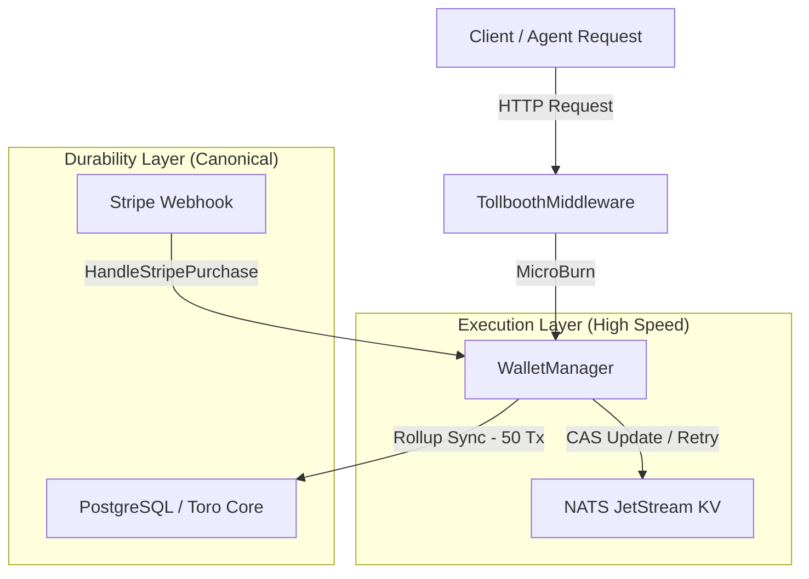

# Micrion Package (`tap/pkg/micrion`)

The `micrion` package implements the micro-billing, token-deduction, and rate-limiting infrastructure for Toro. It provides a dual-layer ledger system designed to enforce high-frequency billing ("tolls") on autonomous agent actions while preserving transaction durability and idempotency.

---

## What is a Micrion?

A **Micrion** (abbreviated as `µC` or micro-credits) is the high-precision, fractional billing unit used across the Toro Autonomous Agent Platform (TAP).

### Unit & Conversion Rate
* **Base Unit**: `1 USD = 1,000,000 Micrions` (i.e. $1\ \mu\text{C} = \$0.000001$, or 0.0001 cents).
* Defined as the conversion constant `MicrionMultiplier` in [core.go](file:///Users/Yankz/programming/usetoro/tap/pkg/core/primitives.go#L13).

### Why do we need it?
* **High-Frequency Micro-Billing**: Standard currency units (like USD cents) are too coarse for charging individual agent behaviors. A single database execution or NATS pub/sub message costs a fraction of a cent. Micrions allow granular pricing.
* **Infinite Reasoning Loop Prevention**: Autonomous agents can consume vast infrastructure resources if they enter cognitive loops. Forcing agents to pay a toll for every external database call, API query, or event publication acts as a hard budget throttle. Once an agent depletes its balance, execution halts with a `402 Payment Required` block.
* **Task Incentivization & Rewards**: Tasks dispatched in TAP are rewarded based on their complexity:
  * **ComplexityEntry**: `1,000,000 µC` ($1.00 USD)
  * **ComplexityJunior**: `5,000,000 µC` ($5.00 USD)
  * **ComplexitySenior**: `10,000,000 µC` ($10.00 USD)

### How is it used?
Agents maintain a balance in the execution layer. Whenever the agent initiates an action, a toll is deducted via `MicroBurn`:
* **HTTP API Endpoints**: Charged using `TollboothMiddleware`.
* **Database Hits**: Charged `1,616 µC` ($0.001616) per query via the `TolledDBTX` interceptor wrapper.
* **NATS Pub/Sub**: Charged `1,616 µC` ($0.001616) per publication/request via the `TolledEventBus` interceptor wrapper.

---

## Core Architecture

To balance high-speed execution with permanent transaction records, `micrion` implements a **dual-layer ledger system**:



### 1. High-Speed Execution Layer (NATS JetStream KV)
* **Storage**: JSON-serialized state (`ExecutionState`) stored in a dedicated NATS Key-Value bucket named `micrions`.
* **Concurrency**: Uses Compare-And-Set (CAS) logic via NATS Key-Value updates. In the event of a collision (concurrent billing operations), the operation retries up to `MaxRetries` (100 times) with randomized backoff.
* **Transient State**: Tracks uncommitted micro-burns and their counts before rolling up.

### 2. Canonical Durability Layer (PostgreSQL)
* **Interface**: Decoupled from core DB dependencies via the `FiatLedger` interface.
* **Purchases**: stripe purchases/USD conversions are immediately logged to PostgreSQL and then loaded into the execution layer (`TopUp`).
* **Rollups (Two Generals Idempotency Lock)**: To avoid hammering the relational database on every single API hit or database query, micro-burns are aggregated. Once `RollupThreshold` (50 transactions) is reached:
  1. The cumulative burned amount is written to PostgreSQL via `LogBulkBurn`.
  2. The NATS KV revision serves as an idempotency lock.
  3. The transient counters in NATS KV are reset.

---

## Core Types

### `WalletManager`
Coordinates transactions across NATS Key-Value and the underlying SQL database:
```go
type WalletManager struct {
    ledger FiatLedger
    kv     nats.KeyValue
}
```

### `ExecutionState`
The JSON payload representing the wallet status in NATS KV:
```go
type ExecutionState struct {
    EntityID         string `json:"entity_id"`
    Balance          int64  `json:"balance"`
    UncommittedBurns int64  `json:"uncommitted_burns"`
    UncommittedCount int    `json:"uncommitted_count"`
}
```

---

## Interceptors and Middleware

The package provides automated wrappers to charge tolls transparently across the system:

### 1. `TollboothMiddleware`
An HTTP middleware that extracts the Agent DID from the `X-Agent-DID` header, attempts to burn the required toll, and rejects requests with `402 Payment Required` if the balance is insufficient.

### 2. `TolledEventBus`
Wraps a standard Toro `EventBus` to charge a default `InfraTollCost` (1,616 Micrions) for outbound publications (`Publish`) and requests (`RequestWithContext`).

### 3. `TolledDBTX`
Wraps a database connection (`DBTX` interface like `pgxpool.Pool`) to charge `InfraTollCost` for every database execution (`Exec`), query (`Query`), or row retrieval (`QueryRow`).

---

## Errors

* **`ErrPaymentRequired`**: Returned when an agent does not have enough micrions for the toll. Translates to HTTP 402.
* **`ErrAgentNotFound`**: Returned when the agent's balance key does not exist.
